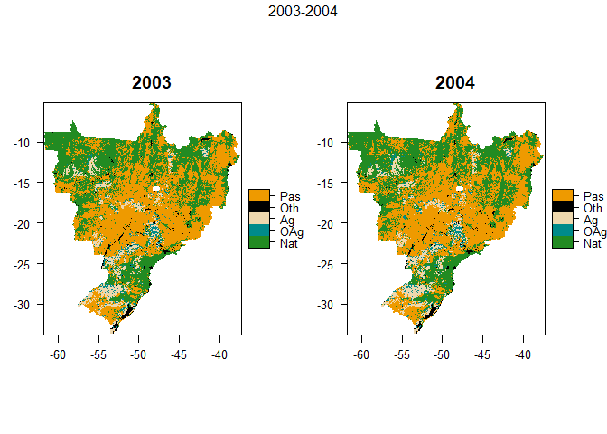
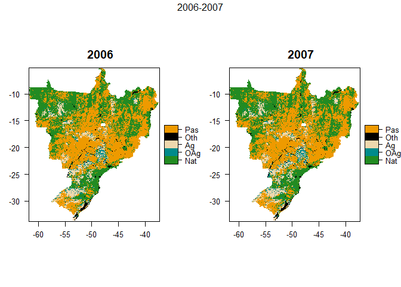
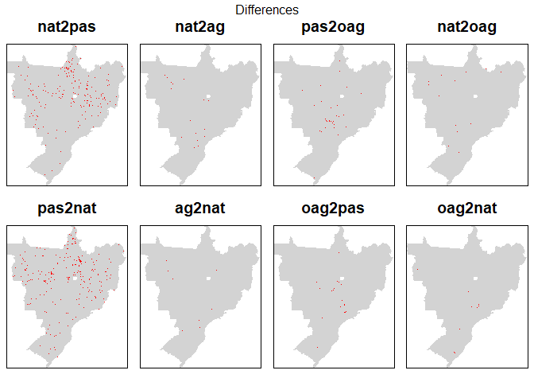

## Examine differences between pairs of raster maps for sequential years


```r
library(tidyverse)
library(caret)   #for confusionMatrix
library(diffeR)  #for map comparison
library(knitr)
library(raster)
library(rasterVis)
library(gridExtra)


####FUNCTIONS
nat2pas <- function(x,y) { x == 1 & y == 5 }
pas2nat <- function(x,y) { x == 5 & y == 1 }

pas2ag <- function(x,y) { x == 5 & y == 3 }
ag2pas <- function(x,y) { x == 3 & y == 5 }

nat2ag <- function(x,y) { x == 1 & y == 3 }
ag2nat <- function(x,y) { x == 3 & y == 1 }

nat2oag <- function(x,y) { x == 1 & y == 2 }
oag2nat <- function(x,y) { x == 2 & y == 1 }

pas2oag <- function(x,y) { x == 5 & y == 2 }
oag2pas <- function(x,y) { x == 2 & y == 5 }


binRatify <- function(ras){
  
  ras <- ratify(ras)
  rat <- levels(ras)[[1]]
  rat$code <- c("No Change","Change")
  #if(length(rat) == 1) rat$code <- "unknown"
  #if(length(rat) == 2) rat$code <- c("No Change","Change")
  
  levels(ras) <- rat

  return(ras)
  
}


makeObsLUmap <- function(LU, year) {
  
  
  #add categories for later plotting etc. (see https://stackoverflow.com/a/37214431)
  LU <- ratify(LU)     #tell R that the map raster is categorical 
  rat <- levels(LU)[[1]]    #apply the levels (i.e. categories) 

  uLU <- unique(LU) 

  LUcols <- c()
  LUlabs <- c()
  
  if(1 %in% uLU) { 
    LUcols <- c(LUcols, 'forestgreen') 
    LUlabs <- c(LUlabs, 'Nat')  }
  if(2 %in% uLU) { 
    LUcols <- c(LUcols, 'darkcyan') 
    LUlabs <- c(LUlabs, 'OAg') }
  if(3 %in% uLU) { 
    LUcols <- c(LUcols, 'wheat2') 
    LUlabs <- c(LUlabs, 'Ag') }
  if(4 %in% uLU) { 
    LUcols <- c(LUcols, 'black') 
    LUlabs <- c(LUlabs, 'Oth') }
  if(5 %in% uLU) { 
    LUcols <- c(LUcols, 'orange2') 
    LUlabs <- c(LUlabs, 'Pas') }
  
  rat$LandUse <- LUlabs  
  levels(LU) <- rat 
  
  p <- levelplot(LU, att = "LandUse", col.regions=LUcols, main = paste0(year),
      par.settings = list(
        layout.heights = list(top.padding = 0, bottom.padding = 0),
        layout.widths = list(left.padding = 0, right.padding = 0) 
        )
      )  

  return(p)
}
```


```r
path <- "E:/OneDrive - King's College London/Research/Projects/Belmont/Modelling/CRAFTY/Crafty Telecoupling/Data/LandCover/MapBiomas4/BrazilInputMaps/Data/Classified/"

data_yrs <- seq(2001, 2018, 1)

for(i in 1:(length(data_yrs)-1)){

  print(paste0(data_yrs[i],"-",data_yrs[i+1]))
  
  #create a stack of rasters for first set of maps
  innameA <- paste0(path,"LandCover",data_yrs[i],"_PastureB_Disagg.asc")
  lcA <- raster(innameA)
  
  if(i == 1) sA <- stack(lcA)  else  sA <- stack(sA, lcA)
  
  #create a stack of rasters for second set of maps
  innameB <- paste0(path,"LandCover",data_yrs[i+1],"_PastureB_Disagg.asc")
  lcB <- raster(innameB)
  
  if(i == 1) sB <- stack(lcB)  else sB <- stack(sB, lcB) 
  
}

#mask to study area
munis.r <- raster("E:/OneDrive - King's College London/Research/Projects/Belmont/Modelling/CRAFTY/Crafty Telecoupling/Data/CRAFTYInput/Data/sim10_BRmunis_latlon_5km.asc")

sA <- mask(x=sA, mask=munis.r)   
sA <- trim(sA, padding=2)

sB <- mask(x=sB, mask=munis.r)   
sB <- trim(sB, padding=2)
```


```r
LCnames <- c("Nat", "OtherAgri", "Agri", "Other", "Pasture")  #used to label error matrix in loop below

comparisons <- c(nat2pas, pas2nat, nat2ag, ag2nat, pas2oag, oag2pas, nat2oag, oag2nat) 
comparisons_n <- c("nat2pas", "pas2nat", "nat2ag", "ag2nat", "pas2oag", "oag2pas", "nat2oag", "oag2nat")


for(i in 1:(length(data_yrs)-1)){
  
  #i <- 2 #for testing
  
  lul <- list()  #this will hold the plots for the LU map for this year
  lul[[1]] <- makeObsLUmap(sA[[i]], paste0(data_yrs[i]))
  lul[[2]] <- makeObsLUmap(sB[[i]], paste0(data_yrs[i+1]))
  

  #output the crosstab  
  cat("  \n","  \n","Crosstab ",data_yrs[i],"-",data_yrs[i+1],"  \n") 
  xtab <- crosstabm(sA[[i]], sB[[i]])
  colnames(xtab) <- LCnames
  rownames(xtab) <- LCnames
  cat("  \n")
  print(kable(xtab))
  cat("  \n")
  
  pl <- list()  #this will hold the plots for the all map for this year
  ts <- stack(sA[[i]], sB[[i]]) #stack used when creating difference maps

  for(j in seq_along(comparisons)){
    
    #j <- 2 #for testing
    np <- raster::overlay(x=ts, fun=comparisons[[j]])
    
    if(cellStats(np, sum) > 0) #if there are any differences
    {
      np <- binRatify(np) 
      mycols <- c("lightgray", "red")
    } else {
      mycols <- c("lightgray") 
    }
    
        #create the plot
        p <- levelplot(np,
        contour=F, 
        margin=F,
        colorkey=F,
        scales=list(draw=FALSE),
        col.regions= mycols,
        main = comparisons_n[j],
        par.settings = list(
          layout.heights = list(top.padding = 0, bottom.padding = 0),
          layout.widths = list(left.padding = 0, right.padding = 0) 
          )
        )
    
      pl[[j]] <- p   
    
  }
  
  
  print(marrangeGrob(lul, nrow = 1, ncol = 2, top = paste0(data_yrs[i],"-",data_yrs[i+1])))
  print(marrangeGrob(pl, nrow = 2, ncol = 4, top = paste0("Differences")))

}
```

  
   
 Crosstab  2001 - 2002   
  

               Nat   OtherAgri   Agri   Other   Pasture
----------  ------  ----------  -----  ------  --------
Nat          61514         172    203     103      2660
OtherAgri       48        3657    481       5       110
Agri            49         545   9679       4       159
Other           56          15     13    2517        81
Pasture       2315         277    479     174     77685
  
<!-- --><!-- -->  
   
 Crosstab  2002 - 2003   
  

               Nat   OtherAgri    Agri   Other   Pasture
----------  ------  ----------  ------  ------  --------
Nat          60377         199     216     119      3071
OtherAgri       57        3926     598       8        77
Agri            58         393   10269       8       127
Other           63          10      12    2628        90
Pasture       2352         467     838     161     76877
  
<!-- --><!-- -->  
   
 Crosstab  2003 - 2004   
  

               Nat   OtherAgri    Agri   Other   Pasture
----------  ------  ----------  ------  ------  --------
Nat          59604         212     307      70      2714
OtherAgri       80        4205     571       5       134
Agri            54         583   11141       9       146
Other           90          26      29    2658       121
Pasture       2518         398     673     142     76511
  
<!-- --><!-- -->  
   
 Crosstab  2004 - 2005   
  

               Nat   OtherAgri    Agri   Other   Pasture
----------  ------  ----------  ------  ------  --------
Nat          58986         192     235      70      2863
OtherAgri       89        4323     864      10       138
Agri            92         462   11945      10       212
Other           81          12      13    2704        74
Pasture       2193         332     469      79     76553
  
<!-- --><!-- -->  
   
 Crosstab  2005 - 2006   
  

               Nat   OtherAgri    Agri   Other   Pasture
----------  ------  ----------  ------  ------  --------
Nat          58475         159     192      89      2526
OtherAgri      123        4236     795       3       164
Agri           135         642   12413       8       328
Other           64          12      14    2709        74
Pasture       2386         314     366      87     76687
  
<!-- --><!-- -->  
   
 Crosstab  2006 - 2007   
  

               Nat   OtherAgri    Agri   Other   Pasture
----------  ------  ----------  ------  ------  --------
Nat          58377         175     190      92      2349
OtherAgri       62        4500     634       7       160
Agri           132         548   12803      13       284
Other           59          11      14    2771        41
Pasture       2405         372     460     113     76429
  
<!-- --><!-- -->  
   
 Crosstab  2007 - 2008   
  

               Nat   OtherAgri    Agri   Other   Pasture
----------  ------  ----------  ------  ------  --------
Nat          57985         204     271      65      2510
OtherAgri       53        4720     679       7       147
Agri           125         703   13007      11       255
Other           78           8      19    2803        88
Pasture       2353         397     528      93     75892
  
<!-- --><!-- -->  
   
 Crosstab  2008 - 2009   
  

               Nat   OtherAgri    Agri   Other   Pasture
----------  ------  ----------  ------  ------  --------
Nat          57916         162     210      53      2253
OtherAgri       93        5209     515      10       205
Agri           115         688   13391      15       295
Other           93           6      12    2793        75
Pasture       2451         344     338      70     75689
  
<!-- --><!-- -->  
   
 Crosstab  2009 - 2010   
  

               Nat   OtherAgri    Agri   Other   Pasture
----------  ------  ----------  ------  ------  --------
Nat          58043         149     198      67      2211
OtherAgri       71        5361     802       6       169
Agri           115         532   13556       5       258
Other           43          12      17    2806        63
Pasture       2212         299     415     102     75489
  
<!-- --><!-- -->  
   
 Crosstab  2010 - 2011   
  

               Nat   OtherAgri    Agri   Other   Pasture
----------  ------  ----------  ------  ------  --------
Nat          57717         154     229     130      2254
OtherAgri       60        5629     534       6       124
Agri           108         724   13957      10       189
Other           69          11      13    2835        58
Pasture       2389         389     583     148     74681
  
<!-- --><!-- -->  
   
 Crosstab  2011 - 2012   
  

               Nat   OtherAgri    Agri   Other   Pasture
----------  ------  ----------  ------  ------  --------
Nat          57418         139     237      83      2466
OtherAgri       93        5998     636      10       170
Agri           135         941   14013       7       220
Other          109           8      21    2894        97
Pasture       2356         484     691      92     73683
  
<!-- --><!-- -->  
   
 Crosstab  2012 - 2013   
  

               Nat   OtherAgri    Agri   Other   Pasture
----------  ------  ----------  ------  ------  --------
Nat          57107         167     272      84      2481
OtherAgri       78        6472     873       6       141
Agri           107         538   14770       5       178
Other           73          15      12    2873       113
Pasture       2292         574     809      96     72865
  
<!-- --><!-- -->  
   
 Crosstab  2013 - 2014   
  

               Nat   OtherAgri    Agri   Other   Pasture
----------  ------  ----------  ------  ------  --------
Nat          56850         183     264      85      2275
OtherAgri       85        6598     903       7       173
Agri           127         647   15669      14       279
Other           47          19      17    2882        99
Pasture       2244         554     685      71     72224
  
<!-- --><!-- -->  
   
 Crosstab  2014 - 2015   
  

               Nat   OtherAgri    Agri   Other   Pasture
----------  ------  ----------  ------  ------  --------
Nat          56528         202     180      45      2398
OtherAgri       94        6836     918       8       145
Agri           144         778   16389       6       221
Other           97          11      18    2856        77
Pasture       2398         444     569      89     71550
  
<!-- --><!-- -->  
   
 Crosstab  2015 - 2016   
  

               Nat   OtherAgri    Agri   Other   Pasture
----------  ------  ----------  ------  ------  --------
Nat          56625         221     253      53      2109
OtherAgri      130        7130     786      13       212
Agri           160         970   16621      18       305
Other           67           6      10    2853        68
Pasture       2697         350     488      87     70769
  
<!-- --><!-- -->  
   
 Crosstab  2016 - 2017   
  

               Nat   OtherAgri    Agri   Other   Pasture
----------  ------  ----------  ------  ------  --------
Nat          56603         223     244      88      2521
OtherAgri       79        7574     839      15       170
Agri           117         845   16930       9       257
Other           52          12      19    2851        90
Pasture       2229         307     414      76     70437
  
<!-- --><!-- -->  
   
 Crosstab  2017 - 2018   
  

               Nat   OtherAgri    Agri   Other   Pasture
----------  ------  ----------  ------  ------  --------
Nat          56173         154     228      98      2427
OtherAgri       94        7798     889      10       170
Agri           159         675   17324      11       277
Other           89          19      23    2822        86
Pasture       2478         340     476      99     70082
  
<!-- --><!-- -->
