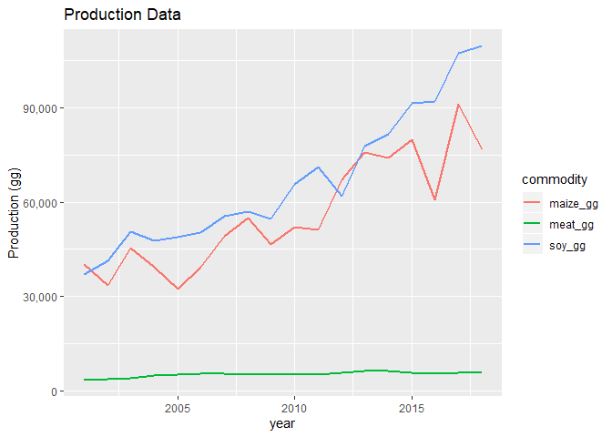
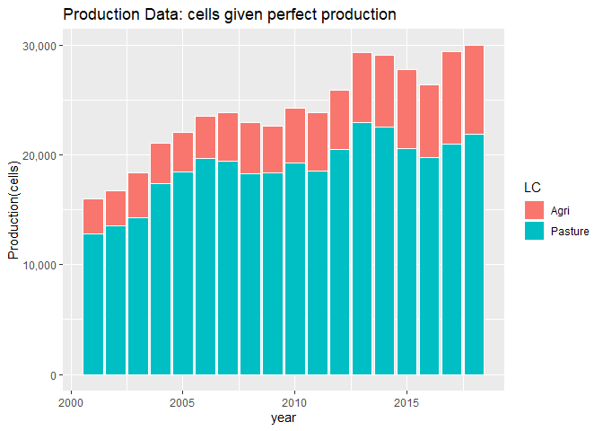
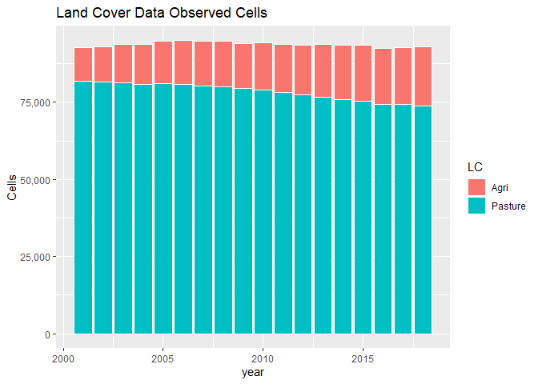
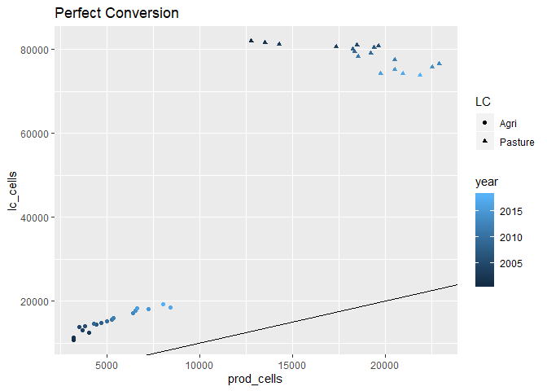

```r
rm(list=ls())
library(tidyverse)
library(readxl)
```

Using Summary Table data for observed Land Cover (PastureB classification)

```r
yrs <- seq(2001, 2018, 1)

#load the region file (used to match each cell to a municipality)
region <- read.csv("SummaryTables/region2001_noDC_HD_2019-10-28.csv")

#for debugging
#i <- 1


#loop through all years
for(i in seq_along(yrs)){
  
  #if this is the first year, create lc_dat
  if(i == 1){
    lc_dat <- read_csv(paste0("SummaryTables/SummaryTable",yrs[i],"_PastureB_Disagg.csv"))   #load empirical map summary data (created using summarise_LCmaps.r)
    lc_dat <- lc_dat %>%
      mutate(year = yrs[i]) 
  }
  
  #if this is not the first year, bind new year data to lc_dat
  else {
    
    lc <- read_csv(paste0("SummaryTables/SummaryTable",yrs[i],"_PastureB_Disagg.csv"))   #load empirical map summary data (created using summarise_LCmaps.r)
    lc <- lc %>%
      mutate(year = yrs[i])
    
    lc_dat <- bind_rows(lc_dat, lc)
  }
  
}  

#add state ID
lc_dat <- lc_dat %>%
  mutate(state = (muniID %/% 100000)) %>%
  mutate(state = if_else(state == 17, "TO", 
      if_else(state == 29, "BA",
      if_else(state == 31, "MG",
      if_else(state == 35, "SP",
      if_else(state == 41, "PR",
      if_else(state == 42, "SC",
      if_else(state == 43, "RS", 
      if_else(state == 50, "MS",
      if_else(state == 51, "MT",
      if_else(state == 52, "GO", "NA"
      ))))))))))
    )

#LC1 = Nature
#LC2 = Other Agri
#LC3 = Agri
#LC4 = Other
#LC5 = Pasture

#add observed cell count columns  
lc_dat <- lc_dat %>%
      mutate(Nature = round(LC1 * NonNAs,0)) %>%
      mutate(OAgri = round(LC2 * NonNAs,0)) %>%
      mutate(Agri = round(LC3 * NonNAs,0)) %>%
      mutate(Other = round(LC4 * NonNAs,0)) %>%
      mutate(Pasture = round(LC5 * NonNAs,0))

#make data long
lc_cells_long <- lc_dat %>%
  select(year:Pasture) %>%
  gather(key = LC, value = cells, -year, -state)

write_csv(lc_cells_long, "lc_cells_long.csv") 

#calculate state totals
lc_cells_long_states <- lc_cells_long %>% 
  group_by(state, year,LC) %>%
  summarise_at(vars(matches("cells")),sum, na.rm=T)

write_csv(lc_cells_long_states, "lc_cells_long_states2.csv") 
```


Plot observed land cover by state through time

```r
lc_cells_long_states %>% 
  ggplot(aes(x = year, y = cells, fill = LC)) + 
  geom_bar(stat = "identity") +
  scale_y_continuous(name = "Cells", labels = scales::comma) +
  facet_grid(.~state) +
  ggtitle("Ten States Observed Cells") + 
  theme(axis.text.x = element_text(angle = 90, vjust = 0.5))
```

<!-- -->


Plot observed land cover for all 10 simulation states through time

```r
lc_cells_long_brazil <- lc_cells_long_states %>% 
  group_by(year,LC) %>%
  summarise_at(vars(matches("cells")),sum)

#lc_cells_long_brazil %>% 
#  spread(key=LC, value=cells) %>%
#  write_csv("SummaryTables_cells.csv")

lc_cells_long_brazil %>% 
  ggplot(aes(x = year, y = cells, fill = LC)) + 
  geom_bar(stat = "identity", colour="white") +
  scale_y_continuous(name = "Cells", labels = scales::comma) +
  #facet_grid(.~state) +
  ggtitle("Ten States Observed Cells")
```

<!-- -->

```r
lc_cells_long_brazil %>% 
  ggplot(aes(x = year, y = cells, colour = LC)) + 
  geom_line(size = 1) +
  scale_y_continuous(name = "Cells", labels = scales::comma) +
  #facet_grid(.~state) +
  ggtitle("Ten States Observed Cells")
```

<!-- -->


Use production data from IBGE

```r
##Load Production Data
meat_prod_Astates_Data <- read_excel("ProductionData/Cattle_meat_production_Kg_2000_2018_all_states.xlsx", sheet = "Plan1", skip = 1)  #data for all states Astates

#dairy data are by municiaplity for all states (Amunis)
#dairy_prod_Amunis_Data <- read_excel("ProductionData/dairy_Municipalities_Brazil.xlsx", sheet = "Tabela", skip = 1, na = c("", "-", "..."))

#maize data are by municiaplity for all states (Amunis)
maize_prod_Amunis_Data <- read_excel("ProductionData/maize_brazil.xlsx", sheet = "Production (tons)", skip = 1, na = c("", "-", "..."))


#maize data are by municiaplity for all states (Amunis)
soy_prod_Amunis_Data <- read_excel("ProductionData/soybean_brazil.xlsx", sheet = "Production (Tons)", skip = 1, na = c("", "-", "..."))


Fstate_vals <- c(17,	29,	31,	35,	41,	42,	43,	50,	51,	52)
Fstate_abbrev <- c("TO", "BA", "MG", "SP", "PR",  "SC", "RS", "MS", "MT", "GO")

Astate_codes <- meat_prod_Astates_Data %>%
  dplyr::select(NM_UF_SIGLA, CD_GCUF) %>%
  rename(state = NM_UF_SIGLA, stateid = CD_GCUF) %>%
  filter(!is.na(state))    #safer way to remove text line at bottom of state column
  

##MEAT
meat_prod_Astates <- meat_prod_Astates_Data %>%
  rename(state = NM_UF_SIGLA) %>%
  dplyr::select(-NM_UF, -CD_GCUF) %>%      #drop columns
  filter(!is.na(state)) %>%   #safer way to remove text line at bottom of state column
  mutate_at(vars("2001":"2018"), as.numeric) 

meat_prod_Astates_long <- meat_prod_Astates %>%
   gather(key = year, value = meat_kg, -state) %>%
   mutate_at(vars(year), as.integer) %>%
   mutate(meat_gg = meat_kg * 0.000001) %>%  #convert from kg to gg
   dplyr::select(-meat_kg)

##DAIRY
# dairy_prod_Amunis <- dairy_prod_Amunis_Data %>%
#   rename(muniID = `IBGE CODE`) %>%
#   filter(!is.na(muniID)) %>%   #safer way to remove text line in muniID
#   mutate(state = substr(muniID, 1, 2)) %>%     #extract the muniID
#   mutate_at(vars("2000":"2015"), as.numeric) %>%  #convert values to numeric
#   dplyr::select(-Municipality)   #drop unwanted columns
# 
# dairy_prod_Astates <- dairy_prod_Amunis %>%
#   group_by(state) %>%
#   mutate_all(funs(. * 1.03 * 1000)) %>%     #convert from thousand litres to kgs
#   summarise_all(sum, na.rm=T) %>%    #summarise munis to states
#   mutate(state=replace(state, 1:length(Astate_codes$stateid), Astate_codes$state)) #re-label stated ids with state abbrevs

# dairy_prod_Astates_long <- dairy_prod_Astates %>%
#   gather(key = year, value = dairy_kg, -state, -muniID) %>%
#   mutate_at(vars(year), as.integer) %>%
#   mutate(dairy_gg = dairy_kg * 0.000001) %>%  #convert from kg to gg
#   dplyr::select(-dairy_kg, -muniID)


#MAIZE
#has the same data strucutre (with some differences in unit conversions - could write function to cover both?) 
maize_prod_Amunis <- maize_prod_Amunis_Data %>%
  rename(muniID = `IBGE CODE`) %>%
  filter(!is.na(muniID)) %>%   #safer way to remove text line in muniID
  mutate(state = substr(muniID, 1, 2)) %>%     #extract the muniID
  mutate_at(vars("2001":"2018"), as.numeric) %>%  #convert values to numeric
  dplyr::select(-Municipality)   #drop unwanted columns

maize_prod_Astates <- maize_prod_Amunis %>%
  group_by(state) %>%
  summarise_all(sum, na.rm=T) %>%    #summarise munis to states
  mutate(state=replace(state, 1:length(Astate_codes$stateid), Astate_codes$state)) #re-label stated ids with state abbrevs

maize_prod_Astates_long <- maize_prod_Astates %>%
  gather(key = year, value = maize_kg, -state, -muniID) %>%
  mutate_at(vars(year), as.integer) %>%
  mutate(maize_gg = maize_kg * 0.001) %>%  #convert from tons to gg
  dplyr::select(-maize_kg, -muniID)

##SOY
soy_prod_Amunis <- soy_prod_Amunis_Data %>%
  rename(muniID = `IBGE CODE`) %>%
  filter(!is.na(muniID)) %>%   #safer way to remove text line in muniID
  mutate(state = substr(muniID, 1, 2)) %>%     #extract the muniID
  mutate_at(vars("2001":"2018"), as.numeric) %>%  #convert values to numeric
  dplyr::select(-Municipality)   #drop unwanted columns

soy_prod_Astates <- soy_prod_Amunis %>%
  group_by(state) %>%
  summarise_all(sum, na.rm=T) %>%    #summarise munis to states
  mutate(state=replace(state, 1:length(Astate_codes$stateid), Astate_codes$state)) #re-label stated ids with state abbrevs

soy_prod_Astates_long <- soy_prod_Astates %>%
  gather(key = year, value = soy_kg, -state, -muniID) %>%
  mutate_at(vars(year), as.integer) %>%
  mutate(soy_gg = soy_kg * 0.001) %>%  #convert from tons to gg
  dplyr::select(-soy_kg, -muniID)

prod_state_year <- left_join(meat_prod_Astates_long, maize_prod_Astates_long, by = c("year", "state"))

prod_state_year <- left_join(prod_state_year, soy_prod_Astates_long, by = c("year", "state"))

#add focal states indicator
prod_state_year <- prod_state_year %>%
  mutate(simulated = state %in% Fstate_abbrev) 

psy_long <- prod_state_year %>%
  gather(key = commodity, value = gg, -state, -year, -simulated)

psimy_long <- psy_long %>%
  group_by(simulated, year, commodity) %>%
  summarise(sumsim = sum(gg, na.rm=T))

prod_state_year
```

<div data-pagedtable="false">
  <script data-pagedtable-source type="application/json">
{"columns":[{"label":["state"],"name":[1],"type":["chr"],"align":["left"]},{"label":["year"],"name":[2],"type":["int"],"align":["right"]},{"label":["meat_gg"],"name":[3],"type":["dbl"],"align":["right"]},{"label":["maize_gg"],"name":[4],"type":["dbl"],"align":["right"]},{"label":["soy_gg"],"name":[5],"type":["dbl"],"align":["right"]},{"label":["simulated"],"name":[6],"type":["lgl"],"align":["right"]}],"data":[{"1":"RO","2":"2001","3":"127.545365","4":"169.077","5":"68.687","6":"FALSE"},{"1":"AC","2":"2001","3":"47.621523","4":"45.559","5":"0.000","6":"FALSE"},{"1":"AM","2":"2001","3":"0.000000","4":"14.296","5":"1.530","6":"FALSE"},{"1":"RR","2":"2001","3":"0.000000","4":"15.510","5":"0.000","6":"FALSE"},{"1":"PA","2":"2001","3":"260.797449","4":"484.092","5":"2.291","6":"FALSE"},{"1":"AP","2":"2001","3":"0.000000","4":"1.465","5":"0.000","6":"FALSE"},{"1":"TO","2":"2001","3":"107.983064","4":"121.259","5":"188.226","6":"TRUE"},{"1":"MA","2":"2001","3":"91.084723","4":"320.236","5":"491.083","6":"FALSE"},{"1":"PI","2":"2001","3":"23.438576","4":"144.540","5":"128.315","6":"FALSE"},{"1":"CE","2":"2001","3":"66.406595","4":"244.580","5":"0.000","6":"FALSE"},{"1":"RN","2":"2001","3":"11.475925","4":"7.716","5":"0.000","6":"FALSE"},{"1":"PB","2":"2001","3":"4.566969","4":"7.723","5":"0.000","6":"FALSE"},{"1":"PE","2":"2001","3":"72.506737","4":"20.514","5":"0.000","6":"FALSE"},{"1":"AL","2":"2001","3":"25.131791","4":"27.510","5":"0.000","6":"FALSE"},{"1":"SE","2":"2001","3":"0.000000","4":"46.726","5":"0.000","6":"FALSE"},{"1":"BA","2":"2001","3":"94.162398","4":"992.852","5":"1407.600","6":"TRUE"},{"1":"MG","2":"2001","3":"284.653628","4":"4021.411","5":"1390.635","6":"TRUE"},{"1":"ES","2":"2001","3":"35.340009","4":"114.779","5":"0.000","6":"FALSE"},{"1":"RJ","2":"2001","3":"21.927623","4":"26.836","5":"0.000","6":"FALSE"},{"1":"SP","2":"2001","3":"795.116025","4":"4200.120","5":"1355.680","6":"TRUE"},{"1":"PR","2":"2001","3":"197.984942","4":"12646.564","5":"8615.187","6":"TRUE"},{"1":"SC","2":"2001","3":"43.933403","4":"3946.870","5":"534.321","6":"TRUE"},{"1":"RS","2":"2001","3":"242.523158","4":"6134.207","5":"6951.830","6":"TRUE"},{"1":"MS","2":"2001","3":"776.814403","4":"2185.846","5":"3115.030","6":"TRUE"},{"1":"MT","2":"2001","3":"505.800010","4":"1743.043","5":"9533.286","6":"TRUE"},{"1":"GO","2":"2001","3":"467.371755","4":"4157.387","5":"4052.169","6":"TRUE"},{"1":"DF","2":"2001","3":"0.000000","4":"121.757","5":"71.389","6":"FALSE"},{"1":"RO","2":"2002","3":"203.448423","4":"153.014","5":"83.782","6":"FALSE"},{"1":"AC","2":"2002","3":"51.532279","4":"51.508","5":"0.000","6":"FALSE"},{"1":"AM","2":"2002","3":"0.000000","4":"15.329","5":"3.189","6":"FALSE"},{"1":"RR","2":"2002","3":"0.000000","4":"19.220","5":"0.000","6":"FALSE"},{"1":"PA","2":"2002","3":"305.789246","4":"416.322","5":"7.535","6":"FALSE"},{"1":"AP","2":"2002","3":"0.000000","4":"1.470","5":"0.000","6":"FALSE"},{"1":"TO","2":"2002","3":"134.264991","4":"126.700","5":"244.329","6":"TRUE"},{"1":"MA","2":"2002","3":"110.626246","4":"327.318","5":"561.718","6":"FALSE"},{"1":"PI","2":"2002","3":"23.209550","4":"82.700","5":"91.014","6":"FALSE"},{"1":"CE","2":"2002","3":"67.883448","4":"629.447","5":"0.294","6":"FALSE"},{"1":"RN","2":"2002","3":"13.739557","4":"68.722","5":"0.000","6":"FALSE"},{"1":"PB","2":"2002","3":"13.721708","4":"91.870","5":"0.000","6":"FALSE"},{"1":"PE","2":"2002","3":"79.055609","4":"86.675","5":"0.000","6":"FALSE"},{"1":"AL","2":"2002","3":"25.609034","4":"40.686","5":"0.000","6":"FALSE"},{"1":"SE","2":"2002","3":"13.886134","4":"38.380","5":"0.000","6":"FALSE"},{"1":"BA","2":"2002","3":"101.383378","4":"849.743","5":"1464.000","6":"TRUE"},{"1":"MG","2":"2002","3":"309.724582","4":"4808.170","5":"1951.342","6":"TRUE"},{"1":"ES","2":"2002","3":"43.181057","4":"138.045","5":"0.000","6":"FALSE"},{"1":"RJ","2":"2002","3":"17.898778","4":"23.255","5":"0.000","6":"FALSE"},{"1":"SP","2":"2002","3":"857.318829","4":"3943.470","5":"1560.520","6":"TRUE"},{"1":"PR","2":"2002","3":"219.350444","4":"9797.816","5":"9538.774","6":"TRUE"},{"1":"SC","2":"2002","3":"48.618774","4":"3100.031","5":"529.941","6":"TRUE"},{"1":"RS","2":"2002","3":"227.606238","4":"3901.171","5":"5610.518","6":"TRUE"},{"1":"MS","2":"2002","3":"768.600342","4":"1381.604","5":"3267.084","6":"TRUE"},{"1":"MT","2":"2002","3":"591.999111","4":"2311.368","5":"11684.885","6":"TRUE"},{"1":"GO","2":"2002","3":"459.550197","4":"3389.532","5":"5405.589","6":"TRUE"},{"1":"DF","2":"2002","3":"0.000000","4":"147.266","5":"103.104","6":"FALSE"},{"1":"RO","2":"2003","3":"210.334762","4":"197.166","5":"126.396","6":"FALSE"},{"1":"AC","2":"2003","3":"51.476045","4":"50.946","5":"0.000","6":"FALSE"},{"1":"AM","2":"2003","3":"0.000000","4":"22.189","5":"5.211","6":"FALSE"},{"1":"RR","2":"2003","3":"0.000000","4":"28.440","5":"0.000","6":"FALSE"},{"1":"PA","2":"2003","3":"342.549804","4":"523.816","5":"43.251","6":"FALSE"},{"1":"AP","2":"2003","3":"0.000000","4":"1.059","5":"0.000","6":"FALSE"},{"1":"TO","2":"2003","3":"135.905257","4":"140.757","5":"377.638","6":"TRUE"},{"1":"MA","2":"2003","3":"123.122888","4":"381.679","5":"660.078","6":"FALSE"},{"1":"PI","2":"2003","3":"22.798424","4":"228.388","5":"308.225","6":"FALSE"},{"1":"CE","2":"2003","3":"64.920721","4":"745.317","5":"1.560","6":"FALSE"},{"1":"RN","2":"2003","3":"11.975245","4":"69.569","5":"0.000","6":"FALSE"},{"1":"PB","2":"2003","3":"11.758812","4":"123.880","5":"0.000","6":"FALSE"},{"1":"PE","2":"2003","3":"76.011614","4":"81.458","5":"0.000","6":"FALSE"},{"1":"AL","2":"2003","3":"31.690243","4":"11.889","5":"0.000","6":"FALSE"},{"1":"SE","2":"2003","3":"13.603353","4":"86.595","5":"0.000","6":"FALSE"},{"1":"BA","2":"2003","3":"110.377443","4":"1216.855","5":"1555.500","6":"TRUE"},{"1":"MG","2":"2003","3":"363.300791","4":"5326.118","5":"2335.446","6":"TRUE"},{"1":"ES","2":"2003","3":"51.505314","4":"132.287","5":"0.000","6":"FALSE"},{"1":"RJ","2":"2003","3":"15.789840","4":"22.911","5":"0.000","6":"FALSE"},{"1":"SP","2":"2003","3":"846.735475","4":"4732.040","5":"1708.938","6":"TRUE"},{"1":"PR","2":"2003","3":"219.774024","4":"14390.104","5":"11009.946","6":"TRUE"},{"1":"SC","2":"2003","3":"51.192258","4":"4310.934","5":"712.175","6":"TRUE"},{"1":"RS","2":"2003","3":"273.089441","4":"5426.124","5":"9579.297","6":"TRUE"},{"1":"MS","2":"2003","3":"757.112381","4":"3071.632","5":"4090.892","6":"TRUE"},{"1":"MT","2":"2003","3":"645.158600","4":"3192.813","5":"12965.983","6":"TRUE"},{"1":"GO","2":"2003","3":"526.740692","4":"3632.636","5":"6319.213","6":"TRUE"},{"1":"DF","2":"2003","3":"0.000000","4":"179.721","5":"119.691","6":"FALSE"},{"1":"RO","2":"2004","3":"238.611728","4":"240.380","5":"163.029","6":"FALSE"},{"1":"AC","2":"2004","3":"46.901577","4":"68.252","5":"0.000","6":"FALSE"},{"1":"AM","2":"2004","3":"0.000000","4":"24.956","5":"5.461","6":"FALSE"},{"1":"RR","2":"2004","3":"0.000000","4":"24.000","5":"26.400","6":"FALSE"},{"1":"PA","2":"2004","3":"387.301654","4":"570.311","5":"99.437","6":"FALSE"},{"1":"AP","2":"2004","3":"4.538942","4":"0.926","5":"0.000","6":"FALSE"},{"1":"TO","2":"2004","3":"169.005916","4":"143.157","5":"652.322","6":"TRUE"},{"1":"MA","2":"2004","3":"130.993148","4":"408.853","5":"903.998","6":"FALSE"},{"1":"PI","2":"2004","3":"22.191872","4":"134.114","5":"388.193","6":"FALSE"},{"1":"CE","2":"2004","3":"62.014765","4":"379.837","5":"1.113","6":"FALSE"},{"1":"RN","2":"2004","3":"8.967494","4":"60.570","5":"0.000","6":"FALSE"},{"1":"PB","2":"2004","3":"12.044386","4":"72.899","5":"0.000","6":"FALSE"},{"1":"PE","2":"2004","3":"72.509812","4":"65.746","5":"0.000","6":"FALSE"},{"1":"AL","2":"2004","3":"30.464463","4":"29.833","5":"0.471","6":"FALSE"},{"1":"SE","2":"2004","3":"0.000000","4":"136.317","5":"0.000","6":"FALSE"},{"1":"BA","2":"2004","3":"139.808843","4":"1610.524","5":"2365.290","6":"TRUE"},{"1":"MG","2":"2004","3":"409.439498","4":"5952.172","5":"2660.714","6":"TRUE"},{"1":"ES","2":"2004","3":"54.337704","4":"129.579","5":"0.000","6":"FALSE"},{"1":"RJ","2":"2004","3":"18.295730","4":"24.852","5":"0.000","6":"FALSE"},{"1":"SP","2":"2004","3":"1077.180404","4":"4647.240","5":"1854.230","6":"TRUE"},{"1":"PR","2":"2004","3":"276.807713","4":"10934.582","5":"10219.005","6":"TRUE"},{"1":"SC","2":"2004","3":"51.253480","4":"3257.770","5":"641.748","6":"TRUE"},{"1":"RS","2":"2004","3":"371.331456","4":"3376.862","5":"5541.714","6":"TRUE"},{"1":"MS","2":"2004","3":"865.321932","4":"2374.015","5":"3282.705","6":"TRUE"},{"1":"MT","2":"2004","3":"814.195774","4":"3408.968","5":"14517.912","6":"TRUE"},{"1":"GO","2":"2004","3":"601.626460","4":"3523.279","5":"6091.676","6":"TRUE"},{"1":"DF","2":"2004","3":"0.000000","4":"187.564","5":"134.523","6":"FALSE"},{"1":"RO","2":"2005","3":"292.833511","4":"245.198","5":"233.281","6":"FALSE"},{"1":"AC","2":"2005","3":"49.402753","4":"60.979","5":"0.114","6":"FALSE"},{"1":"AM","2":"2005","3":"9.726928","4":"34.890","5":"5.136","6":"FALSE"},{"1":"RR","2":"2005","3":"0.000000","4":"24.000","5":"36.400","6":"FALSE"},{"1":"PA","2":"2005","3":"446.469841","4":"559.698","5":"204.302","6":"FALSE"},{"1":"AP","2":"2005","3":"5.807920","4":"1.330","5":"0.000","6":"FALSE"},{"1":"TO","2":"2005","3":"199.498893","4":"156.588","5":"905.328","6":"TRUE"},{"1":"MA","2":"2005","3":"125.871160","4":"402.787","5":"996.909","6":"FALSE"},{"1":"PI","2":"2005","3":"23.054667","4":"191.839","5":"559.545","6":"FALSE"},{"1":"CE","2":"2005","3":"61.448872","4":"281.713","5":"0.630","6":"FALSE"},{"1":"RN","2":"2005","3":"13.996350","4":"23.116","5":"0.000","6":"FALSE"},{"1":"PB","2":"2005","3":"13.994747","4":"61.386","5":"0.000","6":"FALSE"},{"1":"PE","2":"2005","3":"74.875812","4":"115.949","5":"0.000","6":"FALSE"},{"1":"AL","2":"2005","3":"31.193345","4":"34.435","5":"0.984","6":"FALSE"},{"1":"SE","2":"2005","3":"0.000000","4":"205.577","5":"0.000","6":"FALSE"},{"1":"BA","2":"2005","3":"181.825945","4":"1616.464","5":"2401.872","6":"TRUE"},{"1":"MG","2":"2005","3":"450.757748","4":"6243.873","5":"2937.243","6":"TRUE"},{"1":"ES","2":"2005","3":"54.252988","4":"122.212","5":"0.000","6":"FALSE"},{"1":"RJ","2":"2005","3":"21.462939","4":"26.970","5":"0.000","6":"FALSE"},{"1":"SP","2":"2005","3":"1051.245287","4":"4093.896","5":"1703.660","6":"TRUE"},{"1":"PR","2":"2005","3":"308.947377","4":"8572.364","5":"9492.153","6":"TRUE"},{"1":"SC","2":"2005","3":"62.016996","4":"2695.211","5":"607.413","6":"TRUE"},{"1":"RS","2":"2005","3":"422.111180","4":"1485.040","5":"2444.540","6":"TRUE"},{"1":"MS","2":"2005","3":"849.039907","4":"1291.901","5":"3718.514","6":"TRUE"},{"1":"MT","2":"2005","3":"930.797063","4":"3483.266","5":"17761.444","6":"TRUE"},{"1":"GO","2":"2005","3":"626.468453","4":"2855.538","5":"6983.860","6":"TRUE"},{"1":"DF","2":"2005","3":"2.590015","4":"227.092","5":"188.746","6":"FALSE"},{"1":"RO","2":"2006","3":"372.880113","4":"264.430","5":"273.701","6":"FALSE"},{"1":"AC","2":"2006","3":"60.864043","4":"56.612","5":"0.024","6":"FALSE"},{"1":"AM","2":"2006","3":"17.327856","4":"37.069","5":"5.138","6":"FALSE"},{"1":"RR","2":"2006","3":"6.859677","4":"24.000","5":"30.800","6":"FALSE"},{"1":"PA","2":"2006","3":"508.031746","4":"576.579","5":"209.864","6":"FALSE"},{"1":"AP","2":"2006","3":"0.000000","4":"1.530","5":"0.000","6":"FALSE"},{"1":"TO","2":"2006","3":"249.575093","4":"142.149","5":"742.891","6":"TRUE"},{"1":"MA","2":"2006","3":"171.330919","4":"426.203","5":"931.142","6":"FALSE"},{"1":"PI","2":"2006","3":"24.698836","4":"229.533","5":"544.086","6":"FALSE"},{"1":"CE","2":"2006","3":"65.157266","4":"760.231","5":"1.026","6":"FALSE"},{"1":"RN","2":"2006","3":"19.702340","4":"51.647","5":"0.000","6":"FALSE"},{"1":"PB","2":"2006","3":"14.526256","4":"156.854","5":"0.000","6":"FALSE"},{"1":"PE","2":"2006","3":"81.607074","4":"195.573","5":"0.000","6":"FALSE"},{"1":"AL","2":"2006","3":"33.017777","4":"38.664","5":"0.264","6":"FALSE"},{"1":"SE","2":"2006","3":"0.000000","4":"184.908","5":"0.000","6":"FALSE"},{"1":"BA","2":"2006","3":"208.993338","4":"1124.206","5":"1991.400","6":"TRUE"},{"1":"MG","2":"2006","3":"551.256448","4":"5152.200","5":"2453.975","6":"TRUE"},{"1":"ES","2":"2006","3":"60.157199","4":"78.377","5":"0.000","6":"FALSE"},{"1":"RJ","2":"2006","3":"15.472950","4":"25.786","5":"0.000","6":"FALSE"},{"1":"SP","2":"2006","3":"980.550410","4":"4378.380","5":"1648.100","6":"TRUE"},{"1":"PR","2":"2006","3":"316.897316","4":"11239.987","5":"9362.901","6":"TRUE"},{"1":"SC","2":"2006","3":"70.147501","4":"2886.139","5":"798.809","6":"TRUE"},{"1":"RS","2":"2006","3":"446.798524","4":"4528.143","5":"7559.291","6":"TRUE"},{"1":"MS","2":"2006","3":"835.387857","4":"2342.619","5":"4153.542","6":"TRUE"},{"1":"MT","2":"2006","3":"1082.805129","4":"4228.423","5":"15594.221","6":"TRUE"},{"1":"GO","2":"2006","3":"660.321886","4":"3297.193","5":"6017.719","6":"TRUE"},{"1":"DF","2":"2006","3":"8.621845","4":"234.242","5":"145.746","6":"FALSE"},{"1":"RO","2":"2007","3":"469.412895","4":"249.927","5":"259.069","6":"FALSE"},{"1":"AC","2":"2007","3":"97.699593","4":"56.763","5":"0.300","6":"FALSE"},{"1":"AM","2":"2007","3":"24.397942","4":"29.174","5":"1.931","6":"FALSE"},{"1":"RR","2":"2007","3":"13.436701","4":"12.800","5":"20.300","6":"FALSE"},{"1":"PA","2":"2007","3":"539.092268","4":"562.032","5":"154.015","6":"FALSE"},{"1":"AP","2":"2007","3":"0.000000","4":"1.830","5":"0.000","6":"FALSE"},{"1":"TO","2":"2007","3":"250.912042","4":"157.590","5":"731.672","6":"TRUE"},{"1":"MA","2":"2007","3":"171.955865","4":"466.841","5":"1125.094","6":"FALSE"},{"1":"PI","2":"2007","3":"26.873734","4":"171.101","5":"484.940","6":"FALSE"},{"1":"CE","2":"2007","3":"68.045652","4":"357.342","5":"1.086","6":"FALSE"},{"1":"RN","2":"2007","3":"24.460162","4":"28.191","5":"0.000","6":"FALSE"},{"1":"PB","2":"2007","3":"16.235547","4":"73.693","5":"0.000","6":"FALSE"},{"1":"PE","2":"2007","3":"91.433617","4":"123.816","5":"0.000","6":"FALSE"},{"1":"AL","2":"2007","3":"37.560810","4":"34.111","5":"0.120","6":"FALSE"},{"1":"SE","2":"2007","3":"0.000000","4":"237.129","5":"0.000","6":"FALSE"},{"1":"BA","2":"2007","3":"234.132047","4":"1635.849","5":"2298.000","6":"TRUE"},{"1":"MG","2":"2007","3":"586.845981","4":"6066.077","5":"2417.996","6":"TRUE"},{"1":"ES","2":"2007","3":"70.714233","4":"91.841","5":"0.000","6":"FALSE"},{"1":"RJ","2":"2007","3":"28.875927","4":"22.631","5":"0.000","6":"FALSE"},{"1":"SP","2":"2007","3":"989.968631","4":"4190.573","5":"1243.833","6":"TRUE"},{"1":"PR","2":"2007","3":"295.009711","4":"14258.086","5":"11876.790","6":"TRUE"},{"1":"SC","2":"2007","3":"69.857417","4":"3793.364","5":"1111.456","6":"TRUE"},{"1":"RS","2":"2007","3":"309.331471","4":"5969.118","5":"9929.005","6":"TRUE"},{"1":"MS","2":"2007","3":"854.283231","4":"2972.221","5":"4846.031","6":"TRUE"},{"1":"MT","2":"2007","3":"1094.831279","4":"6130.082","5":"15275.087","6":"TRUE"},{"1":"GO","2":"2007","3":"654.302795","4":"4155.599","5":"5937.727","6":"TRUE"},{"1":"DF","2":"2007","3":"8.840948","4":"264.436","5":"142.720","6":"FALSE"},{"1":"RO","2":"2008","3":"393.238384","4":"305.601","5":"311.560","6":"FALSE"},{"1":"AC","2":"2008","3":"88.162877","4":"61.088","5":"0.150","6":"FALSE"},{"1":"AM","2":"2008","3":"22.912034","4":"29.313","5":"0.600","6":"FALSE"},{"1":"RR","2":"2008","3":"16.087394","4":"12.800","5":"22.400","6":"FALSE"},{"1":"PA","2":"2008","3":"491.878822","4":"622.414","5":"201.111","6":"FALSE"},{"1":"AP","2":"2008","3":"1.368838","4":"2.406","5":"0.000","6":"FALSE"},{"1":"TO","2":"2008","3":"191.358127","4":"230.270","5":"894.309","6":"TRUE"},{"1":"MA","2":"2008","3":"173.583350","4":"479.728","5":"1262.665","6":"FALSE"},{"1":"PI","2":"2008","3":"25.921568","4":"321.390","5":"819.258","6":"FALSE"},{"1":"CE","2":"2008","3":"67.630251","4":"752.882","5":"1.665","6":"FALSE"},{"1":"RN","2":"2008","3":"23.601663","4":"53.771","5":"0.000","6":"FALSE"},{"1":"PB","2":"2008","3":"16.849785","4":"119.202","5":"0.000","6":"FALSE"},{"1":"PE","2":"2008","3":"88.688854","4":"178.593","5":"0.000","6":"FALSE"},{"1":"AL","2":"2008","3":"36.753043","4":"52.182","5":"0.432","6":"FALSE"},{"1":"SE","2":"2008","3":"0.000000","4":"584.786","5":"0.000","6":"FALSE"},{"1":"BA","2":"2008","3":"245.218364","4":"1884.042","5":"2747.634","6":"TRUE"},{"1":"MG","2":"2008","3":"638.015084","4":"6611.100","5":"2566.350","6":"TRUE"},{"1":"ES","2":"2008","3":"84.586541","4":"94.641","5":"0.000","6":"FALSE"},{"1":"RJ","2":"2008","3":"35.814799","4":"19.734","5":"0.000","6":"FALSE"},{"1":"SP","2":"2008","3":"884.582253","4":"4681.177","5":"1446.108","6":"TRUE"},{"1":"PR","2":"2008","3":"279.609363","4":"15613.442","5":"11800.466","6":"TRUE"},{"1":"SC","2":"2008","3":"79.139056","4":"4089.215","5":"946.463","6":"TRUE"},{"1":"RS","2":"2008","3":"324.656192","4":"5231.885","5":"7679.939","6":"TRUE"},{"1":"MS","2":"2008","3":"742.067659","4":"3675.526","5":"4570.771","6":"TRUE"},{"1":"MT","2":"2008","3":"924.877748","4":"7799.413","5":"17802.976","6":"TRUE"},{"1":"GO","2":"2008","3":"716.683363","4":"5101.543","5":"6604.805","6":"TRUE"},{"1":"DF","2":"2008","3":"8.433379","4":"325.203","5":"153.443","6":"FALSE"},{"1":"RO","2":"2009","3":"431.915977","4":"368.819","5":"356.836","6":"FALSE"},{"1":"AC","2":"2009","3":"93.676029","4":"57.293","5":"0.165","6":"FALSE"},{"1":"AM","2":"2009","3":"26.612207","4":"29.252","5":"0.612","6":"FALSE"},{"1":"RR","2":"2009","3":"15.298902","4":"12.800","5":"3.920","6":"FALSE"},{"1":"PA","2":"2009","3":"507.490475","4":"552.104","5":"206.456","6":"FALSE"},{"1":"AP","2":"2009","3":"0.000000","4":"2.850","5":"0.000","6":"FALSE"},{"1":"TO","2":"2009","3":"205.039993","4":"250.451","5":"875.428","6":"TRUE"},{"1":"MA","2":"2009","3":"158.625482","4":"524.178","5":"1211.085","6":"FALSE"},{"1":"PI","2":"2009","3":"25.240998","4":"496.279","5":"780.580","6":"FALSE"},{"1":"CE","2":"2009","3":"64.321753","4":"538.962","5":"3.315","6":"FALSE"},{"1":"RN","2":"2009","3":"20.252494","4":"42.282","5":"0.000","6":"FALSE"},{"1":"PB","2":"2009","3":"15.103299","4":"101.241","5":"0.000","6":"FALSE"},{"1":"PE","2":"2009","3":"85.662651","4":"193.059","5":"0.000","6":"FALSE"},{"1":"AL","2":"2009","3":"32.295671","4":"42.382","5":"0.164","6":"FALSE"},{"1":"SE","2":"2009","3":"14.338974","4":"703.294","5":"0.000","6":"FALSE"},{"1":"BA","2":"2009","3":"258.615460","4":"2157.719","5":"2426.298","6":"TRUE"},{"1":"MG","2":"2009","3":"574.837024","4":"6536.545","5":"2751.431","6":"TRUE"},{"1":"ES","2":"2009","3":"79.394062","4":"97.139","5":"0.000","6":"FALSE"},{"1":"RJ","2":"2009","3":"29.532950","4":"19.023","5":"0.000","6":"FALSE"},{"1":"SP","2":"2009","3":"891.588926","4":"3674.059","5":"1327.105","6":"TRUE"},{"1":"PR","2":"2009","3":"282.220043","4":"11261.704","5":"9408.991","6":"TRUE"},{"1":"SC","2":"2009","3":"77.787300","4":"3244.500","5":"993.991","6":"TRUE"},{"1":"RS","2":"2009","3":"342.453835","4":"4186.862","5":"8025.322","6":"TRUE"},{"1":"MS","2":"2009","3":"787.269663","4":"2181.429","5":"4046.223","6":"TRUE"},{"1":"MT","2":"2009","3":"1010.482777","4":"8181.984","5":"17962.819","6":"TRUE"},{"1":"GO","2":"2009","3":"617.444773","4":"4980.614","5":"6809.187","6":"TRUE"},{"1":"DF","2":"2009","3":"0.968925","4":"282.998","5":"155.454","6":"FALSE"},{"1":"RO","2":"2010","3":"443.204227","4":"365.980","5":"385.388","6":"FALSE"},{"1":"AC","2":"2010","3":"109.324332","4":"81.125","5":"0.330","6":"FALSE"},{"1":"AM","2":"2010","3":"40.537354","4":"34.880","5":"0.540","6":"FALSE"},{"1":"RR","2":"2010","3":"16.492191","4":"12.800","5":"3.920","6":"FALSE"},{"1":"PA","2":"2010","3":"499.488696","4":"519.258","5":"243.616","6":"FALSE"},{"1":"AP","2":"2010","3":"0.000000","4":"3.233","5":"0.000","6":"FALSE"},{"1":"TO","2":"2010","3":"211.868603","4":"282.475","5":"991.326","6":"TRUE"},{"1":"MA","2":"2010","3":"134.078898","4":"535.853","5":"1322.363","6":"FALSE"},{"1":"PI","2":"2010","3":"26.683121","4":"342.483","5":"868.493","6":"FALSE"},{"1":"CE","2":"2010","3":"64.043929","4":"174.955","5":"3.417","6":"FALSE"},{"1":"RN","2":"2010","3":"21.707655","4":"8.119","5":"0.000","6":"FALSE"},{"1":"PB","2":"2010","3":"11.446558","4":"11.507","5":"0.000","6":"FALSE"},{"1":"PE","2":"2010","3":"91.018191","4":"69.715","5":"0.000","6":"FALSE"},{"1":"AL","2":"2010","3":"44.218003","4":"23.480","5":"0.000","6":"FALSE"},{"1":"SE","2":"2010","3":"25.217923","4":"750.718","5":"0.000","6":"FALSE"},{"1":"BA","2":"2010","3":"268.871913","4":"2223.302","5":"3112.929","6":"TRUE"},{"1":"MG","2":"2010","3":"559.345190","4":"6089.941","5":"2902.464","6":"TRUE"},{"1":"ES","2":"2010","3":"89.118238","4":"65.537","5":"0.000","6":"FALSE"},{"1":"RJ","2":"2010","3":"47.548109","4":"17.678","5":"0.000","6":"FALSE"},{"1":"SP","2":"2010","3":"887.134205","4":"4026.500","5":"1412.934","6":"TRUE"},{"1":"PR","2":"2010","3":"338.599312","4":"13567.096","5":"14091.829","6":"TRUE"},{"1":"SC","2":"2010","3":"116.125890","4":"3653.803","5":"1378.532","6":"TRUE"},{"1":"RS","2":"2010","3":"426.564677","4":"5633.912","5":"10480.026","6":"TRUE"},{"1":"MS","2":"2010","3":"796.638088","4":"3782.946","5":"5340.462","6":"TRUE"},{"1":"MT","2":"2010","3":"1030.711870","4":"8164.273","5":"18787.783","6":"TRUE"},{"1":"GO","2":"2010","3":"656.052878","4":"4676.483","5":"7252.926","6":"TRUE"},{"1":"DF","2":"2010","3":"4.471851","4":"246.219","5":"177.065","6":"FALSE"},{"1":"RO","2":"2011","3":"433.655624","4":"340.045","5":"419.522","6":"FALSE"},{"1":"AC","2":"2011","3":"99.659561","4":"81.793","5":"0.282","6":"FALSE"},{"1":"AM","2":"2011","3":"46.829798","4":"35.945","5":"0.540","6":"FALSE"},{"1":"RR","2":"2011","3":"16.505877","4":"11.800","5":"10.080","6":"FALSE"},{"1":"PA","2":"2011","3":"501.665134","4":"541.128","5":"317.093","6":"FALSE"},{"1":"AP","2":"2011","3":"0.000000","4":"2.466","5":"0.000","6":"FALSE"},{"1":"TO","2":"2011","3":"243.140967","4":"312.213","5":"1193.453","6":"TRUE"},{"1":"MA","2":"2011","3":"162.782918","4":"646.209","5":"1571.418","6":"FALSE"},{"1":"PI","2":"2011","3":"25.739030","4":"677.623","5":"1144.033","6":"FALSE"},{"1":"CE","2":"2011","3":"60.829709","4":"915.286","5":"0.000","6":"FALSE"},{"1":"RN","2":"2011","3":"21.006155","4":"47.926","5":"0.000","6":"FALSE"},{"1":"PB","2":"2011","3":"7.739329","4":"62.426","5":"0.000","6":"FALSE"},{"1":"PE","2":"2011","3":"89.701629","4":"124.028","5":"0.000","6":"FALSE"},{"1":"AL","2":"2011","3":"46.652669","4":"33.393","5":"0.000","6":"FALSE"},{"1":"SE","2":"2011","3":"24.914361","4":"480.476","5":"0.000","6":"FALSE"},{"1":"BA","2":"2011","3":"258.584017","4":"2051.623","5":"3512.568","6":"TRUE"},{"1":"MG","2":"2011","3":"484.494766","4":"6536.187","5":"2940.857","6":"TRUE"},{"1":"ES","2":"2011","3":"69.089016","4":"81.924","5":"0.000","6":"FALSE"},{"1":"RJ","2":"2011","3":"38.918063","4":"18.278","5":"0.000","6":"FALSE"},{"1":"SP","2":"2011","3":"809.285988","4":"3362.555","5":"1271.437","6":"TRUE"},{"1":"PR","2":"2011","3":"279.585426","4":"12472.720","5":"15457.911","6":"TRUE"},{"1":"SC","2":"2011","3":"92.940531","4":"3651.825","5":"1490.551","6":"TRUE"},{"1":"RS","2":"2011","3":"412.341731","4":"5772.422","5":"11717.548","6":"TRUE"},{"1":"MS","2":"2011","3":"768.861658","4":"3628.492","5":"5079.581","6":"TRUE"},{"1":"MT","2":"2011","3":"1085.217724","4":"7763.942","5":"20800.544","6":"TRUE"},{"1":"GO","2":"2011","3":"670.540931","4":"5743.622","5":"7703.982","6":"TRUE"},{"1":"DF","2":"2011","3":"8.494779","4":"263.888","5":"184.047","6":"FALSE"},{"1":"RO","2":"2012","3":"479.166300","4":"534.423","5":"470.485","6":"FALSE"},{"1":"AC","2":"2012","3":"90.486083","4":"96.687","5":"0.000","6":"FALSE"},{"1":"AM","2":"2012","3":"47.621095","4":"36.697","5":"0.660","6":"FALSE"},{"1":"RR","2":"2012","3":"8.294636","4":"11.800","5":"14.000","6":"FALSE"},{"1":"PA","2":"2012","3":"524.229838","4":"604.799","5":"373.398","6":"FALSE"},{"1":"AP","2":"2012","3":"0.000000","4":"2.120","5":"0.000","6":"FALSE"},{"1":"TO","2":"2012","3":"239.935660","4":"370.940","5":"1276.928","6":"TRUE"},{"1":"MA","2":"2012","3":"158.020499","4":"783.491","5":"1640.183","6":"FALSE"},{"1":"PI","2":"2012","3":"27.705688","4":"769.387","5":"1242.574","6":"FALSE"},{"1":"CE","2":"2012","3":"54.867552","4":"122.501","5":"3.854","6":"FALSE"},{"1":"RN","2":"2012","3":"22.444657","4":"2.489","5":"0.000","6":"FALSE"},{"1":"PB","2":"2012","3":"19.206571","4":"6.548","5":"0.000","6":"FALSE"},{"1":"PE","2":"2012","3":"65.477449","4":"22.054","5":"0.000","6":"FALSE"},{"1":"AL","2":"2012","3":"42.627976","4":"1.650","5":"0.000","6":"FALSE"},{"1":"SE","2":"2012","3":"27.684537","4":"290.575","5":"0.000","6":"FALSE"},{"1":"BA","2":"2012","3":"273.550962","4":"1882.938","5":"3212.789","6":"TRUE"},{"1":"MG","2":"2012","3":"581.738382","4":"7625.142","5":"3073.499","6":"TRUE"},{"1":"ES","2":"2012","3":"64.145313","4":"77.233","5":"0.000","6":"FALSE"},{"1":"RJ","2":"2012","3":"37.723776","4":"15.009","5":"0.000","6":"FALSE"},{"1":"SP","2":"2012","3":"832.998843","4":"4478.520","5":"1566.956","6":"TRUE"},{"1":"PR","2":"2012","3":"314.985686","4":"16555.330","5":"10937.896","6":"TRUE"},{"1":"SC","2":"2012","3":"93.982255","4":"2870.450","5":"1079.690","6":"TRUE"},{"1":"RS","2":"2012","3":"424.430429","4":"3155.061","5":"5945.243","6":"TRUE"},{"1":"MS","2":"2012","3":"945.895938","4":"6477.070","5":"4594.359","6":"TRUE"},{"1":"MT","2":"2012","3":"1220.217278","4":"15646.716","5":"21841.292","6":"TRUE"},{"1":"GO","2":"2012","3":"716.300111","4":"8230.069","5":"8398.891","6":"TRUE"},{"1":"DF","2":"2012","3":"8.988577","4":"403.111","5":"176.160","6":"FALSE"},{"1":"RO","2":"2013","3":"541.362013","4":"449.449","5":"574.900","6":"FALSE"},{"1":"AC","2":"2013","3":"95.198983","4":"124.536","5":"0.154","6":"FALSE"},{"1":"AM","2":"2013","3":"47.640244","4":"27.610","5":"0.060","6":"FALSE"},{"1":"RR","2":"2013","3":"16.466062","4":"15.438","5":"40.200","6":"FALSE"},{"1":"PA","2":"2013","3":"586.302228","4":"613.546","5":"506.347","6":"FALSE"},{"1":"AP","2":"2013","3":"0.000000","4":"2.011","5":"12.906","6":"FALSE"},{"1":"TO","2":"2013","3":"273.393210","4":"350.669","5":"1557.939","6":"TRUE"},{"1":"MA","2":"2013","3":"163.850842","4":"1321.683","5":"1581.687","6":"FALSE"},{"1":"PI","2":"2013","3":"34.716659","4":"485.043","5":"920.950","6":"FALSE"},{"1":"CE","2":"2013","3":"49.988064","4":"112.741","5":"0.000","6":"FALSE"},{"1":"RN","2":"2013","3":"22.698980","4":"11.924","5":"0.000","6":"FALSE"},{"1":"PB","2":"2013","3":"17.939126","4":"27.452","5":"0.000","6":"FALSE"},{"1":"PE","2":"2013","3":"69.232219","4":"23.922","5":"0.000","6":"FALSE"},{"1":"AL","2":"2013","3":"43.204126","4":"8.749","5":"0.000","6":"FALSE"},{"1":"SE","2":"2013","3":"24.777885","4":"700.902","5":"0.000","6":"FALSE"},{"1":"BA","2":"2013","3":"299.993719","4":"2109.906","5":"2765.533","6":"TRUE"},{"1":"MG","2":"2013","3":"707.021750","4":"7447.665","5":"3375.690","6":"TRUE"},{"1":"ES","2":"2013","3":"74.807372","4":"62.831","5":"0.000","6":"FALSE"},{"1":"RJ","2":"2013","3":"41.399501","4":"13.321","5":"0.000","6":"FALSE"},{"1":"SP","2":"2013","3":"894.741266","4":"4408.375","5":"1844.951","6":"TRUE"},{"1":"PR","2":"2013","3":"333.179882","4":"17342.302","5":"15937.620","6":"TRUE"},{"1":"SC","2":"2013","3":"88.232190","4":"3326.366","5":"1586.351","6":"TRUE"},{"1":"RS","2":"2013","3":"425.345263","4":"5419.780","5":"12756.577","6":"TRUE"},{"1":"MS","2":"2013","3":"994.475401","4":"7573.324","5":"5780.519","6":"TRUE"},{"1":"MT","2":"2013","3":"1445.056659","4":"20186.020","5":"23416.774","6":"TRUE"},{"1":"GO","2":"2013","3":"840.632291","4":"7686.971","5":"8913.069","6":"TRUE"},{"1":"DF","2":"2013","3":"0.000000","4":"420.636","5":"152.250","6":"FALSE"},{"1":"RO","2":"2014","3":"483.418533","4":"542.279","5":"614.678","6":"FALSE"},{"1":"AC","2":"2014","3":"98.700660","4":"104.984","5":"1.095","6":"FALSE"},{"1":"AM","2":"2014","3":"49.324784","4":"21.430","5":"0.000","6":"FALSE"},{"1":"RR","2":"2014","3":"16.532518","4":"15.350","5":"33.950","6":"FALSE"},{"1":"PA","2":"2014","3":"606.847336","4":"590.078","5":"736.947","6":"FALSE"},{"1":"AP","2":"2014","3":"0.000000","4":"1.958","5":"40.792","6":"FALSE"},{"1":"TO","2":"2014","3":"269.302361","4":"452.126","5":"2094.100","6":"TRUE"},{"1":"MA","2":"2014","3":"191.611734","4":"1520.047","5":"1875.792","6":"FALSE"},{"1":"PI","2":"2014","3":"26.483445","4":"1036.825","5":"1488.646","6":"FALSE"},{"1":"CE","2":"2014","3":"47.387836","4":"347.828","5":"0.000","6":"FALSE"},{"1":"RN","2":"2014","3":"22.009923","4":"13.167","5":"0.000","6":"FALSE"},{"1":"PB","2":"2014","3":"12.131029","4":"28.249","5":"0.420","6":"FALSE"},{"1":"PE","2":"2014","3":"72.857166","4":"53.074","5":"0.000","6":"FALSE"},{"1":"AL","2":"2014","3":"41.608629","4":"11.301","5":"0.000","6":"FALSE"},{"1":"SE","2":"2014","3":"25.388296","4":"762.472","5":"0.000","6":"FALSE"},{"1":"BA","2":"2014","3":"317.778172","4":"2920.991","5":"3206.364","6":"TRUE"},{"1":"MG","2":"2014","3":"745.820074","4":"6966.931","5":"3345.549","6":"TRUE"},{"1":"ES","2":"2014","3":"88.138858","4":"58.221","5":"0.000","6":"FALSE"},{"1":"RJ","2":"2014","3":"41.620455","4":"11.062","5":"0.000","6":"FALSE"},{"1":"SP","2":"2014","3":"892.594974","4":"3983.895","5":"1709.229","6":"TRUE"},{"1":"PR","2":"2014","3":"336.966026","4":"15823.241","5":"14913.173","6":"TRUE"},{"1":"SC","2":"2014","3":"93.614710","4":"3149.729","5":"1668.235","6":"TRUE"},{"1":"RS","2":"2014","3":"414.281015","4":"5389.520","5":"13041.720","6":"TRUE"},{"1":"MS","2":"2014","3":"959.575809","4":"8251.121","5":"6339.386","6":"TRUE"},{"1":"MT","2":"2014","3":"1325.781623","4":"18071.316","5":"26495.884","6":"TRUE"},{"1":"GO","2":"2014","3":"844.344187","4":"9088.029","5":"8938.560","6":"TRUE"},{"1":"DF","2":"2014","3":"5.215691","4":"666.390","5":"216.000","6":"FALSE"},{"1":"RO","2":"2015","3":"461.751161","4":"787.093","5":"748.429","6":"FALSE"},{"1":"AC","2":"2015","3":"94.879850","4":"94.483","5":"0.000","6":"FALSE"},{"1":"AM","2":"2015","3":"49.756682","4":"16.816","5":"0.000","6":"FALSE"},{"1":"RR","2":"2015","3":"3.821321","4":"15.528","5":"55.795","6":"FALSE"},{"1":"PA","2":"2015","3":"635.538614","4":"759.662","5":"1022.677","6":"FALSE"},{"1":"AP","2":"2015","3":"0.000000","4":"1.650","5":"29.370","6":"FALSE"},{"1":"TO","2":"2015","3":"273.949537","4":"639.736","5":"2418.367","6":"TRUE"},{"1":"MA","2":"2015","3":"200.062216","4":"1397.831","5":"2099.507","6":"FALSE"},{"1":"PI","2":"2015","3":"23.117955","4":"1101.439","5":"1772.722","6":"FALSE"},{"1":"CE","2":"2015","3":"41.273767","4":"130.887","5":"0.000","6":"FALSE"},{"1":"RN","2":"2015","3":"21.996797","4":"4.222","5":"0.000","6":"FALSE"},{"1":"PB","2":"2015","3":"13.232311","4":"10.934","5":"0.000","6":"FALSE"},{"1":"PE","2":"2015","3":"70.805519","4":"25.867","5":"0.000","6":"FALSE"},{"1":"AL","2":"2015","3":"34.241662","4":"15.800","5":"0.550","6":"FALSE"},{"1":"SE","2":"2015","3":"22.749393","4":"495.729","5":"0.000","6":"FALSE"},{"1":"BA","2":"2015","3":"295.551658","4":"2681.529","5":"4513.633","6":"TRUE"},{"1":"MG","2":"2015","3":"665.014233","4":"6839.297","5":"3524.055","6":"TRUE"},{"1":"ES","2":"2015","3":"81.161629","4":"30.147","5":"0.000","6":"FALSE"},{"1":"RJ","2":"2015","3":"45.703800","4":"6.234","5":"0.000","6":"FALSE"},{"1":"SP","2":"2015","3":"806.319837","4":"4688.951","5":"2406.262","6":"TRUE"},{"1":"PR","2":"2015","3":"300.324566","4":"15777.409","5":"17229.378","6":"TRUE"},{"1":"SC","2":"2015","3":"98.640430","4":"3076.480","5":"2000.323","6":"TRUE"},{"1":"RS","2":"2015","3":"395.347119","4":"5563.555","5":"15700.264","6":"TRUE"},{"1":"MS","2":"2015","3":"851.616228","4":"9727.809","5":"7305.608","6":"TRUE"},{"1":"MT","2":"2015","3":"1171.522222","4":"21353.295","5":"27850.954","6":"TRUE"},{"1":"GO","2":"2015","3":"786.796241","4":"9512.503","5":"8606.210","6":"TRUE"},{"1":"DF","2":"2015","3":"19.367279","4":"528.188","5":"180.832","6":"FALSE"},{"1":"RO","2":"2016","3":"544.740378","4":"602.411","5":"759.928","6":"FALSE"},{"1":"AC","2":"2016","3":"104.409787","4":"82.329","5":"0.150","6":"FALSE"},{"1":"AM","2":"2016","3":"55.183314","4":"9.929","5":"0.000","6":"FALSE"},{"1":"RR","2":"2016","3":"14.642647","4":"17.013","5":"67.347","6":"FALSE"},{"1":"PA","2":"2016","3":"666.760254","4":"643.008","5":"1304.598","6":"FALSE"},{"1":"AP","2":"2016","3":"0.000000","4":"1.517","5":"42.351","6":"FALSE"},{"1":"TO","2":"2016","3":"252.819542","4":"531.685","5":"1922.508","6":"TRUE"},{"1":"MA","2":"2016","3":"182.618149","4":"682.791","5":"1242.772","6":"FALSE"},{"1":"PI","2":"2016","3":"20.704145","4":"600.690","5":"644.263","6":"FALSE"},{"1":"CE","2":"2016","3":"37.272029","4":"114.675","5":"0.000","6":"FALSE"},{"1":"RN","2":"2016","3":"17.981242","4":"2.943","5":"0.000","6":"FALSE"},{"1":"PB","2":"2016","3":"18.762281","4":"12.613","5":"0.000","6":"FALSE"},{"1":"PE","2":"2016","3":"69.317545","4":"13.364","5":"0.000","6":"FALSE"},{"1":"AL","2":"2016","3":"34.219524","4":"13.057","5":"1.043","6":"FALSE"},{"1":"SE","2":"2016","3":"22.341552","4":"140.962","5":"0.000","6":"FALSE"},{"1":"BA","2":"2016","3":"273.333036","4":"1580.460","5":"3257.119","6":"TRUE"},{"1":"MG","2":"2016","3":"588.879497","4":"5843.579","5":"4747.494","6":"TRUE"},{"1":"ES","2":"2016","3":"73.035747","4":"37.897","5":"0.000","6":"FALSE"},{"1":"RJ","2":"2016","3":"34.038892","4":"7.563","5":"0.000","6":"FALSE"},{"1":"SP","2":"2016","3":"755.233311","4":"4592.671","5":"2792.796","6":"TRUE"},{"1":"PR","2":"2016","3":"290.104677","4":"13929.989","5":"17122.294","6":"TRUE"},{"1":"SC","2":"2016","3":"91.525886","4":"2530.363","5":"2139.611","6":"TRUE"},{"1":"RS","2":"2016","3":"414.409266","4":"4729.948","5":"16209.892","6":"TRUE"},{"1":"MS","2":"2016","3":"825.087126","4":"6029.756","5":"7389.990","6":"TRUE"},{"1":"MT","2":"2016","3":"1213.790359","4":"15339.785","5":"26277.303","6":"TRUE"},{"1":"GO","2":"2016","3":"731.964958","4":"5804.842","5":"10239.473","6":"TRUE"},{"1":"DF","2":"2016","3":"0.000000","4":"292.474","5":"233.888","6":"FALSE"},{"1":"RO","2":"2017","3":"569.674106","4":"933.956","5":"913.454","6":"FALSE"},{"1":"AC","2":"2017","3":"98.697565","4":"89.244","5":"0.261","6":"FALSE"},{"1":"AM","2":"2017","3":"55.965816","4":"8.852","5":"0.000","6":"FALSE"},{"1":"RR","2":"2017","3":"16.571571","4":"41.374","5":"45.077","6":"FALSE"},{"1":"PA","2":"2017","3":"654.137951","4":"872.065","5":"1632.115","6":"FALSE"},{"1":"AP","2":"2017","3":"0.000000","4":"1.564","5":"54.400","6":"FALSE"},{"1":"TO","2":"2017","3":"238.984479","4":"841.957","5":"2410.207","6":"TRUE"},{"1":"MA","2":"2017","3":"171.109210","4":"1631.080","5":"2331.688","6":"FALSE"},{"1":"PI","2":"2017","3":"24.615413","4":"1439.469","5":"2020.195","6":"FALSE"},{"1":"CE","2":"2017","3":"33.568966","4":"373.425","5":"0.000","6":"FALSE"},{"1":"RN","2":"2017","3":"16.320842","4":"4.071","5":"0.000","6":"FALSE"},{"1":"PB","2":"2017","3":"13.616724","4":"26.242","5":"0.000","6":"FALSE"},{"1":"PE","2":"2017","3":"64.640317","4":"45.598","5":"0.000","6":"FALSE"},{"1":"AL","2":"2017","3":"35.255402","4":"33.507","5":"1.240","6":"FALSE"},{"1":"SE","2":"2017","3":"23.839823","4":"843.762","5":"0.000","6":"FALSE"},{"1":"BA","2":"2017","3":"284.267941","4":"1915.453","5":"5143.899","6":"TRUE"},{"1":"MG","2":"2017","3":"665.401915","4":"6752.413","5":"5318.554","6":"TRUE"},{"1":"ES","2":"2017","3":"74.792458","4":"37.209","5":"0.000","6":"FALSE"},{"1":"RJ","2":"2017","3":"39.245049","4":"8.243","5":"0.000","6":"FALSE"},{"1":"SP","2":"2017","3":"779.207883","4":"5178.871","5":"3291.823","6":"TRUE"},{"1":"PR","2":"2017","3":"309.643264","4":"17542.688","5":"19181.853","6":"TRUE"},{"1":"SC","2":"2017","3":"97.391973","4":"3009.582","5":"2447.350","6":"TRUE"},{"1":"RS","2":"2017","3":"420.986683","4":"6058.900","5":"18744.186","6":"TRUE"},{"1":"MS","2":"2017","3":"868.704630","4":"9821.727","5":"9101.890","6":"TRUE"},{"1":"MT","2":"2017","3":"1281.704165","4":"29942.322","5":"30479.870","6":"TRUE"},{"1":"GO","2":"2017","3":"818.635903","4":"9996.344","5":"11372.539","6":"TRUE"},{"1":"DF","2":"2017","3":"0.000000","4":"460.740","5":"241.500","6":"FALSE"},{"1":"RO","2":"2018","3":"591.392196","4":"735.150","5":"1000.311","6":"FALSE"},{"1":"AC","2":"2018","3":"99.457234","4":"80.631","5":"1.410","6":"FALSE"},{"1":"AM","2":"2018","3":"54.611644","4":"8.114","5":"0.000","6":"FALSE"},{"1":"RR","2":"2018","3":"18.726893","4":"44.648","5":"105.780","6":"FALSE"},{"1":"PA","2":"2018","3":"671.836991","4":"790.965","5":"1638.469","6":"FALSE"},{"1":"AP","2":"2018","3":"0.000000","4":"1.155","5":"53.770","6":"FALSE"},{"1":"TO","2":"2018","3":"259.158061","4":"812.816","5":"2667.936","6":"TRUE"},{"1":"MA","2":"2018","3":"170.070960","4":"1320.971","5":"2751.206","6":"FALSE"},{"1":"PI","2":"2018","3":"25.237309","4":"1518.094","5":"2469.650","6":"FALSE"},{"1":"CE","2":"2018","3":"31.674815","4":"470.149","5":"0.190","6":"FALSE"},{"1":"RN","2":"2018","3":"17.286064","4":"23.934","5":"0.000","6":"FALSE"},{"1":"PB","2":"2018","3":"12.729176","4":"54.748","5":"0.000","6":"FALSE"},{"1":"PE","2":"2018","3":"72.318033","4":"60.400","5":"0.000","6":"FALSE"},{"1":"AL","2":"2018","3":"32.662259","4":"25.050","5":"2.475","6":"FALSE"},{"1":"SE","2":"2018","3":"30.905056","4":"106.814","5":"0.000","6":"FALSE"},{"1":"BA","2":"2018","3":"295.847504","4":"2265.139","5":"6310.605","6":"TRUE"},{"1":"MG","2":"2018","3":"671.379647","4":"6634.939","5":"5438.116","6":"TRUE"},{"1":"ES","2":"2018","3":"72.264043","4":"42.438","5":"0.000","6":"FALSE"},{"1":"RJ","2":"2018","3":"41.044466","4":"7.219","5":"0.000","6":"FALSE"},{"1":"SP","2":"2018","3":"822.902729","4":"4488.539","5":"3410.297","6":"TRUE"},{"1":"PR","2":"2018","3":"349.701235","4":"12758.122","5":"19026.204","6":"TRUE"},{"1":"SC","2":"2018","3":"109.682780","4":"2550.050","5":"2346.038","6":"TRUE"},{"1":"RS","2":"2018","3":"469.954920","4":"4557.251","5":"17538.725","6":"TRUE"},{"1":"MS","2":"2018","3":"828.247618","4":"7430.987","5":"9869.382","6":"TRUE"},{"1":"MT","2":"2018","3":"1393.786622","4":"26172.540","5":"31608.562","6":"TRUE"},{"1":"GO","2":"2018","3":"821.182189","4":"8934.855","5":"11395.436","6":"TRUE"},{"1":"DF","2":"2018","3":"0.000000","4":"392.580","5":"253.110","6":"FALSE"}],"options":{"columns":{"min":{},"max":[10]},"rows":{"min":[10],"max":[10]},"pages":{}}}
  </script>
</div>


```r
psimy_long_sim <- psimy_long %>% 
  filter(simulated == "TRUE") 

psimy_long_sim %>% 
  ggplot(aes(x = year, y = sumsim, fill = commodity)) + 
  geom_bar(stat = "identity", colour="white") +
  scale_y_continuous(name = "Production (gg)", labels = scales::comma) +
  #facet_grid(.~state) +
  ggtitle("Production Data")
```

<!-- -->

```r
psimy_long_sim %>% 
  ggplot(aes(x = year, y = sumsim, colour=commodity)) + 
  geom_line(size = 1) +
  scale_y_continuous(name = "Production (gg)", labels = scales::comma) +
  #facet_grid(.~state) +
  ggtitle("Production Data")
```

<!-- -->


For CRAFTY we assume the following values are the maximum possible production yields (gg per 25sq km):
- Soy = 20	
- Maize = 30
- Milk = 2.5
- Meat = 0.275

Using these values we can check what the observed production quantities would imply for the number of land cover cells.


```r
#THESE ARE PERFECT VALUES! Assumes service production = 1 

#first, combine maize2 with maize
psimy_long_sim  <- psimy_long_sim %>%
  spread(commodity, sumsim) %>%
  gather(key = commodity, value = sumsim, -year, -simulated)


psimy_long_sim  <- psimy_long_sim %>%
  mutate(cells = if_else(commodity == "maize_gg", sumsim / 30,
      if_else(commodity == "meat_gg", sumsim / 0.275, sumsim / 20)
      )) %>%
  mutate(commodity = if_else(commodity == "maize_gg", "maize",
      if_else(commodity == "meat_gg", "meat", "soy"
      ))
  )

psimy_long_sim %>% 
  ggplot(aes(x = year, y = cells, fill = commodity)) + 
  geom_bar(stat = "identity", colour="white") +
  scale_y_continuous(name = "Production (cells)", labels = scales::comma) +
  #facet_grid(.~state) +
  ggtitle("Production Data: cells given perfect production")
```

<!-- -->

```r
psimy_long_sim %>% 
  ggplot(aes(x = year, y = cells, colour = commodity)) + 
  geom_line(size = 1) +
  scale_y_continuous(name = "Production (cells)", labels = scales::comma) +
  #facet_grid(.~state) +
  ggtitle("Production Data: cells given perfect production")
```

<!-- -->

```r
psimy_wide_sim  <- psimy_long_sim %>%
  dplyr::select(-sumsim) %>%
  spread(commodity, cells) 

psimy_wide_sim
```

<div data-pagedtable="false">
  <script data-pagedtable-source type="application/json">
{"columns":[{"label":["simulated"],"name":[1],"type":["lgl"],"align":["right"]},{"label":["year"],"name":[2],"type":["int"],"align":["right"]},{"label":["maize"],"name":[3],"type":["dbl"],"align":["right"]},{"label":["meat"],"name":[4],"type":["dbl"],"align":["right"]},{"label":["soy"],"name":[5],"type":["dbl"],"align":["right"]}],"data":[{"1":"TRUE","2":"2001","3":"1338.319","4":"12786.70","5":"1857.198"},{"1":"TRUE","2":"2002","3":"1120.320","4":"13521.52","5":"2062.849"},{"1":"TRUE","2":"2003","3":"1514.667","4":"14288.68","5":"2532.751"},{"1":"TRUE","2":"2004","3":"1307.619","4":"17367.17","5":"2391.366"},{"1":"TRUE","2":"2005","3":"1083.138","4":"18482.58","5":"2447.801"},{"1":"TRUE","2":"2006","3":"1310.648","4":"19646.30","5":"2516.142"},{"1":"TRUE","2":"2007","3":"1644.285","4":"19416.27","5":"2783.380"},{"1":"TRUE","2":"2008","3":"1830.587","4":"18277.12","5":"2852.991"},{"1":"TRUE","2":"2009","3":"1555.196","4":"18355.42","5":"2731.340"},{"1":"TRUE","2":"2010","3":"1736.691","4":"19243.32","5":"3287.561"},{"1":"TRUE","2":"2011","3":"1709.853","4":"18563.61","5":"3558.422"},{"1":"TRUE","2":"2012","3":"2243.075","4":"20523.77","5":"3096.377"},{"1":"TRUE","2":"2013","3":"2528.379","4":"22916.62","5":"3896.751"},{"1":"TRUE","2":"2014","3":"2469.897","4":"22545.67","5":"4087.610"},{"1":"TRUE","2":"2015","3":"2662.019","4":"20527.57","5":"4577.753"},{"1":"TRUE","2":"2016","3":"2030.436","4":"19771.45","5":"4604.924"},{"1":"TRUE","2":"2017","3":"3035.342","4":"20963.38","5":"5374.609"},{"1":"TRUE","2":"2018","3":"2553.508","4":"21897.61","5":"5480.565"}],"options":{"columns":{"min":{},"max":[10]},"rows":{"min":[10],"max":[10]},"pages":{}}}
  </script>
</div>

```r
#write_csv(psimy_wide_sim, "TotalProduction.csv")
```

From the observed production data we see increasing required cells, from 20,000 to 30,000

To compare this estimated number of cells (from perfect production) with the number of cells observed in land cover maps, we first need to aggregeate the production data to 'Agri' to match the LC data (and set Pasture equal to meat)


```r
psimy_wide_sim  <- psimy_long_sim %>%
  dplyr::select(-sumsim) %>%
  spread(commodity, cells) %>%
  mutate(Agri = maize + soy, Pasture = meat)

plcsim_long_sim <- psimy_wide_sim %>%
  dplyr::select(year, Agri, Pasture) %>%
  gather(key = LC, value = cells, -year, -simulated) 


plcsim_long_sim %>% 
  ggplot(aes(x = year, y = cells, fill = LC)) + 
  geom_bar(stat = "identity", colour="white") +
  scale_y_continuous(name = "Production(cells)", labels = scales::comma) +
  #facet_grid(.~state) +
  ggtitle("Production Data: cells given perfect production")
```

<!-- -->

```r
plcsim_long_sim %>% 
  ggplot(aes(x = year, y = cells, fill = LC)) + 
  geom_bar(stat = "identity", colour="white", position="fill") +
  scale_y_continuous(name = "Production(cells)", labels = scales::percent_format()) +
  #facet_grid(.~state) +
  ggtitle("Production Data: cells given perfect production")
```

<!-- -->

```r
plcsim_long_sim %>% 
  ggplot(aes(x = year, y = cells, colour = LC)) + 
  geom_line(size = 1) +
  scale_y_continuous(name = "Production (cells)", labels = scales::comma) +
  #facet_grid(.~state) +
  ggtitle("Production Data: cells given perfect production")
```

<!-- -->

Now let's see what we got in the observed land cover data 


```r
lc_cells_long_brazil %>% 
  filter(LC == "Agri" | LC == "Pasture") %>%
  ggplot(aes(x = year, y = cells, fill = LC)) + 
  geom_bar(stat = "identity", colour="white") +
  scale_y_continuous(name = "Cells", labels = scales::comma) +
  #facet_grid(.~state) +
  ggtitle("Land Cover Data Observed Cells")
```

<!-- -->

```r
lc_cells_long_brazil %>% 
  filter(LC == "Agri" | LC == "Pasture") %>%
  ggplot(aes(x = year, y = cells, fill = LC)) + 
  geom_bar(stat = "identity", colour="white", position="fill") +
  scale_y_continuous(name = "Cells", labels = scales::percent_format()) +
  #facet_grid(.~state) +
  ggtitle("Land Cover Data Observed Cells")
```

<!-- -->

```r
lc_cells_long_brazil %>% 
  filter(LC == "Agri" | LC == "Pasture") %>%
  ggplot(aes(x = year, y = cells, colour = LC)) + 
  geom_line(size = 1) +
  scale_y_continuous(name = "Cells", labels = scales::comma) +
  #facet_grid(.~state) +
  ggtitle("Land Cover Data Observed Cells")
```

<!-- -->

Proportions are about right (Agri increases share through time) although observed land area in agriculture increases more consistently than according to that estimated from (perfect) production

However, in terms of absolute number of cells there are many more cells observed in the LC data than predicted by perfect production data. 

Let's look at these data in table format.

## Production Data
Values are number of cells (`APratio` is ```Agri / Pasture```)

```r
psimy_wide_sim <- psimy_wide_sim %>%  
  mutate(APratio = round(Agri / Pasture,3))

psimy_wide_sim
```

<div data-pagedtable="false">
  <script data-pagedtable-source type="application/json">
{"columns":[{"label":["simulated"],"name":[1],"type":["lgl"],"align":["right"]},{"label":["year"],"name":[2],"type":["int"],"align":["right"]},{"label":["maize"],"name":[3],"type":["dbl"],"align":["right"]},{"label":["meat"],"name":[4],"type":["dbl"],"align":["right"]},{"label":["soy"],"name":[5],"type":["dbl"],"align":["right"]},{"label":["Agri"],"name":[6],"type":["dbl"],"align":["right"]},{"label":["Pasture"],"name":[7],"type":["dbl"],"align":["right"]},{"label":["APratio"],"name":[8],"type":["dbl"],"align":["right"]}],"data":[{"1":"TRUE","2":"2001","3":"1338.319","4":"12786.70","5":"1857.198","6":"3195.517","7":"12786.70","8":"0.250"},{"1":"TRUE","2":"2002","3":"1120.320","4":"13521.52","5":"2062.849","6":"3183.169","7":"13521.52","8":"0.235"},{"1":"TRUE","2":"2003","3":"1514.667","4":"14288.68","5":"2532.751","6":"4047.418","7":"14288.68","8":"0.283"},{"1":"TRUE","2":"2004","3":"1307.619","4":"17367.17","5":"2391.366","6":"3698.985","7":"17367.17","8":"0.213"},{"1":"TRUE","2":"2005","3":"1083.138","4":"18482.58","5":"2447.801","6":"3530.939","7":"18482.58","8":"0.191"},{"1":"TRUE","2":"2006","3":"1310.648","4":"19646.30","5":"2516.142","6":"3826.790","7":"19646.30","8":"0.195"},{"1":"TRUE","2":"2007","3":"1644.285","4":"19416.27","5":"2783.380","6":"4427.665","7":"19416.27","8":"0.228"},{"1":"TRUE","2":"2008","3":"1830.587","4":"18277.12","5":"2852.991","6":"4683.578","7":"18277.12","8":"0.256"},{"1":"TRUE","2":"2009","3":"1555.196","4":"18355.42","5":"2731.340","6":"4286.535","7":"18355.42","8":"0.234"},{"1":"TRUE","2":"2010","3":"1736.691","4":"19243.32","5":"3287.561","6":"5024.252","7":"19243.32","8":"0.261"},{"1":"TRUE","2":"2011","3":"1709.853","4":"18563.61","5":"3558.422","6":"5268.275","7":"18563.61","8":"0.284"},{"1":"TRUE","2":"2012","3":"2243.075","4":"20523.77","5":"3096.377","6":"5339.452","7":"20523.77","8":"0.260"},{"1":"TRUE","2":"2013","3":"2528.379","4":"22916.62","5":"3896.751","6":"6425.130","7":"22916.62","8":"0.280"},{"1":"TRUE","2":"2014","3":"2469.897","4":"22545.67","5":"4087.610","6":"6557.507","7":"22545.67","8":"0.291"},{"1":"TRUE","2":"2015","3":"2662.019","4":"20527.57","5":"4577.753","6":"7239.771","7":"20527.57","8":"0.353"},{"1":"TRUE","2":"2016","3":"2030.436","4":"19771.45","5":"4604.924","6":"6635.360","7":"19771.45","8":"0.336"},{"1":"TRUE","2":"2017","3":"3035.342","4":"20963.38","5":"5374.609","6":"8409.950","7":"20963.38","8":"0.401"},{"1":"TRUE","2":"2018","3":"2553.508","4":"21897.61","5":"5480.565","6":"8034.073","7":"21897.61","8":"0.367"}],"options":{"columns":{"min":{},"max":[10]},"rows":{"min":[10],"max":[10]},"pages":{}}}
  </script>
</div>

## Land Cover Data
Values are number of cells (`APratio` is ```Agri / Pasture```)

```r
lc_cells_wide_brazil <- lc_cells_long_brazil %>%
  spread(LC, cells) %>%
  mutate(APratio = round(Agri / Pasture,3))

lc_cells_wide_brazil 
```

<div data-pagedtable="false">
  <script data-pagedtable-source type="application/json">
{"columns":[{"label":["year"],"name":[1],"type":["dbl"],"align":["right"]},{"label":["Agri"],"name":[2],"type":["dbl"],"align":["right"]},{"label":["Nature"],"name":[3],"type":["dbl"],"align":["right"]},{"label":["OAgri"],"name":[4],"type":["dbl"],"align":["right"]},{"label":["Other"],"name":[5],"type":["dbl"],"align":["right"]},{"label":["Pasture"],"name":[6],"type":["dbl"],"align":["right"]},{"label":["APratio"],"name":[7],"type":["dbl"],"align":["right"]}],"data":[{"1":"2001","2":"10785","3":"63205","4":"4432","5":"2682","6":"81896","7":"0.132"},{"1":"2002","2":"11232","3":"62594","4":"4738","5":"2803","6":"81632","7":"0.138"},{"1":"2003","2":"12408","3":"61364","4":"5039","5":"2924","6":"81265","7":"0.153"},{"1":"2004","2":"12995","3":"60759","4":"5690","5":"2885","6":"80675","7":"0.161"},{"1":"2005","2":"13806","3":"59764","4":"5595","5":"2874","6":"80962","7":"0.171"},{"1":"2006","2":"14059","3":"59563","4":"5597","5":"2895","6":"80887","7":"0.174"},{"1":"2007","2":"14360","3":"59445","4":"5818","5":"2996","6":"80382","7":"0.179"},{"1":"2008","2":"14766","3":"59073","4":"6211","5":"2980","6":"79969","7":"0.185"},{"1":"2009","2":"14580","3":"59301","4":"6687","5":"2942","6":"79493","7":"0.183"},{"1":"2010","2":"15147","3":"59204","4":"6560","5":"2986","6":"79103","7":"0.191"},{"1":"2011","2":"15576","3":"59056","4":"7001","5":"3129","6":"78237","7":"0.199"},{"1":"2012","2":"15954","3":"58906","4":"7522","5":"3085","6":"77529","7":"0.206"},{"1":"2013","2":"17096","3":"58558","4":"7723","5":"3064","6":"76561","7":"0.223"},{"1":"2014","2":"17738","3":"58298","4":"8116","5":"3058","6":"75788","7":"0.234"},{"1":"2015","2":"18137","3":"58074","4":"8538","5":"3004","6":"75248","7":"0.241"},{"1":"2016","2":"18230","3":"58597","4":"8881","5":"3023","6":"74268","7":"0.245"},{"1":"2017","2":"18575","3":"58120","4":"9042","5":"3037","6":"74224","7":"0.250"},{"1":"2018","2":"19172","3":"57924","4":"8994","5":"3038","6":"73871","7":"0.260"}],"options":{"columns":{"min":{},"max":[10]},"rows":{"min":[10],"max":[10]},"pages":{}}}
  </script>
</div>

Again, we see proportions are quite similar, but absolute numbers of cells are way off. This is likely because observed land was not producing 'perfect' yields. So, let's see what assuming production conversion is not perfect does.


First let's calculate what 'production efficiency' (i.e. proportion of 'perfect' production) the observed numbers of cells indicates. 


```r
joined <- left_join(plcsim_long_sim, lc_cells_long_brazil, by = c("year", "LC"))

joined <- joined %>%
  mutate(prod_cells = round(cells.x,0)) %>% 
  dplyr::select(-cells.x) %>%
  rename(lc_cells = cells.y) %>% 
  mutate(pe = prod_cells / lc_cells )

joined %>%
  ggplot(aes(x = year, y = pe, colour = LC)) + 
  geom_line(size = 1) +
  scale_y_continuous(name = "Proportion (of Perfect)", labels = scales::comma) +
  #facet_grid(.~state) +
  ggtitle("Production Efficiency")
```

<!-- -->

```r
joined
```

<div data-pagedtable="false">
  <script data-pagedtable-source type="application/json">
{"columns":[{"label":["simulated"],"name":[1],"type":["lgl"],"align":["right"]},{"label":["year"],"name":[2],"type":["dbl"],"align":["right"]},{"label":["LC"],"name":[3],"type":["chr"],"align":["left"]},{"label":["lc_cells"],"name":[4],"type":["dbl"],"align":["right"]},{"label":["prod_cells"],"name":[5],"type":["dbl"],"align":["right"]},{"label":["pe"],"name":[6],"type":["dbl"],"align":["right"]}],"data":[{"1":"TRUE","2":"2001","3":"Agri","4":"10785","5":"3196","6":"0.2963375"},{"1":"TRUE","2":"2002","3":"Agri","4":"11232","5":"3183","6":"0.2833868"},{"1":"TRUE","2":"2003","3":"Agri","4":"12408","5":"4047","6":"0.3261605"},{"1":"TRUE","2":"2004","3":"Agri","4":"12995","5":"3699","6":"0.2846479"},{"1":"TRUE","2":"2005","3":"Agri","4":"13806","5":"3531","6":"0.2557584"},{"1":"TRUE","2":"2006","3":"Agri","4":"14059","5":"3827","6":"0.2722100"},{"1":"TRUE","2":"2007","3":"Agri","4":"14360","5":"4428","6":"0.3083565"},{"1":"TRUE","2":"2008","3":"Agri","4":"14766","5":"4684","6":"0.3172152"},{"1":"TRUE","2":"2009","3":"Agri","4":"14580","5":"4287","6":"0.2940329"},{"1":"TRUE","2":"2010","3":"Agri","4":"15147","5":"5024","6":"0.3316828"},{"1":"TRUE","2":"2011","3":"Agri","4":"15576","5":"5268","6":"0.3382126"},{"1":"TRUE","2":"2012","3":"Agri","4":"15954","5":"5339","6":"0.3346496"},{"1":"TRUE","2":"2013","3":"Agri","4":"17096","5":"6425","6":"0.3758189"},{"1":"TRUE","2":"2014","3":"Agri","4":"17738","5":"6558","6":"0.3697147"},{"1":"TRUE","2":"2015","3":"Agri","4":"18137","5":"7240","6":"0.3991840"},{"1":"TRUE","2":"2016","3":"Agri","4":"18230","5":"6635","6":"0.3639605"},{"1":"TRUE","2":"2017","3":"Agri","4":"18575","5":"8410","6":"0.4527591"},{"1":"TRUE","2":"2018","3":"Agri","4":"19172","5":"8034","6":"0.4190486"},{"1":"TRUE","2":"2001","3":"Pasture","4":"81896","5":"12787","6":"0.1561371"},{"1":"TRUE","2":"2002","3":"Pasture","4":"81632","5":"13522","6":"0.1656458"},{"1":"TRUE","2":"2003","3":"Pasture","4":"81265","5":"14289","6":"0.1758322"},{"1":"TRUE","2":"2004","3":"Pasture","4":"80675","5":"17367","6":"0.2152711"},{"1":"TRUE","2":"2005","3":"Pasture","4":"80962","5":"18483","6":"0.2282923"},{"1":"TRUE","2":"2006","3":"Pasture","4":"80887","5":"19646","6":"0.2428820"},{"1":"TRUE","2":"2007","3":"Pasture","4":"80382","5":"19416","6":"0.2415466"},{"1":"TRUE","2":"2008","3":"Pasture","4":"79969","5":"18277","6":"0.2285511"},{"1":"TRUE","2":"2009","3":"Pasture","4":"79493","5":"18355","6":"0.2309008"},{"1":"TRUE","2":"2010","3":"Pasture","4":"79103","5":"19243","6":"0.2432651"},{"1":"TRUE","2":"2011","3":"Pasture","4":"78237","5":"18564","6":"0.2372790"},{"1":"TRUE","2":"2012","3":"Pasture","4":"77529","5":"20524","6":"0.2647267"},{"1":"TRUE","2":"2013","3":"Pasture","4":"76561","5":"22917","6":"0.2993299"},{"1":"TRUE","2":"2014","3":"Pasture","4":"75788","5":"22546","6":"0.2974877"},{"1":"TRUE","2":"2015","3":"Pasture","4":"75248","5":"20528","6":"0.2728046"},{"1":"TRUE","2":"2016","3":"Pasture","4":"74268","5":"19771","6":"0.2662116"},{"1":"TRUE","2":"2017","3":"Pasture","4":"74224","5":"20963","6":"0.2824289"},{"1":"TRUE","2":"2018","3":"Pasture","4":"73871","5":"21898","6":"0.2964357"}],"options":{"columns":{"min":{},"max":[10]},"rows":{"min":[10],"max":[10]},"pages":{}}}
  </script>
</div>

We see clear increasing trends for both Agri and Pasture. 

Let's plot the relationship between production (cells) and land cover (cells): 

```r
joined %>% ggplot(aes(x = prod_cells, y = lc_cells, colour=year, shape=LC)) + 
  geom_point() +
  geom_abline(intercept = 0, slope = 1, color = "black") +
  ggtitle("Perfect Conversion")
```

<!-- -->

We see that for maximum (perfect) production, neither Agri nor Pasture correlate well. 

When we plot the 40% conversion (below) we see Agri matches up a little better.


```r
joined <- joined %>%
  mutate(prod_cells40 = prod_cells / 0.4) 

joined %>%
  ggplot(aes(x = prod_cells40, y = lc_cells, colour=year, shape=LC)) + 
  geom_point() +
  geom_abline(intercept = 0, slope = 1, color = "black") +
  ggtitle("Imperfect Conversion (40%)")
```

<!-- -->

Plot Agri only. We see early years fluctuate around 0.4, with improving conversion later. 


```r
joined %>%
  filter(LC == "Agri") %>%
  ggplot(aes(x = prod_cells40, y = lc_cells, colour=year, shape=LC)) + 
  geom_point() +
  geom_abline(intercept = 0, slope = 1, color = "black") +
  ggtitle("Imperfect Conversion (40%)")
```

<!-- -->


Assuming 0.4 production efficiency for Soy and Maize, what is the number of cells that would be required given the observed production?


```r
psimy_long_sim  <- psimy_long_sim %>%
  mutate(prod04_cells = cells / 0.4)


psimy_long_sim %>% 
  filter(commodity == "maize" | commodity == "soy") %>%
  ggplot(aes(x = year, y = prod04_cells, colour = commodity)) + 
  geom_line(size = 1) +
  scale_y_continuous(name = "Cells", labels = scales::comma) +
  #facet_grid(.~state) +
  ggtitle("Production Data: cells given 0.4 production")
```

<!-- -->

