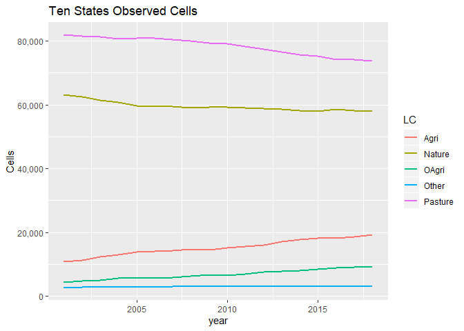
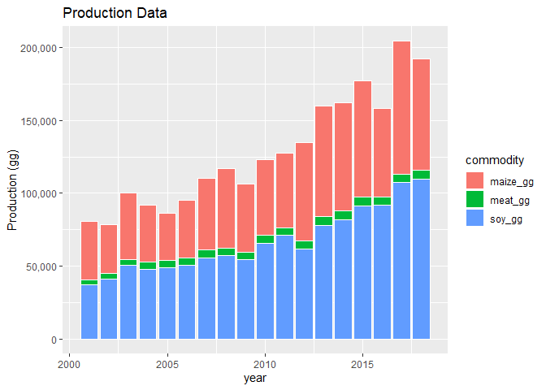
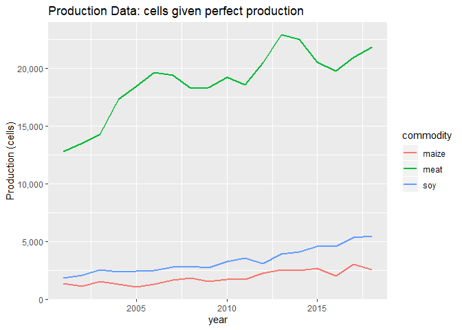
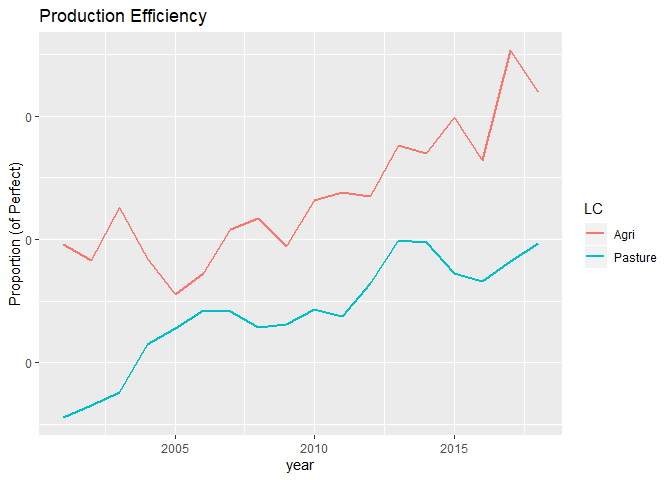
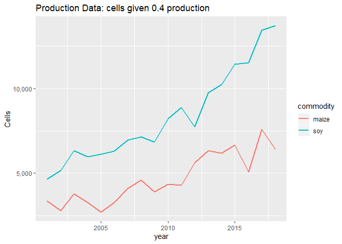

```r
rm(list=ls())
library(tidyverse)
library(readxl)
```

Using Summary Table data for observed Land Cover (PastureB classification)

```r
yrs <- seq(2001, 2015, 1)

#load the region file (used to match each cell to a municipality)
region <- read.csv("SummaryTables/region2000_moistureDev.csv")

#for debugging
#i <- 1


#loop through all years
for(i in seq_along(yrs)){
  
  #if this is the first year, create lc_dat
  if(i == 1){
    lc_dat <- read_csv(paste0("SummaryTables/LCs",yrs[i],"_PastureB.csv"))   #load empirical map summary data (created using summarise_LCmaps.r)
    lc_dat <- lc_dat %>%
      mutate(year = yrs[i]) 
  }
  
  #if this is not the first year, bind new year data to lc_dat
  else {
    
    lc <- read_csv(paste0("SummaryTables/LCs",yrs[i],"_PastureB.csv"))   #load empirical map summary data (created using summarise_LCmaps.r)
    lc <- lc %>%
      mutate(year = yrs[i])
    
    lc_dat <- bind_rows(lc_dat, lc)
  }
  
}  

#add state ID
lc_dat <- lc_dat %>%
  mutate(state = (muniID %/% 100000)) %>%
  mutate(state = if_else(state == 17, "TO", 
      if_else(state == 29, "BA",
      if_else(state == 31, "MG",
      if_else(state == 35, "SP",
      if_else(state == 41, "PR",
      if_else(state == 42, "SC",
      if_else(state == 43, "RS", 
      if_else(state == 50, "MS",
      if_else(state == 51, "MT",
      if_else(state == 52, "GO", "NA"
      ))))))))))
    )

#LC1 = Nature
#LC2 = Other Agri
#LC3 = Agri
#LC4 = Other
#LC5 = Pasture

#add observed cell count columns  
lc_dat <- lc_dat %>%
      mutate(Nature = round(LC1 * NonNAs,0)) %>%
      mutate(OAgri = round(LC2 * NonNAs,0)) %>%
      mutate(Agri = round(LC3 * NonNAs,0)) %>%
      mutate(Other = round(LC4 * NonNAs,0)) %>%
      mutate(Pasture = round(LC5 * NonNAs,0))

#make data long
lc_cells_long <- lc_dat %>%
  select(year:Pasture) %>%
  gather(key = LC, value = cells, -year, -state)

write_csv(lc_cells_long, "lc_cells_long.csv") 

#calculate state totals
lc_cells_long_states <- lc_cells_long %>% 
  group_by(state, year,LC) %>%
  summarise_at(vars(matches("cells")),sum, na.rm=T)

write_csv(lc_cells_long_states, "lc_cells_long_states2.csv") 
```


Plot observed land cover by state through time

```r
lc_cells_long_states %>% 
  ggplot(aes(x = year, y = cells, fill = LC)) + 
  geom_bar(stat = "identity") +
  scale_y_continuous(name = "Cells", labels = scales::comma) +
  facet_grid(.~state) +
  ggtitle("Ten States Observed Cells") + 
  theme(axis.text.x = element_text(angle = 90, vjust = 0.5))
```

<!-- -->


Plot observed land cover for all 10 simulation states through time

```r
lc_cells_long_brazil <- lc_cells_long_states %>% 
  group_by(year,LC) %>%
  summarise_at(vars(matches("cells")),sum)

#lc_cells_long_brazil %>% 
#  spread(key=LC, value=cells) %>%
#  write_csv("SummaryTables_cells.csv")

lc_cells_long_brazil %>% 
  ggplot(aes(x = year, y = cells, fill = LC)) + 
  geom_bar(stat = "identity", colour="white") +
  scale_y_continuous(name = "Cells", labels = scales::comma) +
  #facet_grid(.~state) +
  ggtitle("Ten States Observed Cells")
```

<!-- -->

```r
lc_cells_long_brazil %>% 
  ggplot(aes(x = year, y = cells, colour = LC)) + 
  geom_line(size = 1) +
  scale_y_continuous(name = "Cells", labels = scales::comma) +
  #facet_grid(.~state) +
  ggtitle("Ten States Observed Cells")
```

<!-- -->


Use production data from IBGE

```r
##Load Production Data
meat_prod_Astates_Data <- read_excel("ProductionData/Cattle_meat_production_Kg_2000_2017_all_states.xlsx", sheet = "Plan1", skip = 1)  #data for all states Astates

#dairy data are by municiaplity for all states (Amunis)
dairy_prod_Amunis_Data <- read_excel("ProductionData/dairy_Municipalities_Brazil.xlsx", sheet = "Tabela", skip = 1, na = c("", "-", "..."))

#maize data are by municiaplity for all states (Amunis)
maize_prod_Amunis_Data <- read_excel("ProductionData/maize_brazil.xlsx", sheet = "Production (tons)", skip = 1, na = c("", "-", "..."))

#maize data are by municiaplity for all states (Amunis)
maize2_prod_Amunis_Data <- read_excel("ProductionData/maize2_brazil.xlsx", sheet = "Production (tons)", skip = 1, na = c("", "-", "..."), col_types = c("numeric", "guess","numeric","numeric","numeric","numeric","numeric","numeric","numeric","numeric","numeric","numeric","numeric","numeric","numeric","numeric","numeric"))  #need to specify for 2010 column

#maize data are by municiaplity for all states (Amunis)
soy_prod_Amunis_Data <- read_excel("ProductionData/soybean_brazil.xlsx", sheet = "Production (Tons)", skip = 1, na = c("", "-", "..."))


Fstate_vals <- c(17,	29,	31,	35,	41,	42,	43,	50,	51,	52)
Fstate_abbrev <- c("TO", "BA", "MG", "SP", "PR",  "SC", "RS", "MS", "MT", "GO")

Astate_codes <- meat_prod_Astates_Data %>%
  dplyr::select(NM_UF_SIGLA, CD_GCUF) %>%
  rename(state = NM_UF_SIGLA, stateid = CD_GCUF) %>%
  filter(!is.na(state))    #safer way to remove text line at bottom of state column
  

##MEAT
meat_prod_Astates <- meat_prod_Astates_Data %>%
  rename(state = NM_UF_SIGLA) %>%
  dplyr::select(-NM_UF, -CD_GCUF, -`2016`, -`2017`) %>%      #drop columns
  filter(!is.na(state)) %>%   #safer way to remove text line at bottom of state column
  mutate_at(vars("2000":"2015"), as.numeric) 

meat_prod_Astates_long <- meat_prod_Astates %>%
   gather(key = year, value = meat_kg, -state) %>%
   mutate_at(vars(year), as.integer) %>%
   mutate(meat_gg = meat_kg * 0.000001) %>%  #convert from kg to gg
   dplyr::select(-meat_kg)

##DAIRY
dairy_prod_Amunis <- dairy_prod_Amunis_Data %>%
  rename(muniID = `IBGE CODE`) %>%
  filter(!is.na(muniID)) %>%   #safer way to remove text line in muniID
  mutate(state = substr(muniID, 1, 2)) %>%     #extract the muniID
  mutate_at(vars("2000":"2015"), as.numeric) %>%  #convert values to numeric
  dplyr::select(-Municipality)   #drop unwanted columns

dairy_prod_Astates <- dairy_prod_Amunis %>%
  group_by(state) %>%
  mutate_all(funs(. * 1.03 * 1000)) %>%     #convert from thousand litres to kgs
  summarise_all(sum, na.rm=T) %>%    #summarise munis to states
  mutate(state=replace(state, 1:length(Astate_codes$stateid), Astate_codes$state)) #re-label stated ids with state abbrevs

dairy_prod_Astates_long <- dairy_prod_Astates %>%
  gather(key = year, value = dairy_kg, -state, -muniID) %>%
  mutate_at(vars(year), as.integer) %>%
  mutate(dairy_gg = dairy_kg * 0.000001) %>%  #convert from kg to gg
  dplyr::select(-dairy_kg, -muniID)


#MAIZE
#has the same data strucutre (with some differences in unit conversions - could write function to cover both?) 
maize_prod_Amunis <- maize_prod_Amunis_Data %>%
  rename(muniID = `IBGE CODE`) %>%
  filter(!is.na(muniID)) %>%   #safer way to remove text line in muniID
  mutate(state = substr(muniID, 1, 2)) %>%     #extract the muniID
  mutate_at(vars("2000":"2015"), as.numeric) %>%  #convert values to numeric
  dplyr::select(-Municipality)   #drop unwanted columns

maize_prod_Astates <- maize_prod_Amunis %>%
  group_by(state) %>%
  summarise_all(sum, na.rm=T) %>%    #summarise munis to states
  mutate(state=replace(state, 1:length(Astate_codes$stateid), Astate_codes$state)) #re-label stated ids with state abbrevs

maize_prod_Astates_long <- maize_prod_Astates %>%
  gather(key = year, value = maize_kg, -state, -muniID) %>%
  mutate_at(vars(year), as.integer) %>%
  mutate(maize_gg = maize_kg * 0.001) %>%  #convert from tons to gg
  dplyr::select(-maize_kg, -muniID)

#MAIZE2
maize2_prod_Amunis <- maize2_prod_Amunis_Data %>%
  rename(muniID = `IBGE CODE`) %>%
  filter(!is.na(muniID)) %>%   #safer way to remove text line in muniID
  mutate(state = substr(muniID, 1, 2)) %>%     #extract the muniID
  mutate_at(vars("2003":"2015"), as.numeric) %>%  #convert values to numeric
  dplyr::select(-Municipality)   #drop unwanted columns

maize2_prod_Astates <- maize2_prod_Amunis %>%
  group_by(state) %>%
  summarise_all(sum, na.rm=T) %>%    #summarise munis to states
  mutate(state=replace(state, 1:length(Astate_codes$stateid), Astate_codes$state)) #re-label stated ids with state abbrevs

maize2_prod_Astates_long <- maize2_prod_Astates %>%
  gather(key = year, value = maize2_kg, -state, -muniID) %>%
  mutate_at(vars(year), as.integer) %>%
  mutate(maize2_gg = maize2_kg * 0.001) %>%  #convert from tons to gg
  dplyr::select(-maize2_kg, -muniID)


##SOY
soy_prod_Amunis <- soy_prod_Amunis_Data %>%
  rename(muniID = `IBGE CODE`) %>%
  filter(!is.na(muniID)) %>%   #safer way to remove text line in muniID
  mutate(state = substr(muniID, 1, 2)) %>%     #extract the muniID
  mutate_at(vars("2000":"2015"), as.numeric) %>%  #convert values to numeric
  dplyr::select(-Municipality)   #drop unwanted columns

soy_prod_Astates <- soy_prod_Amunis %>%
  group_by(state) %>%
  summarise_all(sum, na.rm=T) %>%    #summarise munis to states
  mutate(state=replace(state, 1:length(Astate_codes$stateid), Astate_codes$state)) #re-label stated ids with state abbrevs

soy_prod_Astates_long <- soy_prod_Astates %>%
  gather(key = year, value = soy_kg, -state, -muniID) %>%
  mutate_at(vars(year), as.integer) %>%
  mutate(soy_gg = soy_kg * 0.001) %>%  #convert from tons to gg
  dplyr::select(-soy_kg, -muniID)

prod_state_year <- left_join(meat_prod_Astates_long, dairy_prod_Astates_long, by = c("year", "state"))

prod_state_year <- left_join(prod_state_year, maize_prod_Astates_long, by = c("year", "state"))

prod_state_year <- left_join(prod_state_year, maize2_prod_Astates_long, by = c("year", "state"))

prod_state_year <- left_join(prod_state_year, soy_prod_Astates_long, by = c("year", "state"))

#add focal states indicator
prod_state_year <- prod_state_year %>%
  mutate(simulated = state %in% Fstate_abbrev) 

psy_long <- prod_state_year %>%
  gather(key = commodity, value = gg, -state, -year, -simulated)

psimy_long <- psy_long %>%
  group_by(simulated, year, commodity) %>%
  summarise(sumsim = sum(gg, na.rm=T))

prod_state_year
```

<div data-pagedtable="false">
  <script data-pagedtable-source type="application/json">
{"columns":[{"label":["state"],"name":[1],"type":["chr"],"align":["left"]},{"label":["year"],"name":[2],"type":["int"],"align":["right"]},{"label":["meat_gg"],"name":[3],"type":["dbl"],"align":["right"]},{"label":["dairy_gg"],"name":[4],"type":["dbl"],"align":["right"]},{"label":["maize_gg"],"name":[5],"type":["dbl"],"align":["right"]},{"label":["maize2_gg"],"name":[6],"type":["dbl"],"align":["right"]},{"label":["soy_gg"],"name":[7],"type":["dbl"],"align":["right"]},{"label":["simulated"],"name":[8],"type":["lgl"],"align":["right"]}],"data":[{"1":"RO","2":"2000","3":"97.877050","4":"434.92368","5":"204.146","6":"NA","7":"36.222","8":"FALSE"},{"1":"AC","2":"2000","3":"38.732944","4":"42.02709","5":"48.379","6":"NA","7":"0.000","8":"FALSE"},{"1":"AM","2":"2000","3":"0.000000","4":"37.78040","5":"17.966","6":"NA","7":"1.428","8":"FALSE"},{"1":"RR","2":"2000","3":"0.000000","4":"10.25674","5":"19.500","6":"NA","7":"0.000","8":"FALSE"},{"1":"PA","2":"2000","3":"233.569268","4":"391.73475","5":"532.331","6":"NA","7":"2.602","8":"FALSE"},{"1":"AP","2":"2000","3":"0.000000","4":"3.84808","5":"0.854","6":"NA","7":"0.000","8":"FALSE"},{"1":"TO","2":"2000","3":"110.798381","4":"160.70678","5":"121.387","6":"NA","7":"144.362","8":"TRUE"},{"1":"MA","2":"2000","3":"81.384253","4":"154.48249","5":"322.264","6":"NA","7":"454.781","8":"FALSE"},{"1":"PI","2":"2000","3":"23.467009","4":"78.85165","5":"229.328","6":"NA","7":"100.963","8":"FALSE"},{"1":"CE","2":"2000","3":"65.887770","4":"341.82301","5":"623.630","6":"NA","7":"0.000","8":"FALSE"},{"1":"RN","2":"2000","3":"10.461722","4":"149.27481","5":"57.564","6":"NA","7":"0.000","8":"FALSE"},{"1":"PB","2":"2000","3":"3.474122","4":"109.02035","5":"125.242","6":"NA","7":"0.000","8":"FALSE"},{"1":"PE","2":"2000","3":"57.330623","4":"300.90214","5":"139.729","6":"NA","7":"0.000","8":"FALSE"},{"1":"AL","2":"2000","3":"24.796955","4":"224.42258","5":"42.544","6":"NA","7":"0.000","8":"FALSE"},{"1":"SE","2":"2000","3":"0.000000","4":"118.59317","5":"86.931","6":"NA","7":"0.000","8":"FALSE"},{"1":"BA","2":"2000","3":"81.137353","4":"746.64803","5":"1321.569","6":"NA","7":"1508.115","8":"TRUE"},{"1":"MG","2":"2000","3":"231.299844","4":"6041.44852","5":"4232.225","6":"NA","7":"1438.829","8":"TRUE"},{"1":"ES","2":"2000","3":"37.585391","4":"389.41004","5":"112.342","6":"NA","7":"0.000","8":"FALSE"},{"1":"RJ","2":"2000","3":"14.958824","4":"482.81559","5":"32.026","6":"NA","7":"0.000","8":"FALSE"},{"1":"SP","2":"2000","3":"561.621045","4":"1917.27496","5":"3060.090","6":"NA","7":"1190.110","8":"TRUE"},{"1":"PR","2":"2000","3":"181.113460","4":"1853.22956","5":"7354.043","6":"NA","7":"7188.386","8":"TRUE"},{"1":"SC","2":"2000","3":"48.617974","4":"1033.20742","5":"3403.265","6":"NA","7":"524.688","8":"TRUE"},{"1":"RS","2":"2000","3":"288.556520","4":"2165.08575","5":"3936.202","6":"NA","7":"4783.895","8":"TRUE"},{"1":"MS","2":"2000","3":"775.372279","4":"440.07574","5":"1069.571","6":"NA","7":"2486.120","8":"TRUE"},{"1":"MT","2":"2000","3":"453.637692","4":"435.42117","5":"1429.672","6":"NA","7":"8774.470","8":"TRUE"},{"1":"GO","2":"2000","3":"455.207954","4":"2259.61297","5":"3659.475","6":"NA","7":"4092.934","8":"TRUE"},{"1":"DF","2":"2000","3":"0.000000","4":"37.40754","5":"138.725","6":"NA","7":"92.921","8":"FALSE"},{"1":"RO","2":"2001","3":"127.545365","4":"489.86388","5":"169.077","6":"NA","7":"68.687","8":"FALSE"},{"1":"AC","2":"2001","3":"47.621523","4":"88.34825","5":"45.559","6":"NA","7":"0.000","8":"FALSE"},{"1":"AM","2":"2001","3":"0.000000","4":"38.83409","5":"14.296","6":"NA","7":"1.530","8":"FALSE"},{"1":"RR","2":"2001","3":"0.000000","4":"9.31429","5":"15.510","6":"NA","7":"0.000","8":"FALSE"},{"1":"PA","2":"2001","3":"260.797449","4":"472.94716","5":"484.092","6":"NA","7":"2.291","8":"FALSE"},{"1":"AP","2":"2001","3":"0.000000","4":"3.40724","5":"1.465","6":"NA","7":"0.000","8":"FALSE"},{"1":"TO","2":"2001","3":"107.983064","4":"171.00266","5":"121.259","6":"NA","7":"188.226","8":"TRUE"},{"1":"MA","2":"2001","3":"91.084723","4":"160.11144","5":"320.236","6":"NA","7":"491.083","8":"FALSE"},{"1":"PI","2":"2001","3":"23.438576","4":"79.95993","5":"144.540","6":"NA","7":"128.315","8":"FALSE"},{"1":"CE","2":"2001","3":"66.406595","4":"337.97390","5":"244.580","6":"NA","7":"0.000","8":"FALSE"},{"1":"RN","2":"2001","3":"11.475925","4":"147.37343","5":"7.716","6":"NA","7":"0.000","8":"FALSE"},{"1":"PB","2":"2001","3":"4.566969","4":"108.71650","5":"7.723","6":"NA","7":"0.000","8":"FALSE"},{"1":"PE","2":"2001","3":"72.506737","4":"371.07913","5":"20.514","6":"NA","7":"0.000","8":"FALSE"},{"1":"AL","2":"2001","3":"25.131791","4":"251.36635","5":"27.510","6":"NA","7":"0.000","8":"FALSE"},{"1":"SE","2":"2001","3":"0.000000","4":"116.26434","5":"46.726","6":"NA","7":"0.000","8":"FALSE"},{"1":"BA","2":"2001","3":"94.162398","4":"761.28021","5":"992.852","6":"NA","7":"1407.600","8":"TRUE"},{"1":"MG","2":"2001","3":"284.653628","4":"6160.66381","5":"4021.411","6":"NA","7":"1390.635","8":"TRUE"},{"1":"ES","2":"2001","3":"35.340009","4":"373.10102","5":"114.779","6":"NA","7":"0.000","8":"FALSE"},{"1":"RJ","2":"2001","3":"21.927623","4":"460.07422","5":"26.836","6":"NA","7":"0.000","8":"FALSE"},{"1":"SP","2":"2001","3":"795.116025","4":"1836.51472","5":"4200.120","6":"NA","7":"1355.680","8":"TRUE"},{"1":"PR","2":"2001","3":"197.984942","4":"1946.32405","5":"12646.564","6":"NA","7":"8615.187","8":"TRUE"},{"1":"SC","2":"2001","3":"43.933403","4":"1108.37888","5":"3946.870","6":"NA","7":"534.321","8":"TRUE"},{"1":"RS","2":"2001","3":"242.523158","4":"2288.72489","5":"6134.207","6":"NA","7":"6951.830","8":"TRUE"},{"1":"MS","2":"2001","3":"776.814403","4":"458.53334","5":"2185.846","6":"NA","7":"3115.030","8":"TRUE"},{"1":"MT","2":"2001","3":"505.800010","4":"456.09327","5":"1743.043","6":"NA","7":"9533.286","8":"TRUE"},{"1":"GO","2":"2001","3":"467.371755","4":"2391.39323","5":"4157.387","6":"NA","7":"4052.169","8":"TRUE"},{"1":"DF","2":"2001","3":"0.000000","4":"37.69491","5":"121.757","6":"NA","7":"71.389","8":"FALSE"},{"1":"RO","2":"2002","3":"203.448423","4":"663.42300","5":"153.014","6":"NA","7":"83.782","8":"FALSE"},{"1":"AC","2":"2002","3":"51.532279","4":"106.96447","5":"51.508","6":"NA","7":"0.000","8":"FALSE"},{"1":"AM","2":"2002","3":"0.000000","4":"40.75916","5":"15.329","6":"NA","7":"3.189","8":"FALSE"},{"1":"RR","2":"2002","3":"0.000000","4":"8.44600","5":"19.220","6":"NA","7":"0.000","8":"FALSE"},{"1":"PA","2":"2002","3":"305.789246","4":"599.10156","5":"416.322","6":"NA","7":"7.535","8":"FALSE"},{"1":"AP","2":"2002","3":"0.000000","4":"3.44123","5":"1.470","6":"NA","7":"0.000","8":"FALSE"},{"1":"TO","2":"2002","3":"134.264991","4":"191.65519","5":"126.700","6":"NA","7":"244.329","8":"TRUE"},{"1":"MA","2":"2002","3":"110.626246","4":"201.30938","5":"327.318","6":"NA","7":"561.718","8":"FALSE"},{"1":"PI","2":"2002","3":"23.209550","4":"77.17584","5":"82.700","6":"NA","7":"91.014","8":"FALSE"},{"1":"CE","2":"2002","3":"67.883448","4":"351.26502","5":"629.447","6":"NA","7":"0.294","8":"FALSE"},{"1":"RN","2":"2002","3":"13.739557","4":"163.01810","5":"68.722","6":"NA","7":"0.000","8":"FALSE"},{"1":"PB","2":"2002","3":"13.721708","4":"120.54090","5":"91.870","6":"NA","7":"0.000","8":"FALSE"},{"1":"PE","2":"2002","3":"79.055609","4":"399.70489","5":"86.675","6":"NA","7":"0.000","8":"FALSE"},{"1":"AL","2":"2002","3":"25.609034","4":"230.73854","5":"40.686","6":"NA","7":"0.000","8":"FALSE"},{"1":"SE","2":"2002","3":"13.886134","4":"115.53304","5":"38.380","6":"NA","7":"0.000","8":"FALSE"},{"1":"BA","2":"2002","3":"101.383378","4":"774.58781","5":"849.743","6":"NA","7":"1464.000","8":"TRUE"},{"1":"MG","2":"2002","3":"309.724582","4":"6362.68286","5":"4808.170","6":"NA","7":"1951.342","8":"TRUE"},{"1":"ES","2":"2002","3":"43.181057","4":"386.14391","5":"138.045","6":"NA","7":"0.000","8":"FALSE"},{"1":"RJ","2":"2002","3":"17.898778","4":"460.82097","5":"23.255","6":"NA","7":"0.000","8":"FALSE"},{"1":"SP","2":"2002","3":"857.318829","4":"1798.27597","5":"3943.470","6":"NA","7":"1560.520","8":"TRUE"},{"1":"PR","2":"2002","3":"219.350444","4":"2044.89917","5":"9797.816","6":"NA","7":"9538.774","8":"TRUE"},{"1":"SC","2":"2002","3":"48.618774","4":"1228.47997","5":"3100.031","6":"NA","7":"529.941","8":"TRUE"},{"1":"RS","2":"2002","3":"227.606238","4":"2399.50345","5":"3901.171","6":"NA","7":"5610.518","8":"TRUE"},{"1":"MS","2":"2002","3":"768.600342","4":"486.37527","5":"1381.604","6":"NA","7":"3267.084","8":"TRUE"},{"1":"MT","2":"2002","3":"591.999111","4":"481.11094","5":"2311.368","6":"NA","7":"11684.885","8":"TRUE"},{"1":"GO","2":"2002","3":"459.550197","4":"2557.86801","5":"3389.532","6":"NA","7":"5405.589","8":"TRUE"},{"1":"DF","2":"2002","3":"0.000000","4":"38.27789","5":"147.266","6":"NA","7":"103.104","8":"FALSE"},{"1":"RO","2":"2003","3":"210.334762","4":"575.41053","5":"197.166","6":"0.000","7":"126.396","8":"FALSE"},{"1":"AC","2":"2003","3":"51.476045","4":"103.04017","5":"50.946","6":"0.000","7":"0.000","8":"FALSE"},{"1":"AM","2":"2003","3":"0.000000","4":"42.85727","5":"22.189","6":"0.000","7":"5.211","8":"FALSE"},{"1":"RR","2":"2003","3":"0.000000","4":"8.35845","5":"28.440","6":"0.000","7":"0.000","8":"FALSE"},{"1":"PA","2":"2003","3":"342.549804","4":"602.89917","5":"523.816","6":"0.000","7":"43.251","8":"FALSE"},{"1":"AP","2":"2003","3":"0.000000","4":"3.33823","5":"1.059","6":"0.000","7":"0.000","8":"FALSE"},{"1":"TO","2":"2003","3":"135.905257","4":"207.31943","5":"140.757","6":"0.000","7":"377.638","8":"TRUE"},{"1":"MA","2":"2003","3":"123.122888","4":"237.11733","5":"381.679","6":"0.000","7":"660.078","8":"FALSE"},{"1":"PI","2":"2003","3":"22.798424","4":"76.40952","5":"228.388","6":"0.386","7":"308.225","8":"FALSE"},{"1":"CE","2":"2003","3":"64.920721","4":"363.42314","5":"745.317","6":"0.000","7":"1.560","8":"FALSE"},{"1":"RN","2":"2003","3":"11.975245","4":"179.36832","5":"69.569","6":"0.000","7":"0.000","8":"FALSE"},{"1":"PB","2":"2003","3":"11.758812","4":"129.65640","5":"123.880","6":"0.000","7":"0.000","8":"FALSE"},{"1":"PE","2":"2003","3":"76.011614","4":"386.84534","5":"81.458","6":"0.000","7":"0.000","8":"FALSE"},{"1":"AL","2":"2003","3":"31.690243","4":"248.24648","5":"11.889","6":"0.000","7":"0.000","8":"FALSE"},{"1":"SE","2":"2003","3":"13.603353","4":"143.17412","5":"86.595","6":"0.000","7":"0.000","8":"FALSE"},{"1":"BA","2":"2003","3":"110.377443","4":"818.83764","5":"1216.855","6":"0.000","7":"1555.500","8":"TRUE"},{"1":"MG","2":"2003","3":"363.300791","4":"6509.50421","5":"5326.118","6":"111.458","7":"2335.446","8":"TRUE"},{"1":"ES","2":"2003","3":"51.505314","4":"390.62853","5":"132.287","6":"0.000","7":"0.000","8":"FALSE"},{"1":"RJ","2":"2003","3":"15.789840","4":"462.90672","5":"22.911","6":"0.000","7":"0.000","8":"FALSE"},{"1":"SP","2":"2003","3":"846.735475","4":"1838.76630","5":"4732.040","6":"1133.940","7":"1708.938","8":"TRUE"},{"1":"PR","2":"2003","3":"219.774024","4":"2205.70895","5":"14390.104","6":"6000.241","7":"11009.946","8":"TRUE"},{"1":"SC","2":"2003","3":"51.192258","4":"1372.25458","5":"4310.934","6":"0.000","7":"712.175","8":"TRUE"},{"1":"RS","2":"2003","3":"273.089441","4":"2374.93280","5":"5426.124","6":"0.000","7":"9579.297","8":"TRUE"},{"1":"MS","2":"2003","3":"757.112381","4":"496.05624","5":"3071.632","6":"2405.295","7":"4090.892","8":"TRUE"},{"1":"MT","2":"2003","3":"645.158600","4":"506.43040","5":"3192.813","6":"2552.882","7":"12965.983","8":"TRUE"},{"1":"GO","2":"2003","3":"526.740692","4":"2598.74047","5":"3632.636","6":"1068.504","7":"6319.213","8":"TRUE"},{"1":"DF","2":"2003","3":"0.000000","4":"39.34600","5":"179.721","6":"26.515","7":"119.691","8":"FALSE"},{"1":"RO","2":"2004","3":"238.611728","4":"665.83217","5":"240.380","6":"0.000","7":"163.029","8":"FALSE"},{"1":"AC","2":"2004","3":"46.901577","4":"112.42965","5":"68.252","6":"0.000","7":"0.000","8":"FALSE"},{"1":"AM","2":"2004","3":"0.000000","4":"44.20039","5":"24.956","6":"0.000","7":"5.461","8":"FALSE"},{"1":"RR","2":"2004","3":"0.000000","4":"7.50870","5":"24.000","6":"0.000","7":"26.400","8":"FALSE"},{"1":"PA","2":"2004","3":"387.301654","4":"658.27609","5":"570.311","6":"0.000","7":"99.437","8":"FALSE"},{"1":"AP","2":"2004","3":"4.538942","4":"3.37222","5":"0.926","6":"0.000","7":"0.000","8":"FALSE"},{"1":"TO","2":"2004","3":"169.005916","4":"221.16675","5":"143.157","6":"0.000","7":"652.322","8":"TRUE"},{"1":"MA","2":"2004","3":"130.993148","4":"295.46889","5":"408.853","6":"0.000","7":"903.998","8":"FALSE"},{"1":"PI","2":"2004","3":"22.191872","4":"78.02662","5":"134.114","6":"0.911","7":"388.193","8":"FALSE"},{"1":"CE","2":"2004","3":"62.014765","4":"374.17222","5":"379.837","6":"0.000","7":"1.113","8":"FALSE"},{"1":"RN","2":"2004","3":"8.967494","4":"207.30501","5":"60.570","6":"0.000","7":"0.000","8":"FALSE"},{"1":"PB","2":"2004","3":"12.044386","4":"141.44990","5":"72.899","6":"0.000","7":"0.000","8":"FALSE"},{"1":"PE","2":"2004","3":"72.509812","4":"409.48371","5":"65.746","6":"0.000","7":"0.000","8":"FALSE"},{"1":"AL","2":"2004","3":"30.464463","4":"250.72981","5":"29.833","6":"0.000","7":"0.471","8":"FALSE"},{"1":"SE","2":"2004","3":"0.000000","4":"161.69764","5":"136.317","6":"0.000","7":"0.000","8":"FALSE"},{"1":"BA","2":"2004","3":"139.808843","4":"867.83268","5":"1610.524","6":"0.000","7":"2365.290","8":"TRUE"},{"1":"MG","2":"2004","3":"409.439498","4":"6827.79584","5":"5952.172","6":"110.634","7":"2660.714","8":"TRUE"},{"1":"ES","2":"2004","3":"54.337704","4":"417.89160","5":"129.579","6":"0.000","7":"0.000","8":"FALSE"},{"1":"RJ","2":"2004","3":"18.295730","4":"480.93172","5":"24.852","6":"0.323","7":"0.000","8":"FALSE"},{"1":"SP","2":"2004","3":"1077.180404","4":"1791.57788","5":"4647.240","6":"1184.040","7":"1854.230","8":"TRUE"},{"1":"PR","2":"2004","3":"276.807713","4":"2466.38032","5":"10934.582","6":"3360.919","7":"10219.005","8":"TRUE"},{"1":"SC","2":"2004","3":"51.253480","4":"1531.27010","5":"3257.770","6":"0.000","7":"641.748","8":"TRUE"},{"1":"RS","2":"2004","3":"371.331456","4":"2435.89850","5":"3376.862","6":"0.000","7":"5541.714","8":"TRUE"},{"1":"MS","2":"2004","3":"865.321932","4":"505.83094","5":"2374.015","6":"1876.075","7":"3282.705","8":"TRUE"},{"1":"MT","2":"2004","3":"814.195774","4":"567.91213","5":"3408.968","6":"2891.302","7":"14517.912","8":"TRUE"},{"1":"GO","2":"2004","3":"601.626460","4":"2614.52007","5":"3523.279","6":"987.249","7":"6091.676","8":"TRUE"},{"1":"DF","2":"2004","3":"0.000000","4":"40.05464","5":"187.564","6":"27.589","7":"134.523","8":"FALSE"},{"1":"RO","2":"2005","3":"292.833511","4":"713.18539","5":"245.198","6":"0.000","7":"233.281","8":"FALSE"},{"1":"AC","2":"2005","3":"49.402753","4":"82.05495","5":"60.979","6":"0.000","7":"0.114","8":"FALSE"},{"1":"AM","2":"2005","3":"9.726928","4":"45.19949","5":"34.890","6":"0.000","7":"5.136","8":"FALSE"},{"1":"RR","2":"2005","3":"0.000000","4":"5.97091","5":"24.000","6":"0.000","7":"36.400","8":"FALSE"},{"1":"PA","2":"2005","3":"446.469841","4":"717.93781","5":"559.698","6":"0.000","7":"204.302","8":"FALSE"},{"1":"AP","2":"2005","3":"5.807920","4":"4.13648","5":"1.330","6":"0.000","7":"0.000","8":"FALSE"},{"1":"TO","2":"2005","3":"199.498893","4":"227.08719","5":"156.588","6":"0.000","7":"905.328","8":"TRUE"},{"1":"MA","2":"2005","3":"125.871160","4":"330.82467","5":"402.787","6":"0.000","7":"996.909","8":"FALSE"},{"1":"PI","2":"2005","3":"23.054667","4":"81.07645","5":"191.839","6":"0.260","7":"559.545","8":"FALSE"},{"1":"CE","2":"2005","3":"61.448872","4":"379.01837","5":"281.713","6":"0.000","7":"0.630","8":"FALSE"},{"1":"RN","2":"2005","3":"13.996350","4":"217.89032","5":"23.116","6":"0.000","7":"0.000","8":"FALSE"},{"1":"PB","2":"2005","3":"13.994747","4":"153.06212","5":"61.386","6":"0.000","7":"0.000","8":"FALSE"},{"1":"PE","2":"2005","3":"74.875812","4":"542.31251","5":"115.949","6":"0.000","7":"0.000","8":"FALSE"},{"1":"AL","2":"2005","3":"31.193345","4":"243.19021","5":"34.435","6":"0.000","7":"0.984","8":"FALSE"},{"1":"SE","2":"2005","3":"0.000000","4":"197.04930","5":"205.577","6":"0.000","7":"0.000","8":"FALSE"},{"1":"BA","2":"2005","3":"181.825945","4":"916.89570","5":"1616.464","6":"404.389","7":"2401.872","8":"TRUE"},{"1":"MG","2":"2005","3":"450.757748","4":"7115.94864","5":"6243.873","6":"118.893","7":"2937.243","8":"TRUE"},{"1":"ES","2":"2005","3":"54.252988","4":"430.20525","5":"122.212","6":"0.000","7":"0.000","8":"FALSE"},{"1":"RJ","2":"2005","3":"21.462939","4":"478.89541","5":"26.970","6":"0.602","7":"0.000","8":"FALSE"},{"1":"SP","2":"2005","3":"1051.245287","4":"1796.52085","5":"4093.896","6":"792.346","7":"1703.660","8":"TRUE"},{"1":"PR","2":"2005","3":"308.947377","4":"2645.30986","5":"8572.364","6":"2077.195","7":"9492.153","8":"TRUE"},{"1":"SC","2":"2005","3":"62.016996","4":"1602.29478","5":"2695.211","6":"0.000","7":"607.413","8":"TRUE"},{"1":"RS","2":"2005","3":"422.111180","4":"2541.66096","5":"1485.040","6":"0.000","7":"2444.540","8":"TRUE"},{"1":"MS","2":"2005","3":"849.039907","4":"513.63422","5":"1291.901","6":"863.729","7":"3718.514","8":"TRUE"},{"1":"MT","2":"2005","3":"930.797063","4":"614.27861","5":"3483.266","6":"3033.475","7":"17761.444","8":"TRUE"},{"1":"GO","2":"2005","3":"626.468453","4":"2728.06418","5":"2855.538","6":"629.935","7":"6983.860","8":"TRUE"},{"1":"DF","2":"2005","3":"2.590015","4":"35.88726","5":"227.092","6":"31.042","7":"188.746","8":"FALSE"},{"1":"RO","2":"2006","3":"372.880113","4":"656.47462","5":"264.430","6":"0.000","7":"273.701","8":"FALSE"},{"1":"AC","2":"2006","3":"60.864043","4":"101.04094","5":"56.612","6":"0.000","7":"0.024","8":"FALSE"},{"1":"AM","2":"2006","3":"17.327856","4":"46.72801","5":"37.069","6":"0.000","7":"5.138","8":"FALSE"},{"1":"RR","2":"2006","3":"6.859677","4":"5.97297","5":"24.000","6":"0.000","7":"30.800","8":"FALSE"},{"1":"PA","2":"2006","3":"508.031746","4":"711.83403","5":"576.579","6":"0.000","7":"209.864","8":"FALSE"},{"1":"AP","2":"2006","3":"0.000000","4":"4.56702","5":"1.530","6":"0.000","7":"0.000","8":"FALSE"},{"1":"TO","2":"2006","3":"249.575093","4":"223.84681","5":"142.149","6":"0.000","7":"742.891","8":"TRUE"},{"1":"MA","2":"2006","3":"171.330919","4":"351.44424","5":"426.203","6":"0.000","7":"931.142","8":"FALSE"},{"1":"PI","2":"2006","3":"24.698836","4":"82.17546","5":"229.533","6":"0.911","7":"544.086","8":"FALSE"},{"1":"CE","2":"2006","3":"65.157266","4":"391.42678","5":"760.231","6":"0.000","7":"1.026","8":"FALSE"},{"1":"RN","2":"2006","3":"19.702340","4":"242.52174","5":"51.647","6":"0.000","7":"0.000","8":"FALSE"},{"1":"PB","2":"2006","3":"14.526256","4":"159.29774","5":"156.854","6":"0.000","7":"0.000","8":"FALSE"},{"1":"PE","2":"2006","3":"81.607074","4":"649.26050","5":"195.573","6":"0.000","7":"0.000","8":"FALSE"},{"1":"AL","2":"2006","3":"33.017777","4":"235.08926","5":"38.664","6":"0.000","7":"0.264","8":"FALSE"},{"1":"SE","2":"2006","3":"0.000000","4":"249.84813","5":"184.908","6":"0.000","7":"0.000","8":"FALSE"},{"1":"BA","2":"2006","3":"208.993338","4":"932.93074","5":"1124.206","6":"416.311","7":"1991.400","8":"TRUE"},{"1":"MG","2":"2006","3":"551.256448","4":"7306.95184","5":"5152.200","6":"85.652","7":"2453.975","8":"TRUE"},{"1":"ES","2":"2006","3":"60.157199","4":"447.01794","5":"78.377","6":"0.000","7":"0.000","8":"FALSE"},{"1":"RJ","2":"2006","3":"15.472950","4":"482.23982","5":"25.786","6":"0.098","7":"0.000","8":"FALSE"},{"1":"SP","2":"2006","3":"980.550410","4":"1796.34060","5":"4378.380","6":"590.480","7":"1648.100","8":"TRUE"},{"1":"PR","2":"2006","3":"316.897316","4":"2784.69049","5":"11239.987","6":"3561.698","7":"9362.901","8":"TRUE"},{"1":"SC","2":"2006","3":"70.147501","4":"1761.11563","5":"2886.139","6":"0.000","7":"798.809","8":"TRUE"},{"1":"RS","2":"2006","3":"446.798524","4":"2703.89420","5":"4528.143","6":"0.000","7":"7559.291","8":"TRUE"},{"1":"MS","2":"2006","3":"835.387857","4":"504.99355","5":"2342.619","6":"1793.727","7":"4153.542","8":"TRUE"},{"1":"MT","2":"2006","3":"1082.805129","4":"601.36241","5":"4228.423","6":"3725.135","7":"15594.221","8":"TRUE"},{"1":"GO","2":"2006","3":"660.321886","4":"2692.03478","5":"3297.193","6":"972.770","7":"6017.719","8":"TRUE"},{"1":"DF","2":"2006","3":"8.621845","4":"35.14566","5":"234.242","6":"30.171","7":"145.746","8":"FALSE"},{"1":"RO","2":"2007","3":"469.412895","4":"729.59741","5":"249.927","6":"0.000","7":"259.069","8":"FALSE"},{"1":"AC","2":"2007","3":"97.699593","4":"82.90264","5":"56.763","6":"0.000","7":"0.300","8":"FALSE"},{"1":"AM","2":"2007","3":"24.397942","4":"20.08809","5":"29.174","6":"0.000","7":"1.931","8":"FALSE"},{"1":"RR","2":"2007","3":"13.436701","4":"5.76285","5":"12.800","6":"0.000","7":"20.300","8":"FALSE"},{"1":"PA","2":"2007","3":"539.092268","4":"662.48467","5":"562.032","6":"0.000","7":"154.015","8":"FALSE"},{"1":"AP","2":"2007","3":"0.000000","4":"5.91426","5":"1.830","6":"0.000","7":"0.000","8":"FALSE"},{"1":"TO","2":"2007","3":"250.912042","4":"220.10482","5":"157.590","6":"0.000","7":"731.672","8":"TRUE"},{"1":"MA","2":"2007","3":"171.955865","4":"345.84516","5":"466.841","6":"0.000","7":"1125.094","8":"FALSE"},{"1":"PI","2":"2007","3":"26.873734","4":"78.70024","5":"171.101","6":"0.371","7":"484.940","8":"FALSE"},{"1":"CE","2":"2007","3":"68.045652","4":"428.95586","5":"357.342","6":"0.000","7":"1.086","8":"FALSE"},{"1":"RN","2":"2007","3":"24.460162","4":"220.46326","5":"28.191","6":"0.000","7":"0.000","8":"FALSE"},{"1":"PB","2":"2007","3":"16.235547","4":"178.94705","5":"73.693","6":"0.000","7":"0.000","8":"FALSE"},{"1":"PE","2":"2007","3":"91.433617","4":"681.94652","5":"123.816","6":"0.000","7":"0.000","8":"FALSE"},{"1":"AL","2":"2007","3":"37.560810","4":"250.02014","5":"34.111","6":"0.000","7":"0.120","8":"FALSE"},{"1":"SE","2":"2007","3":"0.000000","4":"259.17478","5":"237.129","6":"0.000","7":"0.000","8":"FALSE"},{"1":"BA","2":"2007","3":"234.132047","4":"994.77297","5":"1635.849","6":"499.843","7":"2298.000","8":"TRUE"},{"1":"MG","2":"2007","3":"586.845981","4":"7493.50647","5":"6066.077","6":"101.833","7":"2417.996","8":"TRUE"},{"1":"ES","2":"2007","3":"70.714233","4":"450.90516","5":"91.841","6":"0.000","7":"0.000","8":"FALSE"},{"1":"RJ","2":"2007","3":"28.875927","4":"476.79524","5":"22.631","6":"0.119","7":"0.000","8":"FALSE"},{"1":"SP","2":"2007","3":"989.968631","4":"1676.24981","5":"4190.573","6":"835.664","7":"1243.833","8":"TRUE"},{"1":"PR","2":"2007","3":"295.009711","4":"2782.02691","5":"14258.086","6":"5613.589","7":"11876.790","8":"TRUE"},{"1":"SC","2":"2007","3":"69.857417","4":"1921.53710","5":"3793.364","6":"0.000","7":"1111.456","8":"TRUE"},{"1":"RS","2":"2007","3":"309.331471","4":"3032.00791","5":"5969.118","6":"0.000","7":"9929.005","8":"TRUE"},{"1":"MS","2":"2007","3":"854.283231","4":"504.76798","5":"2972.221","6":"2386.822","7":"4846.031","8":"TRUE"},{"1":"MT","2":"2007","3":"1094.831279","4":"663.53321","5":"6130.082","6":"3860.654","7":"15275.087","8":"TRUE"},{"1":"GO","2":"2007","3":"654.302795","4":"2717.72916","5":"4155.599","6":"1125.134","7":"5937.727","8":"TRUE"},{"1":"DF","2":"2007","3":"8.840948","4":"36.70508","5":"264.436","6":"24.277","7":"142.720","8":"FALSE"},{"1":"RO","2":"2008","3":"393.238384","4":"744.80021","5":"305.601","6":"0.000","7":"311.560","8":"FALSE"},{"1":"AC","2":"2008","3":"88.162877","4":"72.15562","5":"61.088","6":"61.088","7":"0.150","8":"FALSE"},{"1":"AM","2":"2008","3":"22.912034","4":"41.87362","5":"29.313","6":"0.000","7":"0.600","8":"FALSE"},{"1":"RR","2":"2008","3":"16.087394","4":"5.27257","5":"12.800","6":"0.000","7":"22.400","8":"FALSE"},{"1":"PA","2":"2008","3":"491.878822","4":"617.52929","5":"622.414","6":"0.000","7":"201.111","8":"FALSE"},{"1":"AP","2":"2008","3":"1.368838","4":"5.42913","5":"2.406","6":"0.000","7":"0.000","8":"FALSE"},{"1":"TO","2":"2008","3":"191.358127","4":"229.30890","5":"230.270","6":"0.000","7":"894.309","8":"TRUE"},{"1":"MA","2":"2008","3":"173.583350","4":"375.02300","5":"479.728","6":"0.000","7":"1262.665","8":"FALSE"},{"1":"PI","2":"2008","3":"25.921568","4":"80.12473","5":"321.390","6":"0.000","7":"819.258","8":"FALSE"},{"1":"CE","2":"2008","3":"67.630251","4":"437.96218","5":"752.882","6":"0.000","7":"1.665","8":"FALSE"},{"1":"RN","2":"2008","3":"23.601663","4":"225.86252","5":"53.771","6":"0.000","7":"0.000","8":"FALSE"},{"1":"PB","2":"2008","3":"16.849785","4":"199.37813","5":"119.202","6":"0.000","7":"0.000","8":"FALSE"},{"1":"PE","2":"2008","3":"88.688854","4":"747.56679","5":"178.593","6":"0.000","7":"0.000","8":"FALSE"},{"1":"AL","2":"2008","3":"36.753043","4":"243.95859","5":"52.182","6":"0.000","7":"0.432","8":"FALSE"},{"1":"SE","2":"2008","3":"0.000000","4":"267.48894","5":"584.786","6":"0.000","7":"0.000","8":"FALSE"},{"1":"BA","2":"2008","3":"245.218364","4":"980.99260","5":"1884.042","6":"471.414","7":"2747.634","8":"TRUE"},{"1":"MG","2":"2008","3":"638.015084","4":"7887.03960","5":"6611.100","6":"203.674","7":"2566.350","8":"TRUE"},{"1":"ES","2":"2008","3":"84.586541","4":"431.51129","5":"94.641","6":"0.000","7":"0.000","8":"FALSE"},{"1":"RJ","2":"2008","3":"35.814799","4":"489.86285","5":"19.734","6":"0.000","7":"0.000","8":"FALSE"},{"1":"SP","2":"2008","3":"884.582253","4":"1636.61129","5":"4681.177","6":"971.224","7":"1446.108","8":"TRUE"},{"1":"PR","2":"2008","3":"279.609363","4":"2912.78644","5":"15613.442","6":"5951.737","7":"11800.466","8":"TRUE"},{"1":"SC","2":"2008","3":"79.139056","4":"2189.63168","5":"4089.215","6":"0.000","7":"946.463","8":"TRUE"},{"1":"RS","2":"2008","3":"324.656192","4":"3414.02358","5":"5231.885","6":"0.000","7":"7679.939","8":"TRUE"},{"1":"MS","2":"2008","3":"742.067659","4":"510.92532","5":"3675.526","6":"3049.023","7":"4570.771","8":"TRUE"},{"1":"MT","2":"2008","3":"924.877748","4":"676.24959","5":"7799.413","6":"7015.229","7":"17802.976","8":"TRUE"},{"1":"GO","2":"2008","3":"716.683363","4":"2959.74929","5":"5101.543","6":"1334.463","7":"6604.805","8":"TRUE"},{"1":"DF","2":"2008","3":"8.433379","4":"29.87000","5":"325.203","6":"46.701","7":"153.443","8":"FALSE"},{"1":"RO","2":"2009","3":"431.915977","4":"769.28331","5":"368.819","6":"0.000","7":"356.836","8":"FALSE"},{"1":"AC","2":"2009","3":"93.676029","4":"43.87491","5":"57.293","6":"0.000","7":"0.165","8":"FALSE"},{"1":"AM","2":"2009","3":"26.612207","4":"43.00250","5":"29.252","6":"0.000","7":"0.612","8":"FALSE"},{"1":"RR","2":"2009","3":"15.298902","4":"5.27154","5":"12.800","6":"0.000","7":"3.920","8":"FALSE"},{"1":"PA","2":"2009","3":"507.490475","4":"614.65765","5":"552.104","6":"0.000","7":"206.456","8":"FALSE"},{"1":"AP","2":"2009","3":"0.000000","4":"6.90512","5":"2.850","6":"0.000","7":"0.000","8":"FALSE"},{"1":"TO","2":"2009","3":"205.039993","4":"240.01884","5":"250.451","6":"0.000","7":"875.428","8":"TRUE"},{"1":"MA","2":"2009","3":"158.625482","4":"365.73343","5":"524.178","6":"0.000","7":"1211.085","8":"FALSE"},{"1":"PI","2":"2009","3":"25.240998","4":"89.78201","5":"496.279","6":"0.367","7":"780.580","8":"FALSE"},{"1":"CE","2":"2009","3":"64.321753","4":"445.52032","5":"538.962","6":"0.000","7":"3.315","8":"FALSE"},{"1":"RN","2":"2009","3":"20.252494","4":"243.07279","5":"42.282","6":"0.000","7":"0.000","8":"FALSE"},{"1":"PB","2":"2009","3":"15.103299","4":"220.27374","5":"101.241","6":"0.000","7":"0.000","8":"FALSE"},{"1":"PE","2":"2009","3":"85.662651","4":"811.90059","5":"193.059","6":"0.000","7":"0.000","8":"FALSE"},{"1":"AL","2":"2009","3":"32.295671","4":"238.95382","5":"42.382","6":"0.000","7":"0.164","8":"FALSE"},{"1":"SE","2":"2009","3":"14.338974","4":"295.16401","5":"703.294","6":"0.000","7":"0.000","8":"FALSE"},{"1":"BA","2":"2009","3":"258.615460","4":"1217.48987","5":"2157.719","6":"494.192","7":"2426.298","8":"TRUE"},{"1":"MG","2":"2009","3":"574.837024","4":"8169.06699","5":"6536.545","6":"170.023","7":"2751.431","8":"TRUE"},{"1":"ES","2":"2009","3":"79.394062","4":"434.20474","5":"97.139","6":"0.000","7":"0.000","8":"FALSE"},{"1":"RJ","2":"2009","3":"29.532950","4":"497.62699","5":"19.023","6":"0.000","7":"0.000","8":"FALSE"},{"1":"SP","2":"2009","3":"891.588926","4":"1631.41082","5":"3674.059","6":"0.000","7":"1327.105","8":"TRUE"},{"1":"PR","2":"2009","3":"282.220043","4":"3439.49548","5":"11261.704","6":"4447.626","7":"9408.991","8":"TRUE"},{"1":"SC","2":"2009","3":"77.787300","4":"2284.33812","5":"3244.500","6":"0.000","7":"993.991","8":"TRUE"},{"1":"RS","2":"2009","3":"342.453835","4":"3502.19467","5":"4186.862","6":"0.000","7":"8025.322","8":"TRUE"},{"1":"MS","2":"2009","3":"787.269663","4":"517.55646","5":"2181.429","6":"1691.148","7":"4046.223","8":"TRUE"},{"1":"MT","2":"2009","3":"1010.482777","4":"701.01285","5":"8181.984","6":"7742.559","7":"17962.819","8":"TRUE"},{"1":"GO","2":"2009","3":"617.444773","4":"3093.28467","5":"4980.614","6":"1793.097","7":"6809.187","8":"TRUE"},{"1":"DF","2":"2009","3":"0.968925","4":"37.08000","5":"282.998","6":"28.476","7":"155.454","8":"FALSE"},{"1":"RO","2":"2010","3":"443.204227","4":"827.05807","5":"365.980","6":"0.000","7":"385.388","8":"FALSE"},{"1":"AC","2":"2010","3":"109.324332","4":"42.29283","5":"81.125","6":"0.000","7":"0.330","8":"FALSE"},{"1":"AM","2":"2010","3":"40.537354","4":"48.62115","5":"34.880","6":"0.000","7":"0.540","8":"FALSE"},{"1":"RR","2":"2010","3":"16.492191","4":"6.13365","5":"12.800","6":"0.000","7":"3.920","8":"FALSE"},{"1":"PA","2":"2010","3":"499.488696","4":"580.69546","5":"519.258","6":"0.000","7":"243.616","8":"FALSE"},{"1":"AP","2":"2010","3":"0.000000","4":"7.15953","5":"3.233","6":"0.000","7":"0.000","8":"FALSE"},{"1":"TO","2":"2010","3":"211.868603","4":"277.57985","5":"282.475","6":"0.000","7":"991.326","8":"TRUE"},{"1":"MA","2":"2010","3":"134.078898","4":"387.18112","5":"535.853","6":"0.000","7":"1322.363","8":"FALSE"},{"1":"PI","2":"2010","3":"26.683121","4":"89.96638","5":"342.483","6":"0.000","7":"868.493","8":"FALSE"},{"1":"CE","2":"2010","3":"64.043929","4":"457.47656","5":"174.955","6":"0.000","7":"3.417","8":"FALSE"},{"1":"RN","2":"2010","3":"21.707655","4":"236.37882","5":"8.119","6":"0.000","7":"0.000","8":"FALSE"},{"1":"PB","2":"2010","3":"11.446558","4":"223.53266","5":"11.507","6":"0.000","7":"0.000","8":"FALSE"},{"1":"PE","2":"2010","3":"91.018191","4":"903.74569","5":"69.715","6":"0.000","7":"0.000","8":"FALSE"},{"1":"AL","2":"2010","3":"44.218003","4":"238.30904","5":"23.480","6":"0.000","7":"0.000","8":"FALSE"},{"1":"SE","2":"2010","3":"25.217923","4":"305.55156","5":"750.718","6":"750.718","7":"0.000","8":"FALSE"},{"1":"BA","2":"2010","3":"268.871913","4":"1275.72092","5":"2223.302","6":"675.743","7":"3112.929","8":"TRUE"},{"1":"MG","2":"2010","3":"559.345190","4":"8639.68841","5":"6089.941","6":"164.322","7":"2902.464","8":"TRUE"},{"1":"ES","2":"2010","3":"89.118238","4":"450.32115","5":"65.537","6":"0.000","7":"0.000","8":"FALSE"},{"1":"RJ","2":"2010","3":"47.548109","4":"503.44752","5":"17.678","6":"0.000","7":"0.000","8":"FALSE"},{"1":"SP","2":"2010","3":"887.134205","4":"1653.83289","5":"4026.500","6":"0.000","7":"1412.934","8":"TRUE"},{"1":"PR","2":"2010","3":"338.599312","4":"3703.64825","5":"13567.096","6":"6784.919","7":"14091.829","8":"TRUE"},{"1":"SC","2":"2010","3":"116.125890","4":"2452.56493","5":"3653.803","6":"0.000","7":"1378.532","8":"TRUE"},{"1":"RS","2":"2010","3":"426.564677","4":"3742.85108","5":"5633.912","6":"0.000","7":"10480.026","8":"TRUE"},{"1":"MS","2":"2010","3":"796.638088","4":"526.60192","5":"3782.946","6":"3403.128","7":"5340.462","8":"TRUE"},{"1":"MT","2":"2010","3":"1030.711870","4":"729.73646","5":"8164.273","6":"7642.234","7":"18787.783","8":"TRUE"},{"1":"GO","2":"2010","3":"656.052878","4":"3289.54602","5":"4676.483","6":"2112.316","7":"7252.926","8":"TRUE"},{"1":"DF","2":"2010","3":"4.471851","4":"37.34368","5":"246.219","6":"34.460","7":"177.065","8":"FALSE"},{"1":"RO","2":"2011","3":"433.655624","4":"727.84641","5":"340.045","6":"0.000","7":"419.522","8":"FALSE"},{"1":"AC","2":"2011","3":"99.659561","4":"43.52162","5":"81.793","6":"0.000","7":"0.282","8":"FALSE"},{"1":"AM","2":"2011","3":"46.829798","4":"53.59605","5":"35.945","6":"0.000","7":"0.540","8":"FALSE"},{"1":"RR","2":"2011","3":"16.505877","4":"7.22236","5":"11.800","6":"0.000","7":"10.080","8":"FALSE"},{"1":"PA","2":"2011","3":"501.665134","4":"608.27062","5":"541.128","6":"12.000","7":"317.093","8":"FALSE"},{"1":"AP","2":"2011","3":"0.000000","4":"9.76543","5":"2.466","6":"0.000","7":"0.000","8":"FALSE"},{"1":"TO","2":"2011","3":"243.140967","4":"275.32930","5":"312.213","6":"74.758","7":"1193.453","8":"TRUE"},{"1":"MA","2":"2011","3":"162.782918","4":"398.27834","5":"646.209","6":"0.000","7":"1571.418","8":"FALSE"},{"1":"PI","2":"2011","3":"25.739030","4":"91.79257","5":"677.623","6":"0.982","7":"1144.033","8":"FALSE"},{"1":"CE","2":"2011","3":"60.829709","4":"478.53697","5":"915.286","6":"0.000","7":"0.000","8":"FALSE"},{"1":"RN","2":"2011","3":"21.006155","4":"250.54029","5":"47.926","6":"0.477","7":"0.000","8":"FALSE"},{"1":"PB","2":"2011","3":"7.739329","4":"244.21506","5":"62.426","6":"0.000","7":"0.000","8":"FALSE"},{"1":"PE","2":"2011","3":"89.701629","4":"981.82587","5":"124.028","6":"15.208","7":"0.000","8":"FALSE"},{"1":"AL","2":"2011","3":"46.652669","4":"245.39853","5":"33.393","6":"0.000","7":"0.000","8":"FALSE"},{"1":"SE","2":"2011","3":"24.914361","4":"325.45322","5":"480.476","6":"480.476","7":"0.000","8":"FALSE"},{"1":"BA","2":"2011","3":"258.584017","4":"1216.78226","5":"2051.623","6":"308.641","7":"3512.568","8":"TRUE"},{"1":"MG","2":"2011","3":"484.494766","4":"9018.78609","5":"6536.187","6":"327.352","7":"2940.857","8":"TRUE"},{"1":"ES","2":"2011","3":"69.089016","4":"464.83076","5":"81.924","6":"0.521","7":"0.000","8":"FALSE"},{"1":"RJ","2":"2011","3":"38.918063","4":"514.50560","5":"18.278","6":"1.336","7":"0.000","8":"FALSE"},{"1":"SP","2":"2011","3":"809.285988","4":"1649.26793","5":"3362.555","6":"722.031","7":"1271.437","8":"TRUE"},{"1":"PR","2":"2011","3":"279.585426","4":"3930.04740","5":"12472.720","6":"6361.147","7":"15457.911","8":"TRUE"},{"1":"SC","2":"2011","3":"92.940531","4":"2607.09686","5":"3651.825","6":"0.000","7":"1490.551","8":"TRUE"},{"1":"RS","2":"2011","3":"412.341731","4":"3995.84483","5":"5772.422","6":"0.000","7":"11717.548","8":"TRUE"},{"1":"MS","2":"2011","3":"768.861658","4":"537.48696","5":"3628.492","6":"3305.220","7":"5079.581","8":"TRUE"},{"1":"MT","2":"2011","3":"1085.217724","4":"765.48570","5":"7763.942","6":"7424.864","7":"20800.544","8":"TRUE"},{"1":"GO","2":"2011","3":"670.540931","4":"3586.50532","5":"5743.622","6":"3102.921","7":"7703.982","8":"TRUE"},{"1":"DF","2":"2011","3":"8.494779","4":"30.90000","5":"263.888","6":"34.541","7":"184.047","8":"FALSE"},{"1":"RO","2":"2012","3":"479.166300","4":"738.33696","5":"534.423","6":"0.750","7":"470.485","8":"FALSE"},{"1":"AC","2":"2012","3":"90.486083","4":"44.01499","5":"96.687","6":"0.000","7":"0.000","8":"FALSE"},{"1":"AM","2":"2012","3":"47.621095","4":"49.61304","5":"36.697","6":"0.000","7":"0.660","8":"FALSE"},{"1":"RR","2":"2012","3":"8.294636","4":"9.05885","5":"11.800","6":"0.000","7":"14.000","8":"FALSE"},{"1":"PA","2":"2012","3":"524.229838","4":"577.74348","5":"604.799","6":"8.150","7":"373.398","8":"FALSE"},{"1":"AP","2":"2012","3":"0.000000","4":"11.32794","5":"2.120","6":"0.000","7":"0.000","8":"FALSE"},{"1":"TO","2":"2012","3":"239.935660","4":"277.98670","5":"370.940","6":"187.004","7":"1276.928","8":"TRUE"},{"1":"MA","2":"2012","3":"158.020499","4":"393.08508","5":"783.491","6":"134.279","7":"1640.183","8":"FALSE"},{"1":"PI","2":"2012","3":"27.705688","4":"87.65815","5":"769.387","6":"1.471","7":"1242.574","8":"FALSE"},{"1":"CE","2":"2012","3":"54.867552","4":"475.51598","5":"122.501","6":"0.000","7":"3.854","8":"FALSE"},{"1":"RN","2":"2012","3":"22.444657","4":"203.98635","5":"2.489","6":"0.548","7":"0.000","8":"FALSE"},{"1":"PB","2":"2012","3":"19.206571","4":"146.82341","5":"6.548","6":"0.000","7":"0.000","8":"FALSE"},{"1":"PE","2":"2012","3":"65.477449","4":"627.32459","5":"22.054","6":"4.106","7":"0.000","8":"FALSE"},{"1":"AL","2":"2012","3":"42.627976","4":"253.01847","5":"1.650","6":"0.028","7":"0.000","8":"FALSE"},{"1":"SE","2":"2012","3":"27.684537","4":"307.47457","5":"290.575","6":"290.575","7":"0.000","8":"FALSE"},{"1":"BA","2":"2012","3":"273.550962","4":"1111.47094","5":"1882.938","6":"135.011","7":"3212.789","8":"TRUE"},{"1":"MG","2":"2012","3":"581.738382","4":"9173.16249","5":"7625.142","6":"533.626","7":"3073.499","8":"TRUE"},{"1":"ES","2":"2012","3":"64.145313","4":"470.24753","5":"77.233","6":"1.649","7":"0.000","8":"FALSE"},{"1":"RJ","2":"2012","3":"37.723776","4":"555.06082","5":"15.009","6":"1.219","7":"0.000","8":"FALSE"},{"1":"SP","2":"2012","3":"832.998843","4":"1740.41572","5":"4478.520","6":"1321.023","7":"1566.956","8":"TRUE"},{"1":"PR","2":"2012","3":"314.985686","4":"4087.56324","5":"16555.330","6":"9914.343","7":"10937.896","8":"TRUE"},{"1":"SC","2":"2012","3":"93.982255","4":"2799.18259","5":"2870.450","6":"0.000","7":"1079.690","8":"TRUE"},{"1":"RS","2":"2012","3":"424.430429","4":"4170.97985","5":"3155.061","6":"0.000","7":"5945.243","8":"TRUE"},{"1":"MS","2":"2012","3":"945.895938","4":"540.46263","5":"6477.070","6":"6011.235","7":"4594.359","8":"TRUE"},{"1":"MT","2":"2012","3":"1220.217278","4":"744.01741","5":"15646.716","6":"15079.519","7":"21841.292","8":"TRUE"},{"1":"GO","2":"2012","3":"716.300111","4":"3652.72402","5":"8230.069","6":"4564.317","7":"8398.891","8":"TRUE"},{"1":"DF","2":"2012","3":"8.988577","4":"25.34830","5":"403.111","6":"65.043","7":"176.160","8":"FALSE"},{"1":"RO","2":"2013","3":"541.362013","4":"948.10985","5":"449.449","6":"335.041","7":"574.900","8":"FALSE"},{"1":"AC","2":"2013","3":"95.198983","4":"48.53772","5":"124.536","6":"0.000","7":"0.154","8":"FALSE"},{"1":"AM","2":"2013","3":"47.640244","4":"50.43910","5":"27.610","6":"0.000","7":"0.060","8":"FALSE"},{"1":"RR","2":"2013","3":"16.466062","4":"10.44317","5":"15.438","6":"0.000","7":"40.200","8":"FALSE"},{"1":"PA","2":"2013","3":"586.302228","4":"555.67367","5":"613.546","6":"53.265","7":"506.347","8":"FALSE"},{"1":"AP","2":"2013","3":"0.000000","4":"11.27747","5":"2.011","6":"0.000","7":"12.906","8":"FALSE"},{"1":"TO","2":"2013","3":"273.393210","4":"277.33368","5":"350.669","6":"175.211","7":"1557.939","8":"TRUE"},{"1":"MA","2":"2013","3":"163.850842","4":"397.45743","5":"1321.683","6":"565.154","7":"1581.687","8":"FALSE"},{"1":"PI","2":"2013","3":"34.716659","4":"85.01620","5":"485.043","6":"0.718","7":"920.950","8":"FALSE"},{"1":"CE","2":"2013","3":"49.988064","4":"469.12380","5":"112.741","6":"2.485","7":"0.000","8":"FALSE"},{"1":"RN","2":"2013","3":"22.698980","4":"215.42553","5":"11.924","6":"0.132","7":"0.000","8":"FALSE"},{"1":"PB","2":"2013","3":"17.939126","4":"161.97780","5":"27.452","6":"0.000","7":"0.000","8":"FALSE"},{"1":"PE","2":"2013","3":"69.232219","4":"578.68696","5":"23.922","6":"22.899","7":"0.000","8":"FALSE"},{"1":"AL","2":"2013","3":"43.204126","4":"259.70317","5":"8.749","6":"0.128","7":"0.000","8":"FALSE"},{"1":"SE","2":"2013","3":"24.777885","4":"341.34612","5":"700.902","6":"700.902","7":"0.000","8":"FALSE"},{"1":"BA","2":"2013","3":"299.993719","4":"1197.48830","5":"2109.906","6":"687.820","7":"2765.533","8":"TRUE"},{"1":"MG","2":"2013","3":"707.021750","4":"9588.43068","5":"7447.665","6":"620.146","7":"3375.690","8":"TRUE"},{"1":"ES","2":"2013","3":"74.807372","4":"479.74825","5":"62.831","6":"1.913","7":"0.000","8":"FALSE"},{"1":"RJ","2":"2013","3":"41.399501","4":"586.15755","5":"13.321","6":"0.902","7":"0.000","8":"FALSE"},{"1":"SP","2":"2013","3":"894.741266","4":"1726.20378","5":"4408.375","6":"1173.744","7":"1844.951","8":"TRUE"},{"1":"PR","2":"2013","3":"333.179882","4":"4477.92294","5":"17342.302","6":"10298.084","7":"15937.620","8":"TRUE"},{"1":"SC","2":"2013","3":"88.232190","4":"3005.87372","5":"3326.366","6":"0.000","7":"1586.351","8":"TRUE"},{"1":"RS","2":"2013","3":"425.345263","4":"4643.78384","5":"5419.780","6":"0.000","7":"12756.577","8":"TRUE"},{"1":"MS","2":"2013","3":"994.475401","4":"539.05050","5":"7573.324","6":"7193.153","7":"5780.519","8":"TRUE"},{"1":"MT","2":"2013","3":"1445.056659","4":"702.14791","5":"20186.020","6":"19684.916","7":"23416.774","8":"TRUE"},{"1":"GO","2":"2013","3":"840.632291","4":"3890.10709","5":"7686.971","6":"4886.561","7":"8913.069","8":"TRUE"},{"1":"DF","2":"2013","3":"0.000000","4":"35.48144","5":"420.636","6":"115.750","7":"152.250","8":"FALSE"},{"1":"RO","2":"2014","3":"483.418533","4":"968.83860","5":"542.279","6":"446.698","7":"614.678","8":"FALSE"},{"1":"AC","2":"2014","3":"98.700660","4":"53.47863","5":"104.984","6":"1.575","7":"1.095","8":"FALSE"},{"1":"AM","2":"2014","3":"49.324784","4":"52.87917","5":"21.430","6":"1.853","7":"0.000","8":"FALSE"},{"1":"RR","2":"2014","3":"16.532518","4":"11.59986","5":"15.350","6":"0.000","7":"33.950","8":"FALSE"},{"1":"PA","2":"2014","3":"606.847336","4":"570.82085","5":"590.078","6":"78.696","7":"736.947","8":"FALSE"},{"1":"AP","2":"2014","3":"0.000000","4":"12.02113","5":"1.958","6":"0.000","7":"40.792","8":"FALSE"},{"1":"TO","2":"2014","3":"269.302361","4":"334.90141","5":"452.126","6":"304.620","7":"2094.100","8":"TRUE"},{"1":"MA","2":"2014","3":"191.611734","4":"404.82605","5":"1520.047","6":"673.161","7":"1875.792","8":"FALSE"},{"1":"PI","2":"2014","3":"26.483445","4":"82.36086","5":"1036.825","6":"1.109","7":"1488.646","8":"FALSE"},{"1":"CE","2":"2014","3":"47.387836","4":"513.08317","5":"347.828","6":"3.687","7":"0.000","8":"FALSE"},{"1":"RN","2":"2014","3":"22.009923","4":"239.30505","5":"13.167","6":"0.000","7":"0.000","8":"FALSE"},{"1":"PB","2":"2014","3":"12.131029","4":"175.60058","5":"28.249","6":"0.000","7":"0.420","8":"FALSE"},{"1":"PE","2":"2014","3":"72.857166","4":"676.38040","5":"53.074","6":"38.014","7":"0.000","8":"FALSE"},{"1":"AL","2":"2014","3":"41.608629","4":"313.81319","5":"11.301","6":"1.956","7":"0.000","8":"FALSE"},{"1":"SE","2":"2014","3":"25.388296","4":"355.37369","5":"762.472","6":"762.472","7":"0.000","8":"FALSE"},{"1":"BA","2":"2014","3":"317.778172","4":"1248.46403","5":"2920.991","6":"441.197","7":"3206.364","8":"TRUE"},{"1":"MG","2":"2014","3":"745.820074","4":"9651.59440","5":"6966.931","6":"1205.092","7":"3345.549","8":"TRUE"},{"1":"ES","2":"2014","3":"88.138858","4":"498.11109","5":"58.221","6":"3.290","7":"0.000","8":"FALSE"},{"1":"RJ","2":"2014","3":"41.620455","4":"556.25665","5":"11.062","6":"0.901","7":"0.000","8":"FALSE"},{"1":"SP","2":"2014","3":"892.594974","4":"1788.22935","5":"3983.895","6":"1505.276","7":"1709.229","8":"TRUE"},{"1":"PR","2":"2014","3":"336.966026","4":"4676.94160","5":"15823.241","6":"10369.352","7":"14913.173","8":"TRUE"},{"1":"SC","2":"2014","3":"93.614710","4":"3072.75574","5":"3149.729","6":"0.000","7":"1668.235","8":"TRUE"},{"1":"RS","2":"2014","3":"414.281015","4":"4828.11264","5":"5389.520","6":"0.000","7":"13041.720","8":"TRUE"},{"1":"MS","2":"2014","3":"959.575809","4":"544.60117","5":"8251.121","6":"8046.394","7":"6339.386","8":"TRUE"},{"1":"MT","2":"2014","3":"1325.781623","4":"743.04097","5":"18071.316","6":"17748.773","7":"26495.884","8":"TRUE"},{"1":"GO","2":"2014","3":"844.344187","4":"3768.97188","5":"9088.029","6":"6994.804","7":"8938.560","8":"TRUE"},{"1":"DF","2":"2014","3":"NA","4":"35.81001","5":"666.390","6":"290.664","7":"216.000","8":"FALSE"},{"1":"RO","2":"2015","3":"461.751161","4":"842.04869","5":"787.093","6":"695.397","7":"748.429","8":"FALSE"},{"1":"AC","2":"2015","3":"94.879850","4":"60.22513","5":"94.483","6":"1.094","7":"0.000","8":"FALSE"},{"1":"AM","2":"2015","3":"49.756682","4":"49.12070","5":"16.816","6":"0.239","7":"0.000","8":"FALSE"},{"1":"RR","2":"2015","3":"3.821321","4":"13.48373","5":"15.528","6":"1.500","7":"55.795","8":"FALSE"},{"1":"PA","2":"2015","3":"635.538614","4":"584.25102","5":"759.662","6":"123.367","7":"1022.677","8":"FALSE"},{"1":"AP","2":"2015","3":"0.000000","4":"5.84937","5":"1.650","6":"0.000","7":"29.370","8":"FALSE"},{"1":"TO","2":"2015","3":"273.949537","4":"333.25753","5":"639.736","6":"473.262","7":"2418.367","8":"TRUE"},{"1":"MA","2":"2015","3":"200.062216","4":"405.14329","5":"1397.831","6":"519.738","7":"2099.507","8":"FALSE"},{"1":"PI","2":"2015","3":"23.117955","4":"77.46012","5":"1101.439","6":"2.104","7":"1772.722","8":"FALSE"},{"1":"CE","2":"2015","3":"41.273767","4":"503.93471","5":"130.887","6":"1.264","7":"0.000","8":"FALSE"},{"1":"RN","2":"2015","3":"21.996797","4":"252.38090","5":"4.222","6":"0.000","7":"0.000","8":"FALSE"},{"1":"PB","2":"2015","3":"13.232311","4":"187.21692","5":"10.934","6":"0.000","7":"0.000","8":"FALSE"},{"1":"PE","2":"2015","3":"70.805519","4":"881.34216","5":"25.867","6":"17.572","7":"0.000","8":"FALSE"},{"1":"AL","2":"2015","3":"34.241662","4":"363.02762","5":"15.800","6":"0.017","7":"0.550","8":"FALSE"},{"1":"SE","2":"2015","3":"22.749393","4":"391.34232","5":"495.729","6":"495.729","7":"0.000","8":"FALSE"},{"1":"BA","2":"2015","3":"295.551658","4":"1013.53648","5":"2683.111","6":"653.500","7":"4513.633","8":"TRUE"},{"1":"MG","2":"2015","3":"665.014233","4":"9419.31601","5":"6839.297","6":"1408.386","7":"3524.055","8":"TRUE"},{"1":"ES","2":"2015","3":"81.161629","4":"483.45625","5":"30.147","6":"7.349","7":"0.000","8":"FALSE"},{"1":"RJ","2":"2015","3":"45.703800","4":"528.67737","5":"6.234","6":"1.303","7":"0.000","8":"FALSE"},{"1":"SP","2":"2015","3":"806.319837","4":"1821.46848","5":"4688.951","6":"2035.456","7":"2406.262","8":"TRUE"},{"1":"PR","2":"2015","3":"300.324566","4":"4799.33753","5":"15777.409","6":"11175.884","7":"17229.378","8":"TRUE"},{"1":"SC","2":"2015","3":"98.640430","4":"3151.70524","5":"3076.480","6":"0.000","7":"2000.323","8":"TRUE"},{"1":"RS","2":"2015","3":"395.347119","4":"4737.92069","5":"5563.555","6":"0.000","7":"15700.264","8":"TRUE"},{"1":"MS","2":"2015","3":"851.616228","4":"447.83473","5":"9727.809","6":"9552.500","7":"7305.608","8":"TRUE"},{"1":"MT","2":"2015","3":"1171.522222","4":"756.09931","5":"21353.295","6":"21013.205","7":"27850.954","8":"TRUE"},{"1":"GO","2":"2015","3":"786.796241","4":"3507.67839","5":"9512.503","6":"7777.163","7":"8606.210","8":"TRUE"},{"1":"DF","2":"2015","3":"19.367279","4":"30.78670","5":"528.188","6":"331.851","7":"180.832","8":"FALSE"}],"options":{"columns":{"min":{},"max":[10]},"rows":{"min":[10],"max":[10]},"pages":{}}}
  </script>
</div>


```r
psimy_long_sim <- psimy_long %>% 
  filter(simulated == "TRUE") 

psimy_long_sim %>% 
  ggplot(aes(x = year, y = sumsim, fill = commodity)) + 
  geom_bar(stat = "identity", colour="white") +
  scale_y_continuous(name = "Production (gg)", labels = scales::comma) +
  #facet_grid(.~state) +
  ggtitle("Production Data")
```

<!-- -->

```r
psimy_long_sim %>% 
  ggplot(aes(x = year, y = sumsim, colour=commodity)) + 
  geom_line(size = 1) +
  scale_y_continuous(name = "Production (gg)", labels = scales::comma) +
  #facet_grid(.~state) +
  ggtitle("Production Data")
```

<!-- -->


For CRAFTY we assume the following values are the maximum possible production yields (gg per 25sq km):
- Soy = 20	
- Maize = 30
- Milk = 2.5
- Meat = 0.275

Using these values we can check what the observed production quantities would imply for the number of land cover cells.


```r
#THESE ARE PERFECT VALUES! Assumes service production = 1 

#first, combine maize2 with maize
psimy_long_sim  <- psimy_long_sim %>%
  spread(commodity, sumsim) %>%
  mutate(all_maize_gg = maize_gg + maize2_gg) %>%
  select(-maize_gg, -maize2_gg) %>%
  rename(maize_gg = all_maize_gg) %>%
  gather(key = commodity, value = sumsim, -year, -simulated)


psimy_long_sim  <- psimy_long_sim %>%
  mutate(cells = if_else(commodity == "dairy_gg", sumsim / 2.5, 
      if_else(commodity == "maize_gg", sumsim / 30,
      if_else(commodity == "meat_gg", sumsim / 0.275, sumsim / 20)
      ))) %>%
  mutate(commodity = if_else(commodity == "dairy_gg", "dairy", 
      if_else(commodity == "maize_gg", "maize",
      if_else(commodity == "meat_gg", "meat", "soy"
      )))
  )

psimy_long_sim %>% 
  ggplot(aes(x = year, y = cells, fill = commodity)) + 
  geom_bar(stat = "identity", colour="white") +
  scale_y_continuous(name = "Production (cells)", labels = scales::comma) +
  #facet_grid(.~state) +
  ggtitle("Production Data: cells given perfect production")
```

<!-- -->

```r
psimy_long_sim %>% 
  ggplot(aes(x = year, y = cells, colour = commodity)) + 
  geom_line(size = 1) +
  scale_y_continuous(name = "Production (cells)", labels = scales::comma) +
  #facet_grid(.~state) +
  ggtitle("Production Data: cells given perfect production")
```

<!-- -->

```r
psimy_wide_sim  <- psimy_long_sim %>%
  dplyr::select(-sumsim) %>%
  spread(commodity, cells) 

psimy_wide_sim
```

<div data-pagedtable="false">
  <script data-pagedtable-source type="application/json">
{"columns":[{"label":["simulated"],"name":[1],"type":["lgl"],"align":["right"]},{"label":["year"],"name":[2],"type":["int"],"align":["right"]},{"label":["dairy"],"name":[3],"type":["dbl"],"align":["right"]},{"label":["maize"],"name":[4],"type":["dbl"],"align":["right"]},{"label":["meat"],"name":[5],"type":["dbl"],"align":["right"]},{"label":["soy"],"name":[6],"type":["dbl"],"align":["right"]}],"data":[{"1":"TRUE","2":"2000","3":"6821.084","4":"986.250","5":"11590.41","6":"1606.595"},{"1":"TRUE","2":"2001","3":"7031.564","4":"1338.319","5":"12786.70","6":"1857.198"},{"1":"TRUE","2":"2002","3":"7330.175","4":"1120.320","5":"13521.52","6":"2062.849"},{"1":"TRUE","2":"2003","3":"7571.420","4":"1957.078","5":"14288.68","6":"2532.751"},{"1":"TRUE","2":"2004","3":"7932.074","4":"1654.626","5":"17367.17","6":"2391.366"},{"1":"TRUE","2":"2005","3":"8280.678","4":"1347.137","5":"18482.58","6":"2447.801"},{"1":"TRUE","2":"2006","3":"8523.264","4":"1682.174","5":"19646.30","6":"2516.142"},{"1":"TRUE","2":"2007","3":"8802.495","4":"2125.070","5":"19416.27","6":"2783.380"},{"1":"TRUE","2":"2008","3":"9358.927","4":"2463.813","5":"18277.12","6":"2852.991"},{"1":"TRUE","2":"2009","3":"9918.348","4":"2099.817","5":"18355.42","6":"2731.340"},{"1":"TRUE","2":"2010","3":"10516.708","4":"2429.446","5":"19243.32","6":"3287.561"},{"1":"TRUE","2":"2011","3":"11033.053","4":"2430.751","5":"18563.61","6":"3558.422"},{"1":"TRUE","2":"2012","3":"11319.186","4":"3501.277","5":"20523.77","6":"3096.377"},{"1":"TRUE","2":"2013","3":"12019.337","4":"4019.034","5":"22916.62","6":"3896.751"},{"1":"TRUE","2":"2014","3":"12263.045","4":"4023.747","5":"22545.67","6":"4087.610"},{"1":"TRUE","2":"2015","3":"11995.262","4":"4465.050","5":"20527.57","6":"4577.753"}],"options":{"columns":{"min":{},"max":[10]},"rows":{"min":[10],"max":[10]},"pages":{}}}
  </script>
</div>

```r
#write_csv(psimy_wide_sim, "TotalProduction.csv")
```

From the observed production data we see increasing required cells, from 20,000 to 40,000

To compare this estimated number of cells (from perfect production) with the number of cells observed in land cover maps, we first need to aggregeate the production data to 'Agri' to match the LC data (and set Pasture equal to meat)


```r
psimy_wide_sim  <- psimy_long_sim %>%
  dplyr::select(-sumsim) %>%
  spread(commodity, cells) %>%
  mutate(Agri = maize + soy, Pasture = meat)

plcsim_long_sim <- psimy_wide_sim %>%
  dplyr::select(year, Agri, Pasture) %>%
  gather(key = LC, value = cells, -year, -simulated) 


plcsim_long_sim %>% 
  ggplot(aes(x = year, y = cells, fill = LC)) + 
  geom_bar(stat = "identity", colour="white") +
  scale_y_continuous(name = "Production(cells)", labels = scales::comma) +
  #facet_grid(.~state) +
  ggtitle("Production Data: cells given perfect production")
```

<!-- -->

```r
plcsim_long_sim %>% 
  ggplot(aes(x = year, y = cells, fill = LC)) + 
  geom_bar(stat = "identity", colour="white", position="fill") +
  scale_y_continuous(name = "Production(cells)", labels = scales::percent_format()) +
  #facet_grid(.~state) +
  ggtitle("Production Data: cells given perfect production")
```

<!-- -->

```r
plcsim_long_sim %>% 
  ggplot(aes(x = year, y = cells, colour = LC)) + 
  geom_line(size = 1) +
  scale_y_continuous(name = "Production (cells)", labels = scales::comma) +
  #facet_grid(.~state) +
  ggtitle("Production Data: cells given perfect production")
```

<!-- -->

Now let's see what we got in the observed land cover data 


```r
lc_cells_long_brazil %>% 
  filter(LC == "Agri" | LC == "Pasture") %>%
  ggplot(aes(x = year, y = cells, fill = LC)) + 
  geom_bar(stat = "identity", colour="white") +
  scale_y_continuous(name = "Cells", labels = scales::comma) +
  #facet_grid(.~state) +
  ggtitle("Land Cover Data Observed Cells")
```

<!-- -->

```r
lc_cells_long_brazil %>% 
  filter(LC == "Agri" | LC == "Pasture") %>%
  ggplot(aes(x = year, y = cells, fill = LC)) + 
  geom_bar(stat = "identity", colour="white", position="fill") +
  scale_y_continuous(name = "Cells", labels = scales::percent_format()) +
  #facet_grid(.~state) +
  ggtitle("Land Cover Data Observed Cells")
```

<!-- -->

```r
lc_cells_long_brazil %>% 
  filter(LC == "Agri" | LC == "Pasture") %>%
  ggplot(aes(x = year, y = cells, colour = LC)) + 
  geom_line(size = 1) +
  scale_y_continuous(name = "Cells", labels = scales::comma) +
  #facet_grid(.~state) +
  ggtitle("Land Cover Data Observed Cells")
```

<!-- -->

Proportions are about right (Agri increases share through time) although observed land area in agriculture increases more consistently than according to that estimated from (perfect) production

However, in terms of absolute number of cells there are many more cells observed in the LC data than predicted by perfect production data. 

Let's look at these data in table format.

## Production Data
Values are number of cells (`APratio` is ```Agri / Pasture```)

```r
psimy_wide_sim <- psimy_wide_sim %>%  
  mutate(APratio = round(Agri / Pasture,3))

psimy_wide_sim
```

<div data-pagedtable="false">
  <script data-pagedtable-source type="application/json">
{"columns":[{"label":["simulated"],"name":[1],"type":["lgl"],"align":["right"]},{"label":["year"],"name":[2],"type":["int"],"align":["right"]},{"label":["dairy"],"name":[3],"type":["dbl"],"align":["right"]},{"label":["maize"],"name":[4],"type":["dbl"],"align":["right"]},{"label":["meat"],"name":[5],"type":["dbl"],"align":["right"]},{"label":["soy"],"name":[6],"type":["dbl"],"align":["right"]},{"label":["Agri"],"name":[7],"type":["dbl"],"align":["right"]},{"label":["Pasture"],"name":[8],"type":["dbl"],"align":["right"]},{"label":["APratio"],"name":[9],"type":["dbl"],"align":["right"]}],"data":[{"1":"TRUE","2":"2000","3":"6821.084","4":"986.250","5":"11590.41","6":"1606.595","7":"2592.845","8":"11590.41","9":"0.224"},{"1":"TRUE","2":"2001","3":"7031.564","4":"1338.319","5":"12786.70","6":"1857.198","7":"3195.517","8":"12786.70","9":"0.250"},{"1":"TRUE","2":"2002","3":"7330.175","4":"1120.320","5":"13521.52","6":"2062.849","7":"3183.169","8":"13521.52","9":"0.235"},{"1":"TRUE","2":"2003","3":"7571.420","4":"1957.078","5":"14288.68","6":"2532.751","7":"4489.829","8":"14288.68","9":"0.314"},{"1":"TRUE","2":"2004","3":"7932.074","4":"1654.626","5":"17367.17","6":"2391.366","7":"4045.992","8":"17367.17","9":"0.233"},{"1":"TRUE","2":"2005","3":"8280.678","4":"1347.137","5":"18482.58","6":"2447.801","7":"3794.938","8":"18482.58","9":"0.205"},{"1":"TRUE","2":"2006","3":"8523.264","4":"1682.174","5":"19646.30","6":"2516.142","7":"4198.316","8":"19646.30","9":"0.214"},{"1":"TRUE","2":"2007","3":"8802.495","4":"2125.070","5":"19416.27","6":"2783.380","7":"4908.450","8":"19416.27","9":"0.253"},{"1":"TRUE","2":"2008","3":"9358.927","4":"2463.813","5":"18277.12","6":"2852.991","7":"5316.804","8":"18277.12","9":"0.291"},{"1":"TRUE","2":"2009","3":"9918.348","4":"2099.817","5":"18355.42","6":"2731.340","7":"4831.157","8":"18355.42","9":"0.263"},{"1":"TRUE","2":"2010","3":"10516.708","4":"2429.446","5":"19243.32","6":"3287.561","7":"5717.007","8":"19243.32","9":"0.297"},{"1":"TRUE","2":"2011","3":"11033.053","4":"2430.751","5":"18563.61","6":"3558.422","7":"5989.173","8":"18563.61","9":"0.323"},{"1":"TRUE","2":"2012","3":"11319.186","4":"3501.277","5":"20523.77","6":"3096.377","7":"6597.654","8":"20523.77","9":"0.321"},{"1":"TRUE","2":"2013","3":"12019.337","4":"4019.034","5":"22916.62","6":"3896.751","7":"7915.785","8":"22916.62","9":"0.345"},{"1":"TRUE","2":"2014","3":"12263.045","4":"4023.747","5":"22545.67","6":"4087.610","7":"8111.357","8":"22545.67","9":"0.360"},{"1":"TRUE","2":"2015","3":"11995.262","4":"4465.050","5":"20527.57","6":"4577.753","7":"9042.803","8":"20527.57","9":"0.441"}],"options":{"columns":{"min":{},"max":[10]},"rows":{"min":[10],"max":[10]},"pages":{}}}
  </script>
</div>

## Land Cover Data
Values are number of cells (`APratio` is ```Agri / Pasture```)

```r
lc_cells_wide_brazil <- lc_cells_long_brazil %>%
  spread(LC, cells) %>%
  mutate(APratio = round(Agri / Pasture,3))

lc_cells_wide_brazil 
```

<div data-pagedtable="false">
  <script data-pagedtable-source type="application/json">
{"columns":[{"label":["year"],"name":[1],"type":["dbl"],"align":["right"]},{"label":["Agri"],"name":[2],"type":["dbl"],"align":["right"]},{"label":["Nature"],"name":[3],"type":["dbl"],"align":["right"]},{"label":["OAgri"],"name":[4],"type":["dbl"],"align":["right"]},{"label":["Other"],"name":[5],"type":["dbl"],"align":["right"]},{"label":["Pasture"],"name":[6],"type":["dbl"],"align":["right"]},{"label":["APratio"],"name":[7],"type":["dbl"],"align":["right"]}],"data":[{"1":"2001","2":"8468","3":"64139","4":"4157","5":"1917","6":"83449","7":"0.101"},{"1":"2002","2":"8934","3":"63442","4":"4498","5":"2036","6":"83209","7":"0.107"},{"1":"2003","2":"9383","3":"62753","4":"4811","5":"2038","6":"83135","7":"0.113"},{"1":"2004","2":"9554","3":"61948","4":"5196","5":"1999","6":"82728","7":"0.115"},{"1":"2005","2":"9631","3":"61370","4":"5517","5":"2020","6":"82885","7":"0.116"},{"1":"2006","2":"10286","3":"61203","4":"5001","5":"2051","6":"82884","7":"0.124"},{"1":"2007","2":"10216","3":"61502","4":"5350","5":"2071","6":"82283","7":"0.124"},{"1":"2008","2":"10260","3":"61311","4":"5802","5":"2075","6":"81977","7":"0.125"},{"1":"2009","2":"10360","3":"61305","4":"6099","5":"2094","6":"81570","7":"0.127"},{"1":"2010","2":"10029","3":"61403","4":"6431","5":"2121","6":"81441","7":"0.123"},{"1":"2011","2":"10627","3":"61373","4":"6282","5":"2172","6":"80971","7":"0.131"},{"1":"2012","2":"11021","3":"61202","4":"6332","5":"2238","6":"80633","7":"0.137"},{"1":"2013","2":"11772","3":"61782","4":"7198","5":"2270","6":"78404","7":"0.150"},{"1":"2014","2":"11484","3":"62193","4":"7941","5":"2294","6":"77513","7":"0.148"},{"1":"2015","2":"12313","3":"62010","4":"8179","5":"2250","6":"76673","7":"0.161"}],"options":{"columns":{"min":{},"max":[10]},"rows":{"min":[10],"max":[10]},"pages":{}}}
  </script>
</div>

Again, we see proportions are quite similar, but absolute numbers of cells are way off. This is likely because observed land was not producing 'perfect' yields. So, let's see what assuming production conversion is not perfect does.


First let's calculate what 'production efficiency' (i.e. proportion of 'perfect' production) the observed numbers of cells indicates. 


```r
joined <- left_join(plcsim_long_sim, lc_cells_long_brazil, by = c("year", "LC"))

joined <- joined %>%
  mutate(prod_cells = round(cells.x,0)) %>% 
  dplyr::select(-cells.x) %>%
  rename(lc_cells = cells.y) %>% 
  mutate(pe = prod_cells / lc_cells )

joined %>%
  ggplot(aes(x = year, y = pe, colour = LC)) + 
  geom_line(size = 1) +
  scale_y_continuous(name = "Proportion (of Perfect)", labels = scales::comma) +
  #facet_grid(.~state) +
  ggtitle("Production Efficiency")
```

<!-- -->

```r
joined
```

<div data-pagedtable="false">
  <script data-pagedtable-source type="application/json">
{"columns":[{"label":["simulated"],"name":[1],"type":["lgl"],"align":["right"]},{"label":["year"],"name":[2],"type":["dbl"],"align":["right"]},{"label":["LC"],"name":[3],"type":["chr"],"align":["left"]},{"label":["lc_cells"],"name":[4],"type":["dbl"],"align":["right"]},{"label":["prod_cells"],"name":[5],"type":["dbl"],"align":["right"]},{"label":["pe"],"name":[6],"type":["dbl"],"align":["right"]}],"data":[{"1":"TRUE","2":"2000","3":"Agri","4":"NA","5":"2593","6":"NA"},{"1":"TRUE","2":"2001","3":"Agri","4":"8468","5":"3196","6":"0.3774209"},{"1":"TRUE","2":"2002","3":"Agri","4":"8934","5":"3183","6":"0.3562794"},{"1":"TRUE","2":"2003","3":"Agri","4":"9383","5":"4490","6":"0.4785250"},{"1":"TRUE","2":"2004","3":"Agri","4":"9554","5":"4046","6":"0.4234875"},{"1":"TRUE","2":"2005","3":"Agri","4":"9631","5":"3795","6":"0.3940401"},{"1":"TRUE","2":"2006","3":"Agri","4":"10286","5":"4198","6":"0.4081276"},{"1":"TRUE","2":"2007","3":"Agri","4":"10216","5":"4908","6":"0.4804229"},{"1":"TRUE","2":"2008","3":"Agri","4":"10260","5":"5317","6":"0.5182261"},{"1":"TRUE","2":"2009","3":"Agri","4":"10360","5":"4831","6":"0.4663127"},{"1":"TRUE","2":"2010","3":"Agri","4":"10029","5":"5717","6":"0.5700469"},{"1":"TRUE","2":"2011","3":"Agri","4":"10627","5":"5989","6":"0.5635645"},{"1":"TRUE","2":"2012","3":"Agri","4":"11021","5":"6598","6":"0.5986753"},{"1":"TRUE","2":"2013","3":"Agri","4":"11772","5":"7916","6":"0.6724431"},{"1":"TRUE","2":"2014","3":"Agri","4":"11484","5":"8111","6":"0.7062870"},{"1":"TRUE","2":"2015","3":"Agri","4":"12313","5":"9043","6":"0.7344270"},{"1":"TRUE","2":"2000","3":"Pasture","4":"NA","5":"11590","6":"NA"},{"1":"TRUE","2":"2001","3":"Pasture","4":"83449","5":"12787","6":"0.1532313"},{"1":"TRUE","2":"2002","3":"Pasture","4":"83209","5":"13522","6":"0.1625065"},{"1":"TRUE","2":"2003","3":"Pasture","4":"83135","5":"14289","6":"0.1718771"},{"1":"TRUE","2":"2004","3":"Pasture","4":"82728","5":"17367","6":"0.2099289"},{"1":"TRUE","2":"2005","3":"Pasture","4":"82885","5":"18483","6":"0.2229957"},{"1":"TRUE","2":"2006","3":"Pasture","4":"82884","5":"19646","6":"0.2370301"},{"1":"TRUE","2":"2007","3":"Pasture","4":"82283","5":"19416","6":"0.2359661"},{"1":"TRUE","2":"2008","3":"Pasture","4":"81977","5":"18277","6":"0.2229528"},{"1":"TRUE","2":"2009","3":"Pasture","4":"81570","5":"18355","6":"0.2250215"},{"1":"TRUE","2":"2010","3":"Pasture","4":"81441","5":"19243","6":"0.2362815"},{"1":"TRUE","2":"2011","3":"Pasture","4":"80971","5":"18564","6":"0.2292673"},{"1":"TRUE","2":"2012","3":"Pasture","4":"80633","5":"20524","6":"0.2545360"},{"1":"TRUE","2":"2013","3":"Pasture","4":"78404","5":"22917","6":"0.2922938"},{"1":"TRUE","2":"2014","3":"Pasture","4":"77513","5":"22546","6":"0.2908673"},{"1":"TRUE","2":"2015","3":"Pasture","4":"76673","5":"20528","6":"0.2677344"}],"options":{"columns":{"min":{},"max":[10]},"rows":{"min":[10],"max":[10]},"pages":{}}}
  </script>
</div>

We see clear increasing trends for both Agri and Pasture. 

Let's plot the relationship between production (cells) and land cover (cells): 

```r
joined %>% ggplot(aes(x = prod_cells, y = lc_cells, colour=year, shape=LC)) + 
  geom_point() +
  geom_abline(intercept = 0, slope = 1, color = "black") +
  ggtitle("Perfect Conversion")
```

<!-- -->

We see that for maximum (perfect) production, neither Agri nor Pasture correlate well. 

When we plot the 40% conversion (above) we see Agri matches up a little better.


```r
joined <- joined %>%
  mutate(prod_cells40 = prod_cells / 0.4) 

joined %>%
  ggplot(aes(x = prod_cells40, y = lc_cells, colour=year, shape=LC)) + 
  geom_point() +
  geom_abline(intercept = 0, slope = 1, color = "black") +
  ggtitle("Imperfect Conversion (40%)")
```

```
## Warning: Removed 2 rows containing missing values (geom_point).
```

<!-- -->

Plot Agri only. We see early years fluctuate around 0.4, with improving conversion later. 


```r
joined %>%
  filter(LC == "Agri") %>%
  ggplot(aes(x = prod_cells40, y = lc_cells, colour=year, shape=LC)) + 
  geom_point() +
  geom_abline(intercept = 0, slope = 1, color = "black") +
  ggtitle("Imperfect Conversion (40%)")
```

```
## Warning: Removed 1 rows containing missing values (geom_point).
```

<!-- -->


Questions:
- is it right that yields of agri have not improved through time?; 
Well, yes we can see this from figures above... gg of both soy and maize have increased as well as overall Agri land cover area (cells). But pasture land cover (cells) has increased only a little relative to production (gg) 

So why have pasture yields increased through time? Or has it been grassland that has been converted to pasture? This wouldn't be picked up by our land cover maps data.  Could we check this issue by comparing land cover data from maps and pasture area from IBGE? We have planted/harvested data for soy and maize (which we could compare to LC maps) but not for dairy and meat...


Assuming 0.4 production efficiency for Soy and Maize, what is the number of cells that would be required given the observed production?


```r
psimy_long_sim  <- psimy_long_sim %>%
  mutate(prod04_cells = cells / 0.4)


psimy_long_sim %>% 
  filter(commodity == "maize_gg" | commodity == "soy_gg") %>%
  ggplot(aes(x = year, y = prod04_cells, colour = commodity)) + 
  geom_line(size = 1) +
  scale_y_continuous(name = "Cells", labels = scales::comma) +
  #facet_grid(.~state) +
  ggtitle("Production Data: cells given 0.4 production")
```

<!-- -->

