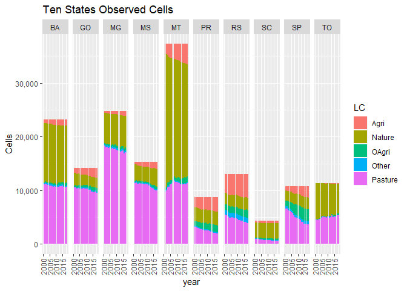
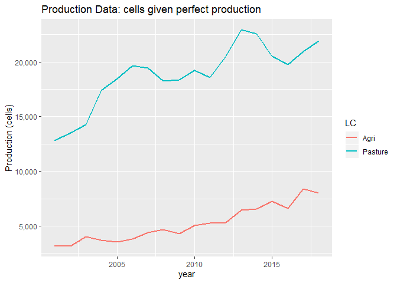
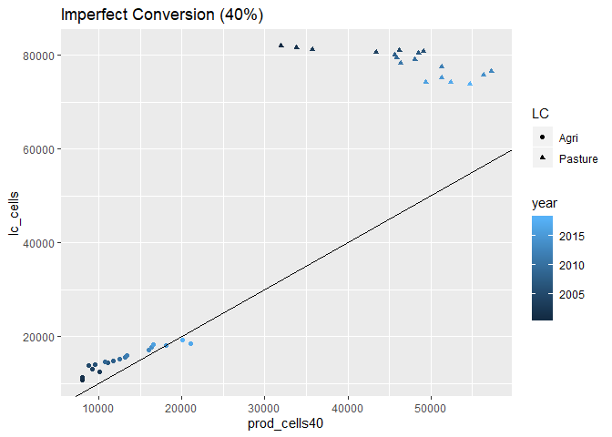

```r
rm(list=ls())
library(tidyverse)
library(readxl)
```

Using Summary Table data for observed Land Cover (PastureB classification)

```r
yrs <- seq(2000, 2015, 1)

#load the region file (used to match each cell to a municipality)
region <- read.csv("SummaryTables/region.csv")

#for debugging
#i <- 1


#loop through all years
for(i in seq_along(yrs)){
  
  #if this is the first year, create lc_dat
  if(i == 1){
    lc_dat <- read_csv(paste0("SummaryTables/LCs",yrs[i],"_PastureB.csv"))   #load empirical map summary data (created using summarise_LCmaps.r)
    lc_dat <- lc_dat %>%
      mutate(year = yrs[i]) 
  }
  
  #if this is not the first year, bind new year data to lc_dat
  else {
    
    lc <- read_csv(paste0("SummaryTables/LCs",yrs[i],"_PastureB.csv"))   #load empirical map summary data (created using summarise_LCmaps.r)
    lc <- lc %>%
      mutate(year = yrs[i])
    
    lc_dat <- bind_rows(lc_dat, lc)
  }
  
}  

#add state ID
lc_dat <- lc_dat %>%
  mutate(state = (muniID %/% 100000)) %>%
  mutate(state = if_else(state == 17, "TO", 
      if_else(state == 29, "BA",
      if_else(state == 31, "MG",
      if_else(state == 35, "SP",
      if_else(state == 41, "PR",
      if_else(state == 42, "SC",
      if_else(state == 43, "RS", 
      if_else(state == 50, "MS",
      if_else(state == 51, "MT",
      if_else(state == 52, "GO", "NA"
      ))))))))))
    )

#LC1 = Nature
#LC2 = Other Agri
#LC3 = Agri
#LC4 = Other
#LC5 = Pasture

#add observed cell count columns  
lc_dat <- lc_dat %>%
      mutate(Nature = round(LC1 * NonNAs,0)) %>%
      mutate(OAgri = round(LC2 * NonNAs,0)) %>%
      mutate(Agri = round(LC3 * NonNAs,0)) %>%
      mutate(Other = round(LC4 * NonNAs,0)) %>%
      mutate(Pasture = round(LC5 * NonNAs,0))

#make data long
lc_cells_long <- lc_dat %>%
  select(year:Pasture) %>%
  gather(key = LC, value = cells, -year, -state)

#calculate state totals
lc_cells_long_states <- lc_cells_long %>% 
  group_by(state, year,LC) %>%
  summarise_at(vars(matches("cells")),sum)
```


Plot observed land cover by state through time

```r
lc_cells_long_states %>% 
  ggplot(aes(x = year, y = cells, fill = LC)) + 
  geom_bar(stat = "identity") +
  scale_y_continuous(name = "Cells", labels = scales::comma) +
  facet_grid(.~state) +
  ggtitle("Ten States Observed Cells") + 
  theme(axis.text.x = element_text(angle = 90, vjust = 0.5))
```

<!-- -->


Plot observed land cover for all 10 simulation states through time

```r
lc_cells_long_brazil <- lc_cells_long_states %>% 
  group_by(year,LC) %>%
  summarise_at(vars(matches("cells")),sum)

lc_cells_long_brazil %>% 
  ggplot(aes(x = year, y = cells, fill = LC)) + 
  geom_bar(stat = "identity", colour="white") +
  scale_y_continuous(name = "Cells", labels = scales::comma) +
  #facet_grid(.~state) +
  ggtitle("Ten States Observed Cells")
```

<!-- -->

```r
lc_cells_long_brazil %>% 
  ggplot(aes(x = year, y = cells, colour = LC)) + 
  geom_line(size = 1) +
  scale_y_continuous(name = "Cells", labels = scales::comma) +
  #facet_grid(.~state) +
  ggtitle("Ten States Observed Cells")
```

<!-- -->


Use production data from IBGE

```r
##Load Production Data
meat_prod_Astates_Data <- read_excel("ProductionData/Cattle_meat_production_Kg_2000_2017_all_states.xlsx", sheet = "Plan1", skip = 1)  #data for all states Astates

#dairy data are by municiaplity for all states (Amunis)
dairy_prod_Amunis_Data <- read_excel("ProductionData/dairy_Municipalities_Brazil.xlsx", sheet = "Tabela", skip = 1, na = c("", "-", "..."))

#maize data are by municiaplity for all states (Amunis)
maize_prod_Amunis_Data <- read_excel("ProductionData/maize_brazil.xlsx", sheet = "Production (tons)", skip = 1, na = c("", "-", "..."))

#maize data are by municiaplity for all states (Amunis)
soy_prod_Amunis_Data <- read_excel("ProductionData/soybean_brazil.xlsx", sheet = "Production (Tons)", skip = 1, na = c("", "-", "..."))


Fstate_vals <- c(17,	29,	31,	35,	41,	42,	43,	50,	51,	52)
Fstate_abbrev <- c("TO", "BA", "MG", "SP", "PR",  "SC", "RS", "MS", "MT", "GO")

Astate_codes <- meat_prod_Astates_Data %>%
  select(NM_UF_SIGLA, CD_GCUF) %>%
  rename(state = NM_UF_SIGLA, stateid = CD_GCUF) %>%
  filter(!is.na(state))    #safer way to remove text line at bottom of state column
  

##MEAT
meat_prod_Astates <- meat_prod_Astates_Data %>%
  rename(state = NM_UF_SIGLA) %>%
  select(-NM_UF, -CD_GCUF, -`2016`, -`2017`) %>%      #drop columns
  filter(!is.na(state)) %>%   #safer way to remove text line at bottom of state column
  mutate_at(vars("2000":"2015"), as.numeric) 

meat_prod_Astates_long <- meat_prod_Astates %>%
   gather(key = year, value = meat_kg, -state) %>%
   mutate_at(vars(year), as.integer) %>%
   mutate(meat_gg = meat_kg * 0.000001) %>%  #convert from kg to gg
   select(-meat_kg)

##DAIRY
dairy_prod_Amunis <- dairy_prod_Amunis_Data %>%
  rename(muniID = `IBGE CODE`) %>%
  filter(!is.na(muniID)) %>%   #safer way to remove text line in muniID
  mutate(state = substr(muniID, 1, 2)) %>%     #extract the muniID
  mutate_at(vars("2000":"2015"), as.numeric) %>%  #convert values to numeric
  select(-Municipality)   #drop unwanted columns

dairy_prod_Astates <- dairy_prod_Amunis %>%
  group_by(state) %>%
  mutate_all(funs(. * 1.03 * 1000)) %>%     #convert from thousand litres to kgs
  summarise_all(sum, na.rm=T) %>%    #summarise munis to states
  mutate(state=replace(state, 1:length(Astate_codes$stateid), Astate_codes$state)) #re-label stated ids with state abbrevs

dairy_prod_Astates_long <- dairy_prod_Astates %>%
  gather(key = year, value = dairy_kg, -state, -muniID) %>%
  mutate_at(vars(year), as.integer) %>%
  mutate(dairy_gg = dairy_kg * 0.000001) %>%  #convert from kg to gg
  select(-dairy_kg, -muniID)


#MAIZE
#has the same data strucutre (with some differences in unit conversions - could write function to cover both?) 
maize_prod_Amunis <- maize_prod_Amunis_Data %>%
  rename(muniID = `IBGE CODE`) %>%
  filter(!is.na(muniID)) %>%   #safer way to remove text line in muniID
  mutate(state = substr(muniID, 1, 2)) %>%     #extract the muniID
  mutate_at(vars("2000":"2015"), as.numeric) %>%  #convert values to numeric
  select(-Municipality)   #drop unwanted columns

maize_prod_Astates <- maize_prod_Amunis %>%
  group_by(state) %>%
  summarise_all(sum, na.rm=T) %>%    #summarise munis to states
  mutate(state=replace(state, 1:length(Astate_codes$stateid), Astate_codes$state)) #re-label stated ids with state abbrevs

maize_prod_Astates_long <- maize_prod_Astates %>%
  gather(key = year, value = maize_kg, -state, -muniID) %>%
  mutate_at(vars(year), as.integer) %>%
  mutate(maize_gg = maize_kg * 0.001) %>%  #convert from tons to gg
  select(-maize_kg, -muniID)

##SOY

soy_prod_Amunis <- soy_prod_Amunis_Data %>%
  rename(muniID = `IBGE CODE`) %>%
  filter(!is.na(muniID)) %>%   #safer way to remove text line in muniID
  mutate(state = substr(muniID, 1, 2)) %>%     #extract the muniID
  mutate_at(vars("2000":"2015"), as.numeric) %>%  #convert values to numeric
  select(-Municipality)   #drop unwanted columns

soy_prod_Astates <- soy_prod_Amunis %>%
  group_by(state) %>%
  summarise_all(sum, na.rm=T) %>%    #summarise munis to states
  mutate(state=replace(state, 1:length(Astate_codes$stateid), Astate_codes$state)) #re-label stated ids with state abbrevs

soy_prod_Astates_long <- soy_prod_Astates %>%
  gather(key = year, value = soy_kg, -state, -muniID) %>%
  mutate_at(vars(year), as.integer) %>%
  mutate(soy_gg = soy_kg * 0.001) %>%  #convert from tons to gg
  select(-soy_kg, -muniID)

prod_state_year <- left_join(meat_prod_Astates_long, dairy_prod_Astates_long, by = c("year", "state"))

prod_state_year <- left_join(prod_state_year, maize_prod_Astates_long, by = c("year", "state"))

prod_state_year <- left_join(prod_state_year, soy_prod_Astates_long, by = c("year", "state"))

#add focal states indicator
prod_state_year <- prod_state_year %>%
  mutate(simulated = state %in% Fstate_abbrev) 

psy_long <- prod_state_year %>%
  gather(key = commodity, value = gg, -state, -year, -simulated)

psimy_long <- psy_long %>%
  group_by(simulated, year, commodity) %>%
  summarise(sumsim = sum(gg, na.rm=T))
```


```r
psimy_long_sim <- psimy_long %>% 
  filter(simulated == "TRUE") 

psimy_long_sim %>% 
  ggplot(aes(x = year, y = sumsim, fill = commodity)) + 
  geom_bar(stat = "identity", colour="white") +
  scale_y_continuous(name = "Production (gg)", labels = scales::comma) +
  #facet_grid(.~state) +
  ggtitle("Production Data")
```

<!-- -->

```r
psimy_long_sim %>% 
  ggplot(aes(x = year, y = sumsim, colour=commodity)) + 
  geom_line(size = 1) +
  scale_y_continuous(name = "Production (gg)", labels = scales::comma) +
  #facet_grid(.~state) +
  ggtitle("Production Data")
```

<!-- -->


For CRAFTY we assume the following values are the maximum possible production yields (gg per 25sq km):
- Soy = 20	
- Maize = 30
- Milk = 2.5
- Meat = 0.275

Using these values we can check what the observed production quantities would imply for the number of land cover cells.


```r
#THESE ARE PERFECT VALUES! Assumes service production = 1 
psimy_long_sim  <- psimy_long_sim %>%
  mutate(cells = if_else(commodity == "dairy_gg", sumsim / 2.5, 
      if_else(commodity == "maize_gg", sumsim / 30,
      if_else(commodity == "meat_gg", sumsim / 0.275, sumsim / 20)
      )))


psimy_long_sim %>% 
  ggplot(aes(x = year, y = cells, fill = commodity)) + 
  geom_bar(stat = "identity", colour="white") +
  scale_y_continuous(name = "Production (cells)", labels = scales::comma) +
  #facet_grid(.~state) +
  ggtitle("Production Data: cells given perfect production")
```

<!-- -->

```r
psimy_long_sim %>% 
  ggplot(aes(x = year, y = cells, colour = commodity)) + 
  geom_line(size = 1) +
  scale_y_continuous(name = "Production (cells)", labels = scales::comma) +
  #facet_grid(.~state) +
  ggtitle("Production Data: cells given perfect production")
```

<!-- -->

From the observed production data we see increasing required cells, from 20,000 to 40,000

To compare this estimated number of cells (from perfect production) with the number of cells observed in land cover maps, we first need to aggrgeate the production data to 'Agri' and Pasture' to match the LC data


```r
psimy_wide_sim  <- psimy_long_sim %>%
  select(-sumsim) %>%
  spread(commodity, cells) %>%
  mutate(Agri = maize_gg + soy_gg, Pasture = dairy_gg + meat_gg)

plcsim_long_sim <- psimy_wide_sim %>%
  select(year, Agri, Pasture) %>%
  gather(key = LC, value = cells, -year, -simulated) 


plcsim_long_sim %>% 
  ggplot(aes(x = year, y = cells, fill = LC)) + 
  geom_bar(stat = "identity", colour="white") +
  scale_y_continuous(name = "Production(cells)", labels = scales::comma) +
  #facet_grid(.~state) +
  ggtitle("Production Data: cells given perfect production")
```

<!-- -->

```r
plcsim_long_sim %>% 
  ggplot(aes(x = year, y = cells, fill = LC)) + 
  geom_bar(stat = "identity", colour="white", position="fill") +
  scale_y_continuous(name = "Production(cells)", labels = scales::percent_format()) +
  #facet_grid(.~state) +
  ggtitle("Production Data: cells given perfect production")
```

<!-- -->

```r
plcsim_long_sim %>% 
  ggplot(aes(x = year, y = cells, colour = LC)) + 
  geom_line(size = 1) +
  scale_y_continuous(name = "Production (cells)", labels = scales::comma) +
  #facet_grid(.~state) +
  ggtitle("Production Data: cells given perfect production")
```

<!-- -->

Now let's see what we got in the observed land cover data 


```r
lc_cells_long_brazil %>% 
  filter(LC == "Agri" | LC == "Pasture") %>%
  ggplot(aes(x = year, y = cells, fill = LC)) + 
  geom_bar(stat = "identity", colour="white") +
  scale_y_continuous(name = "Cells", labels = scales::comma) +
  #facet_grid(.~state) +
  ggtitle("Land Cover Data Observed Cells")
```

<!-- -->

```r
lc_cells_long_brazil %>% 
  filter(LC == "Agri" | LC == "Pasture") %>%
  ggplot(aes(x = year, y = cells, fill = LC)) + 
  geom_bar(stat = "identity", colour="white", position="fill") +
  scale_y_continuous(name = "Cells", labels = scales::percent_format()) +
  #facet_grid(.~state) +
  ggtitle("Land Cover Data Observed Cells")
```

<!-- -->

```r
lc_cells_long_brazil %>% 
  filter(LC == "Agri" | LC == "Pasture") %>%
  ggplot(aes(x = year, y = cells, colour = LC)) + 
  geom_line(size = 1) +
  scale_y_continuous(name = "Cells", labels = scales::comma) +
  #facet_grid(.~state) +
  ggtitle("Land Cover Data Observed Cells")
```

<!-- -->

Proportions are about right (Agri increases share through time) although observed land area in agriculture increases more consistently than according to that estimated from (perfect) production

However, in terms of absolute number of cells there are many more cells observed in the LC data than predicted by perfect production data. 

Let's look at these data in table format.

## Production Data
Values are number of cells (`APratio` is ```Agri / Pasture```)

```r
psimy_wide_sim <- psimy_wide_sim %>%  
  mutate(APratio = round(Agri / Pasture,3))

psimy_wide_sim
```

<div data-pagedtable="false">
  <script data-pagedtable-source type="application/json">
{"columns":[{"label":["simulated"],"name":[1],"type":["lgl"],"align":["right"]},{"label":["year"],"name":[2],"type":["int"],"align":["right"]},{"label":["dairy_gg"],"name":[3],"type":["dbl"],"align":["right"]},{"label":["maize_gg"],"name":[4],"type":["dbl"],"align":["right"]},{"label":["meat_gg"],"name":[5],"type":["dbl"],"align":["right"]},{"label":["soy_gg"],"name":[6],"type":["dbl"],"align":["right"]},{"label":["Agri"],"name":[7],"type":["dbl"],"align":["right"]},{"label":["Pasture"],"name":[8],"type":["dbl"],"align":["right"]},{"label":["APratio"],"name":[9],"type":["dbl"],"align":["right"]}],"data":[{"1":"TRUE","2":"2000","3":"6821.084","4":"986.250","5":"11590.41","6":"1606.595","7":"2592.845","8":"18411.49","9":"0.141"},{"1":"TRUE","2":"2001","3":"7031.564","4":"1338.319","5":"12786.70","6":"1857.198","7":"3195.517","8":"19818.26","9":"0.161"},{"1":"TRUE","2":"2002","3":"7330.175","4":"1120.320","5":"13521.52","6":"2062.849","7":"3183.169","8":"20851.69","9":"0.153"},{"1":"TRUE","2":"2003","3":"7571.420","4":"1514.667","5":"14288.68","6":"2532.751","7":"4047.418","8":"21860.10","9":"0.185"},{"1":"TRUE","2":"2004","3":"7932.074","4":"1307.619","5":"17367.17","6":"2391.366","7":"3698.985","8":"25299.24","9":"0.146"},{"1":"TRUE","2":"2005","3":"8280.678","4":"1083.138","5":"18482.58","6":"2447.801","7":"3530.939","8":"26763.26","9":"0.132"},{"1":"TRUE","2":"2006","3":"8523.264","4":"1310.648","5":"19646.30","6":"2516.142","7":"3826.790","8":"28169.57","9":"0.136"},{"1":"TRUE","2":"2007","3":"8802.495","4":"1644.285","5":"19416.27","6":"2783.380","7":"4427.665","8":"28218.77","9":"0.157"},{"1":"TRUE","2":"2008","3":"9358.927","4":"1830.587","5":"18277.12","6":"2852.991","7":"4683.578","8":"27636.04","9":"0.169"},{"1":"TRUE","2":"2009","3":"9918.348","4":"1555.196","5":"18355.42","6":"2731.340","7":"4286.535","8":"28273.76","9":"0.152"},{"1":"TRUE","2":"2010","3":"10516.708","4":"1736.691","5":"19243.32","6":"3287.561","7":"5024.252","8":"29760.03","9":"0.169"},{"1":"TRUE","2":"2011","3":"11033.053","4":"1709.853","5":"18563.61","6":"3558.422","7":"5268.275","8":"29596.67","9":"0.178"},{"1":"TRUE","2":"2012","3":"11319.186","4":"2243.075","5":"20523.77","6":"3096.377","7":"5339.452","8":"31842.95","9":"0.168"},{"1":"TRUE","2":"2013","3":"12019.337","4":"2528.379","5":"22916.62","6":"3896.751","7":"6425.130","8":"34935.96","9":"0.184"},{"1":"TRUE","2":"2014","3":"12263.045","4":"2469.897","5":"22545.67","6":"4087.610","7":"6557.507","8":"34808.71","9":"0.188"},{"1":"TRUE","2":"2015","3":"11995.262","4":"2662.072","5":"20527.57","6":"4577.753","7":"7239.824","8":"32522.83","9":"0.223"}],"options":{"columns":{"min":{},"max":[10]},"rows":{"min":[10],"max":[10]},"pages":{}}}
  </script>
</div>

## Land Cover Data
Values are number of cells (`APratio` is ```Agri / Pasture```)

```r
lc_cells_wide_brazil <- lc_cells_long_brazil %>%
  spread(LC, cells) %>%
  mutate(APratio = round(Agri / Pasture,3))

lc_cells_wide_brazil 
```

<div data-pagedtable="false">
  <script data-pagedtable-source type="application/json">
{"columns":[{"label":["year"],"name":[1],"type":["dbl"],"align":["right"]},{"label":["Agri"],"name":[2],"type":["dbl"],"align":["right"]},{"label":["Nature"],"name":[3],"type":["dbl"],"align":["right"]},{"label":["OAgri"],"name":[4],"type":["dbl"],"align":["right"]},{"label":["Other"],"name":[5],"type":["dbl"],"align":["right"]},{"label":["Pasture"],"name":[6],"type":["dbl"],"align":["right"]},{"label":["APratio"],"name":[7],"type":["dbl"],"align":["right"]}],"data":[{"1":"2000","2":"5697","3":"63690","4":"26974","5":"2538","6":"64087","7":"0.089"},{"1":"2001","2":"8569","3":"61651","4":"25935","5":"2509","6":"64322","7":"0.133"},{"1":"2002","2":"9149","3":"60962","4":"25611","5":"2629","6":"64632","7":"0.142"},{"1":"2003","2":"9619","3":"60289","4":"25065","5":"2632","6":"65381","7":"0.147"},{"1":"2004","2":"10015","3":"59930","4":"24347","5":"2708","6":"65986","7":"0.152"},{"1":"2005","2":"10689","3":"59339","4":"23511","5":"2729","6":"66718","7":"0.160"},{"1":"2006","2":"11217","3":"59178","4":"21653","5":"2760","6":"68178","7":"0.165"},{"1":"2007","2":"11547","3":"59455","4":"22205","5":"2783","6":"66996","7":"0.172"},{"1":"2008","2":"11524","3":"59270","4":"23289","5":"2788","6":"66115","7":"0.174"},{"1":"2009","2":"11747","3":"59175","4":"24635","5":"2807","6":"64620","7":"0.182"},{"1":"2010","2":"11942","3":"59301","4":"24792","5":"2833","6":"64120","7":"0.186"},{"1":"2011","2":"11793","3":"59284","4":"25953","5":"2888","6":"63068","7":"0.187"},{"1":"2012","2":"12518","3":"59158","4":"24893","5":"2956","6":"63462","7":"0.197"},{"1":"2013","2":"14548","3":"59727","4":"20294","5":"2990","6":"65427","7":"0.222"},{"1":"2014","2":"14795","3":"60159","4":"17826","5":"3017","6":"67189","7":"0.220"},{"1":"2015","2":"16541","3":"59953","4":"16028","5":"2974","6":"67492","7":"0.245"}],"options":{"columns":{"min":{},"max":[10]},"rows":{"min":[10],"max":[10]},"pages":{}}}
  </script>
</div>

Again, we see proportions are quite similar, but absolute numbers of cells are way off. This is likely because observed land was not producing 'perfect' yields. So, let's see what assuming production conversion is not perfect does.


First let's calculate what 'production efficiency' (i.e. proportion of 'perfect' production) the observed numbers of cells indicates. 


```r
joined <- left_join(plcsim_long_sim, lc_cells_long_brazil, by = c("year", "LC"))

joined <- joined %>%
  mutate(prod_cells = round(cells.x,0)) %>% 
  select(-cells.x) %>%
  rename(lc_cells = cells.y) %>% 
  mutate(pe = prod_cells / lc_cells )

joined %>%
  ggplot(aes(x = year, y = pe, colour = LC)) + 
  geom_line(size = 1) +
  scale_y_continuous(name = "Proportion (of Perfect)", labels = scales::comma) +
  #facet_grid(.~state) +
  ggtitle("Production Efficiency")
```

<!-- -->

We see a clear increasing trend for pasture, while for agriculure it fluctuates around 0.40. 

The increasing trend in Pasture may be driven by dairy so let's see what calculating the proportion of pasture from meat production alone looks like. 


```r
psimy_long_sim_r <- psimy_long_sim %>%
  mutate(meat = if_else(commodity == "meat_gg", "Pasture", "other")) %>%
  select(-commodity, -sumsim)
      
joined_lcs <- left_join(joined, psimy_long_sim_r, by = c("year" = "year", "LC" = "meat"))

joined_lcs <- joined_lcs %>%
  mutate(cells = round(cells,0)) %>% 
  select(-simulated.y) %>%
  rename(meat_cells = cells) %>% 
  mutate(meat_pe = meat_cells / lc_cells )

joined_lcs %>%
  ggplot(aes(x = year, y = meat_pe, colour = LC)) + 
  geom_line(size = 1) +
  scale_y_continuous(name = "Proportion (of perfect)", labels = scales::comma) +
  #facet_grid(.~state) +
  ggtitle("Production Efficiency (meat only)")
```

<!-- -->

Trend remains although absolute values are smaller... 

All this implies Pasture has a greater increase in yield than agricultural commodities. 

Let's plot the relationship between production (cells) and land cover (cells): 

```r
joined %>% ggplot(aes(x = prod_cells, y = lc_cells, colour=year, shape=LC)) + 
  geom_point() +
  geom_abline(intercept = 0, slope = 1, color = "black") +
  ggtitle("Perfect Conversion")
```

<!-- -->

We see that for maximum (perfect) production, neither Agri nor Pasture correlate well. 

When we plot the 40% conversion (above) we see Agri matches up much better (at any point in time).

Pasture has a poor relationship because production is relatively poor in earlier years. So again this shows the influence of improving yield seems important for Pasture but less so Agri... 


```r
joined <- joined %>%
  mutate(prod_cells40 = prod_cells / 0.4) 

joined %>%
  ggplot(aes(x = prod_cells40, y = lc_cells, colour=year, shape=LC)) + 
  geom_point() +
  geom_abline(intercept = 0, slope = 1, color = "black") +
  ggtitle("Imperfect Conversion (40%)")
```

<!-- -->


When we examine 40% conversion we see that Agri is well aligned; this implies we should aim for mean Agri service provsion of 0.4.... although this will need to take into account Soy, Maize and Double Cropper services. How to do this? Need to check current mean service values...


```r
joined %>%
  filter(LC == "Agri") %>%
  ggplot(aes(x = prod_cells40, y = lc_cells, colour=year, shape=LC)) + 
  geom_point() +
  geom_abline(intercept = 0, slope = 1, color = "black") +
  ggtitle("Imperfect Conversion (40%)")
```

<!-- -->


Questions:
- is it right that yields of agri have not improved through time?; 
Well, yes we can see this from figures above... gg of both soy and maize have increased as well as overall Agri land cover area (cells). But pasture land cover (cells) has increased only a little relative to production (gg) 

So why have pasture yields increased through time? Or has it been grassland that has been converted to pasture? This wouldn't be picked up by our land cover maps data.  Could we check this issue by comparing land cover data from maps and pasture area from IBGE? We have planted/harvested data for soy and maize (which we could compare to LC maps) but not for dairy and meat...
