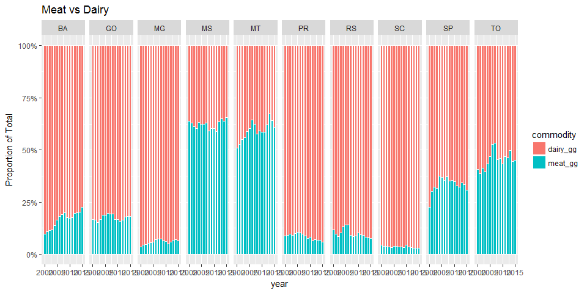
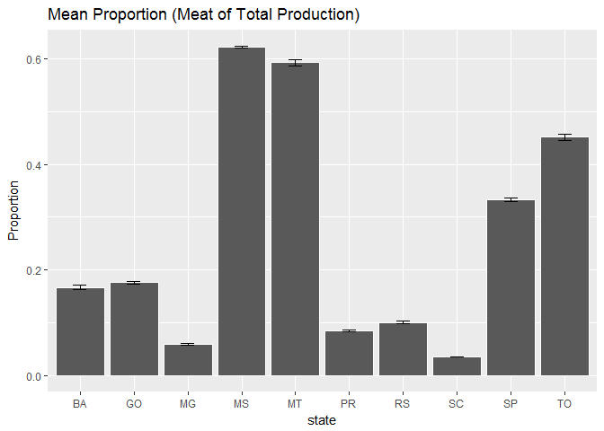
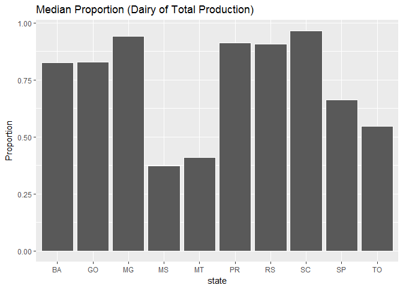
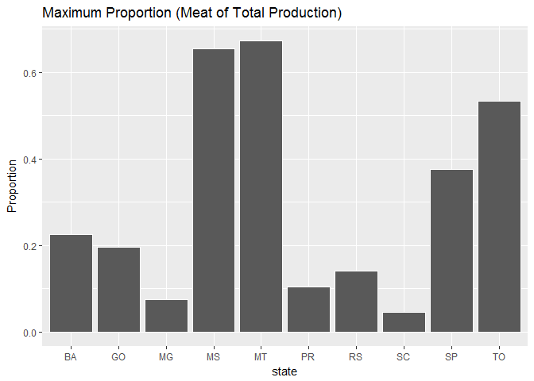

```r
rm(list=ls())
library(tidyverse)
library(readxl)
```


```r
##Load Production Data
meat_prod_Astates_Data <- read_excel("Cattle_meat_production_Kg_2000_2017_all_states.xlsx", sheet = "Plan1", skip = 1)  #data for all states Astates

#dairy data are by municiaplity for all states (Amunis)
dairy_prod_Amunis_Data <- read_excel("dairy_Municipalities_Brazil.xlsx", sheet = "Tabela", skip = 1, na = c("", "-", "..."))

##Tidy production data
meat_prod_Astates <- meat_prod_Astates_Data %>%
  rename(state = NM_UF_SIGLA) %>%
  select(-NM_UF, -CD_GCUF, -`2016`, -`2017`) %>%      #drop columns
  filter(!is.na(state)) %>%   #safer way to remove text line at bottom of state column
  mutate_at(vars("2000":"2015"), as.numeric) 

Fstate_vals <- c(17,	29,	31,	35,	41,	42,	43,	50,	51,	52)
Fstate_abbrev <- c("TO", "BA", "MG", "SP", "PR",  "SC", "RS", "MS", "MT", "GO")

#Filter meat focal states
meat_prod_Fstates <- meat_prod_Astates %>%
  filter(state %in% Fstate_abbrev) 

meat_prod_Fstates_long <- meat_prod_Fstates %>%
  gather(key = year, value = meat_kg, -state) %>%
  mutate_at(vars(year), as.integer) %>%
  mutate(meat_gg = meat_kg * 0.000001) %>%  #convert from kg to gg
  select(-meat_kg)


dairy_prod_Amunis <- dairy_prod_Amunis_Data %>%
  rename(muniID = `IBGE CODE`) %>%
  filter(!is.na(muniID)) %>%   #safer way to remove text line in muniID 
  mutate(state = substr(muniID, 1, 2)) %>%     #extract the muniID
  mutate_at(vars("2000":"2015"), as.numeric) %>%  #convert values to numeric
  select(-muniID, -Municipality)   #drop unwanted states

dairy_prod_Astates <- dairy_prod_Amunis %>% 
  group_by(state) %>%  
  mutate_all(funs(. * 1.03 * 1000)) %>%     #convert from thousand litres to kgs
  summarise_all(sum, na.rm=T)    #summarise munis to states

dairy_prod_Fstates<- dairy_prod_Astates %>%
  filter(state %in% Fstate_vals) %>% 
  mutate(state=replace(state, 1:length(Fstate_vals), Fstate_abbrev))

dairy_prod_Fstates_long <- dairy_prod_Fstates %>%
  gather(key = year, value = dairy_kg, -state) %>%
  mutate_at(vars(year), as.integer) %>%
  mutate(dairy_gg = dairy_kg * 0.000001) %>%  #convert from kg to gg
  select(-dairy_kg)


prod_state_year <- left_join(meat_prod_Fstates_long, dairy_prod_Fstates_long, by = c("year", "state"))

psy_long <- prod_state_year %>%
  gather(key = commodity, value = gg, -state, - year)
```


##Plots

```r
##Plot data

ggplot(psy_long, aes(x = year, y = gg, fill = commodity)) + 
  geom_bar(position = "fill",stat = "identity", colour="white") +
  scale_y_continuous(name = "Proportion of Total", labels = scales::percent_format()) +
  facet_grid(.~state) +
  ggtitle("Meat vs Dairy")
```

<!-- -->


```r
##Proportions
prop_sy <- prod_state_year %>%
  mutate(prop = dairy_gg / (dairy_gg + meat_gg))

prop_s <- prop_sy %>%
  group_by(state) %>%
  summarise(
    prop_mn = round(mean(prop),3),
    prop_md = round(median(prop),3),
    prop_max = round(max(prop),3),
    prop_sd = round(sd(prop),3),
    prop_se = round(sd(prop) / length(prop), 3)
  )

ggplot(prop_s, aes(x = state, y = prop_mn)) + 
  geom_bar(stat="identity", colour="white") +
  geom_errorbar(aes(ymin=(prop_mn-(prop_se*1.96)), ymax=(prop_mn+(prop_se*1.96))), width=0.25) +
  scale_y_continuous(name="Proportion", labels = scales::comma) +
  ggtitle("Mean Proportion (Dairy of Total Production)")
```

<!-- -->

```r
ggplot(prop_s, aes(x = state, y = prop_md)) + 
  geom_bar(stat="identity", colour="white") +
  scale_y_continuous(name="Proportion", labels = scales::comma) +
  ggtitle("Median Proportion (Dairy of Total Production)")
```

<!-- -->

```r
ggplot(prop_s, aes(x = state, y = prop_max)) + 
  geom_bar(stat="identity", colour="white") +
  scale_y_continuous(name="Proportion", labels = scales::comma) +
  ggtitle("Maximum Proportion (Dairy of Total Production)")
```

<!-- -->

```r
prop_s
```

<div data-pagedtable="false">
  <script data-pagedtable-source type="application/json">
{"columns":[{"label":["state"],"name":[1],"type":["chr"],"align":["left"]},{"label":["prop_mn"],"name":[2],"type":["dbl"],"align":["right"]},{"label":["prop_md"],"name":[3],"type":["dbl"],"align":["right"]},{"label":["prop_max"],"name":[4],"type":["dbl"],"align":["right"]},{"label":["prop_sd"],"name":[5],"type":["dbl"],"align":["right"]},{"label":["prop_se"],"name":[6],"type":["dbl"],"align":["right"]}],"data":[{"1":"BA","2":"0.833","3":"0.825","4":"0.902","5":"0.039","6":"0.002"},{"1":"GO","2":"0.824","3":"0.827","4":"0.848","5":"0.014","6":"0.001"},{"1":"MG","2":"0.940","3":"0.940","4":"0.963","5":"0.011","6":"0.001"},{"1":"MS","2":"0.378","3":"0.374","4":"0.411","5":"0.020","6":"0.001"},{"1":"MT","2":"0.407","3":"0.410","4":"0.490","5":"0.043","6":"0.003"},{"1":"PR","2":"0.915","3":"0.912","4":"0.941","5":"0.014","6":"0.001"},{"1":"RS","2":"0.899","3":"0.907","4":"0.923","5":"0.021","6":"0.001"},{"1":"SC","2":"0.964","3":"0.965","4":"0.971","5":"0.005","6":"0.000"},{"1":"SP","2":"0.667","3":"0.663","4":"0.773","5":"0.036","6":"0.002"},{"1":"TO","2":"0.548","3":"0.547","4":"0.613","5":"0.042","6":"0.003"}],"options":{"columns":{"min":{},"max":[10]},"rows":{"min":[10],"max":[10]},"pages":{}}}
  </script>
</div>
