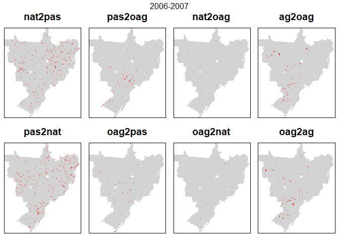
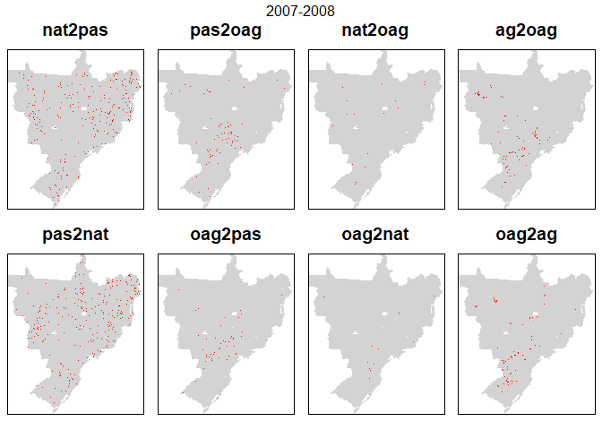

Examine error matrix cross-tabulations of observed maps 

And Maps themselves


```r
library(tidyverse)
library(caret)   #for confusionMatrix
library(diffeR)  #for map comparison
library(knitr)
```


```r
input_path <- "C:/Users/k1076631/Google Drive/Shared/Crafty Telecoupling/Data/"
classification <- "PastureB"

data_yrs <- seq(2000, 2015, 1)

for(i in seq_along(data_yrs)){

  #create a stack of rasters
  
  inname <- paste0(input_path,"LandCover/MapBiomas23/ClassificationComparison/ASCII/brazillc_",data_yrs[i],"_",classification,".asc")

  lc <- raster(inname)
  
  if(i == 1) { s <- stack(lc) }
  else { s <- stack(s, lc) }
  
}
```


```r
mat_yrs <- head(data_yrs, -1) #drop last element of the list

LCnames <- c("Nat", "OtherAgri", "Agri", "Other", "Pasture")  #used to label error matrix in loop below


for(i in seq_along(mat_yrs)){
  
  
  ts <- stack(s[[i]], s[[i+1]])
  plot(ts)
  
  cat("  \n","  \n","Crosstab ",data_yrs[i],"-",data_yrs[i+1],"  \n") 

  xtab <- crosstabm(s[[i]], s[[i+1]])
  colnames(xtab) <- LCnames
  rownames(xtab) <- LCnames
  cat("  \n")
  print(kable(xtab, format="html"))
  cat("  \n")

}
```

<!-- -->  
   
 Crosstab  2000 - 2001   
  
<table>
 <thead>
  <tr>
   <th style="text-align:left;">   </th>
   <th style="text-align:right;"> Nat </th>
   <th style="text-align:right;"> OtherAgri </th>
   <th style="text-align:right;"> Agri </th>
   <th style="text-align:right;"> Other </th>
   <th style="text-align:right;"> Pasture </th>
  </tr>
 </thead>
<tbody>
  <tr>
   <td style="text-align:left;"> Nat </td>
   <td style="text-align:right;"> 221286 </td>
   <td style="text-align:right;"> 3227 </td>
   <td style="text-align:right;"> 155 </td>
   <td style="text-align:right;"> 231 </td>
   <td style="text-align:right;"> 4789 </td>
  </tr>
  <tr>
   <td style="text-align:left;"> OtherAgri </td>
   <td style="text-align:right;"> 2415 </td>
   <td style="text-align:right;"> 26238 </td>
   <td style="text-align:right;"> 2028 </td>
   <td style="text-align:right;"> 94 </td>
   <td style="text-align:right;"> 2296 </td>
  </tr>
  <tr>
   <td style="text-align:left;"> Agri </td>
   <td style="text-align:right;"> 9 </td>
   <td style="text-align:right;"> 41 </td>
   <td style="text-align:right;"> 5670 </td>
   <td style="text-align:right;"> 1 </td>
   <td style="text-align:right;"> 18 </td>
  </tr>
  <tr>
   <td style="text-align:left;"> Other </td>
   <td style="text-align:right;"> 219 </td>
   <td style="text-align:right;"> 99 </td>
   <td style="text-align:right;"> 10 </td>
   <td style="text-align:right;"> 7512 </td>
   <td style="text-align:right;"> 94 </td>
  </tr>
  <tr>
   <td style="text-align:left;"> Pasture </td>
   <td style="text-align:right;"> 2867 </td>
   <td style="text-align:right;"> 2767 </td>
   <td style="text-align:right;"> 788 </td>
   <td style="text-align:right;"> 62 </td>
   <td style="text-align:right;"> 71691 </td>
  </tr>
</tbody>
</table>
  
<!-- -->  
   
 Crosstab  2001 - 2002   
  
<table>
 <thead>
  <tr>
   <th style="text-align:left;">   </th>
   <th style="text-align:right;"> Nat </th>
   <th style="text-align:right;"> OtherAgri </th>
   <th style="text-align:right;"> Agri </th>
   <th style="text-align:right;"> Other </th>
   <th style="text-align:right;"> Pasture </th>
  </tr>
 </thead>
<tbody>
  <tr>
   <td style="text-align:left;"> Nat </td>
   <td style="text-align:right;"> 220914 </td>
   <td style="text-align:right;"> 2186 </td>
   <td style="text-align:right;"> 134 </td>
   <td style="text-align:right;"> 225 </td>
   <td style="text-align:right;"> 3337 </td>
  </tr>
  <tr>
   <td style="text-align:left;"> OtherAgri </td>
   <td style="text-align:right;"> 1827 </td>
   <td style="text-align:right;"> 27186 </td>
   <td style="text-align:right;"> 875 </td>
   <td style="text-align:right;"> 118 </td>
   <td style="text-align:right;"> 2366 </td>
  </tr>
  <tr>
   <td style="text-align:left;"> Agri </td>
   <td style="text-align:right;"> 42 </td>
   <td style="text-align:right;"> 493 </td>
   <td style="text-align:right;"> 7947 </td>
   <td style="text-align:right;"> 2 </td>
   <td style="text-align:right;"> 167 </td>
  </tr>
  <tr>
   <td style="text-align:left;"> Other </td>
   <td style="text-align:right;"> 186 </td>
   <td style="text-align:right;"> 59 </td>
   <td style="text-align:right;"> 6 </td>
   <td style="text-align:right;"> 7609 </td>
   <td style="text-align:right;"> 40 </td>
  </tr>
  <tr>
   <td style="text-align:left;"> Pasture </td>
   <td style="text-align:right;"> 2585 </td>
   <td style="text-align:right;"> 2531 </td>
   <td style="text-align:right;"> 340 </td>
   <td style="text-align:right;"> 71 </td>
   <td style="text-align:right;"> 73361 </td>
  </tr>
</tbody>
</table>
  
<!-- -->  
   
 Crosstab  2002 - 2003   
  
<table>
 <thead>
  <tr>
   <th style="text-align:left;">   </th>
   <th style="text-align:right;"> Nat </th>
   <th style="text-align:right;"> OtherAgri </th>
   <th style="text-align:right;"> Agri </th>
   <th style="text-align:right;"> Other </th>
   <th style="text-align:right;"> Pasture </th>
  </tr>
 </thead>
<tbody>
  <tr>
   <td style="text-align:left;"> Nat </td>
   <td style="text-align:right;"> 218920 </td>
   <td style="text-align:right;"> 2149 </td>
   <td style="text-align:right;"> 100 </td>
   <td style="text-align:right;"> 219 </td>
   <td style="text-align:right;"> 4166 </td>
  </tr>
  <tr>
   <td style="text-align:left;"> OtherAgri </td>
   <td style="text-align:right;"> 2199 </td>
   <td style="text-align:right;"> 26990 </td>
   <td style="text-align:right;"> 424 </td>
   <td style="text-align:right;"> 72 </td>
   <td style="text-align:right;"> 2770 </td>
  </tr>
  <tr>
   <td style="text-align:left;"> Agri </td>
   <td style="text-align:right;"> 27 </td>
   <td style="text-align:right;"> 250 </td>
   <td style="text-align:right;"> 8927 </td>
   <td style="text-align:right;"> 3 </td>
   <td style="text-align:right;"> 95 </td>
  </tr>
  <tr>
   <td style="text-align:left;"> Other </td>
   <td style="text-align:right;"> 252 </td>
   <td style="text-align:right;"> 47 </td>
   <td style="text-align:right;"> 0 </td>
   <td style="text-align:right;"> 7662 </td>
   <td style="text-align:right;"> 64 </td>
  </tr>
  <tr>
   <td style="text-align:left;"> Pasture </td>
   <td style="text-align:right;"> 2598 </td>
   <td style="text-align:right;"> 2988 </td>
   <td style="text-align:right;"> 328 </td>
   <td style="text-align:right;"> 38 </td>
   <td style="text-align:right;"> 73319 </td>
  </tr>
</tbody>
</table>
  
<!-- -->  
   
 Crosstab  2003 - 2004   
  
<table>
 <thead>
  <tr>
   <th style="text-align:left;">   </th>
   <th style="text-align:right;"> Nat </th>
   <th style="text-align:right;"> OtherAgri </th>
   <th style="text-align:right;"> Agri </th>
   <th style="text-align:right;"> Other </th>
   <th style="text-align:right;"> Pasture </th>
  </tr>
 </thead>
<tbody>
  <tr>
   <td style="text-align:left;"> Nat </td>
   <td style="text-align:right;"> 218002 </td>
   <td style="text-align:right;"> 1934 </td>
   <td style="text-align:right;"> 103 </td>
   <td style="text-align:right;"> 223 </td>
   <td style="text-align:right;"> 3734 </td>
  </tr>
  <tr>
   <td style="text-align:left;"> OtherAgri </td>
   <td style="text-align:right;"> 2051 </td>
   <td style="text-align:right;"> 27124 </td>
   <td style="text-align:right;"> 744 </td>
   <td style="text-align:right;"> 83 </td>
   <td style="text-align:right;"> 2422 </td>
  </tr>
  <tr>
   <td style="text-align:left;"> Agri </td>
   <td style="text-align:right;"> 52 </td>
   <td style="text-align:right;"> 287 </td>
   <td style="text-align:right;"> 9147 </td>
   <td style="text-align:right;"> 0 </td>
   <td style="text-align:right;"> 293 </td>
  </tr>
  <tr>
   <td style="text-align:left;"> Other </td>
   <td style="text-align:right;"> 191 </td>
   <td style="text-align:right;"> 59 </td>
   <td style="text-align:right;"> 5 </td>
   <td style="text-align:right;"> 7681 </td>
   <td style="text-align:right;"> 58 </td>
  </tr>
  <tr>
   <td style="text-align:left;"> Pasture </td>
   <td style="text-align:right;"> 2876 </td>
   <td style="text-align:right;"> 2392 </td>
   <td style="text-align:right;"> 215 </td>
   <td style="text-align:right;"> 102 </td>
   <td style="text-align:right;"> 74829 </td>
  </tr>
</tbody>
</table>
  
<!-- -->  
   
 Crosstab  2004 - 2005   
  
<table>
 <thead>
  <tr>
   <th style="text-align:left;">   </th>
   <th style="text-align:right;"> Nat </th>
   <th style="text-align:right;"> OtherAgri </th>
   <th style="text-align:right;"> Agri </th>
   <th style="text-align:right;"> Other </th>
   <th style="text-align:right;"> Pasture </th>
  </tr>
 </thead>
<tbody>
  <tr>
   <td style="text-align:left;"> Nat </td>
   <td style="text-align:right;"> 216875 </td>
   <td style="text-align:right;"> 1958 </td>
   <td style="text-align:right;"> 187 </td>
   <td style="text-align:right;"> 204 </td>
   <td style="text-align:right;"> 3948 </td>
  </tr>
  <tr>
   <td style="text-align:left;"> OtherAgri </td>
   <td style="text-align:right;"> 2024 </td>
   <td style="text-align:right;"> 26495 </td>
   <td style="text-align:right;"> 797 </td>
   <td style="text-align:right;"> 92 </td>
   <td style="text-align:right;"> 2388 </td>
  </tr>
  <tr>
   <td style="text-align:left;"> Agri </td>
   <td style="text-align:right;"> 68 </td>
   <td style="text-align:right;"> 411 </td>
   <td style="text-align:right;"> 9523 </td>
   <td style="text-align:right;"> 10 </td>
   <td style="text-align:right;"> 202 </td>
  </tr>
  <tr>
   <td style="text-align:left;"> Other </td>
   <td style="text-align:right;"> 197 </td>
   <td style="text-align:right;"> 50 </td>
   <td style="text-align:right;"> 3 </td>
   <td style="text-align:right;"> 7792 </td>
   <td style="text-align:right;"> 47 </td>
  </tr>
  <tr>
   <td style="text-align:left;"> Pasture </td>
   <td style="text-align:right;"> 2773 </td>
   <td style="text-align:right;"> 1826 </td>
   <td style="text-align:right;"> 409 </td>
   <td style="text-align:right;"> 60 </td>
   <td style="text-align:right;"> 76268 </td>
  </tr>
</tbody>
</table>
  
<!-- -->  
   
 Crosstab  2005 - 2006   
  
<table>
 <thead>
  <tr>
   <th style="text-align:left;">   </th>
   <th style="text-align:right;"> Nat </th>
   <th style="text-align:right;"> OtherAgri </th>
   <th style="text-align:right;"> Agri </th>
   <th style="text-align:right;"> Other </th>
   <th style="text-align:right;"> Pasture </th>
  </tr>
 </thead>
<tbody>
  <tr>
   <td style="text-align:left;"> Nat </td>
   <td style="text-align:right;"> 216000 </td>
   <td style="text-align:right;"> 1800 </td>
   <td style="text-align:right;"> 120 </td>
   <td style="text-align:right;"> 192 </td>
   <td style="text-align:right;"> 3825 </td>
  </tr>
  <tr>
   <td style="text-align:left;"> OtherAgri </td>
   <td style="text-align:right;"> 2034 </td>
   <td style="text-align:right;"> 25158 </td>
   <td style="text-align:right;"> 552 </td>
   <td style="text-align:right;"> 93 </td>
   <td style="text-align:right;"> 2903 </td>
  </tr>
  <tr>
   <td style="text-align:left;"> Agri </td>
   <td style="text-align:right;"> 65 </td>
   <td style="text-align:right;"> 178 </td>
   <td style="text-align:right;"> 10507 </td>
   <td style="text-align:right;"> 2 </td>
   <td style="text-align:right;"> 167 </td>
  </tr>
  <tr>
   <td style="text-align:left;"> Other </td>
   <td style="text-align:right;"> 189 </td>
   <td style="text-align:right;"> 54 </td>
   <td style="text-align:right;"> 2 </td>
   <td style="text-align:right;"> 7852 </td>
   <td style="text-align:right;"> 61 </td>
  </tr>
  <tr>
   <td style="text-align:left;"> Pasture </td>
   <td style="text-align:right;"> 2944 </td>
   <td style="text-align:right;"> 1383 </td>
   <td style="text-align:right;"> 304 </td>
   <td style="text-align:right;"> 59 </td>
   <td style="text-align:right;"> 78163 </td>
  </tr>
</tbody>
</table>
  
<!-- -->  
   
 Crosstab  2006 - 2007   
  
<table>
 <thead>
  <tr>
   <th style="text-align:left;">   </th>
   <th style="text-align:right;"> Nat </th>
   <th style="text-align:right;"> OtherAgri </th>
   <th style="text-align:right;"> Agri </th>
   <th style="text-align:right;"> Other </th>
   <th style="text-align:right;"> Pasture </th>
  </tr>
 </thead>
<tbody>
  <tr>
   <td style="text-align:left;"> Nat </td>
   <td style="text-align:right;"> 215925 </td>
   <td style="text-align:right;"> 1672 </td>
   <td style="text-align:right;"> 134 </td>
   <td style="text-align:right;"> 224 </td>
   <td style="text-align:right;"> 3277 </td>
  </tr>
  <tr>
   <td style="text-align:left;"> OtherAgri </td>
   <td style="text-align:right;"> 1815 </td>
   <td style="text-align:right;"> 24515 </td>
   <td style="text-align:right;"> 512 </td>
   <td style="text-align:right;"> 74 </td>
   <td style="text-align:right;"> 1657 </td>
  </tr>
  <tr>
   <td style="text-align:left;"> Agri </td>
   <td style="text-align:right;"> 82 </td>
   <td style="text-align:right;"> 408 </td>
   <td style="text-align:right;"> 10823 </td>
   <td style="text-align:right;"> 5 </td>
   <td style="text-align:right;"> 167 </td>
  </tr>
  <tr>
   <td style="text-align:left;"> Other </td>
   <td style="text-align:right;"> 166 </td>
   <td style="text-align:right;"> 63 </td>
   <td style="text-align:right;"> 3 </td>
   <td style="text-align:right;"> 7923 </td>
   <td style="text-align:right;"> 43 </td>
  </tr>
  <tr>
   <td style="text-align:left;"> Pasture </td>
   <td style="text-align:right;"> 3292 </td>
   <td style="text-align:right;"> 2285 </td>
   <td style="text-align:right;"> 375 </td>
   <td style="text-align:right;"> 63 </td>
   <td style="text-align:right;"> 79104 </td>
  </tr>
</tbody>
</table>
  
<!-- -->  
   
 Crosstab  2007 - 2008   
  
<table>
 <thead>
  <tr>
   <th style="text-align:left;">   </th>
   <th style="text-align:right;"> Nat </th>
   <th style="text-align:right;"> OtherAgri </th>
   <th style="text-align:right;"> Agri </th>
   <th style="text-align:right;"> Other </th>
   <th style="text-align:right;"> Pasture </th>
  </tr>
 </thead>
<tbody>
  <tr>
   <td style="text-align:left;"> Nat </td>
   <td style="text-align:right;"> 215831 </td>
   <td style="text-align:right;"> 1977 </td>
   <td style="text-align:right;"> 143 </td>
   <td style="text-align:right;"> 184 </td>
   <td style="text-align:right;"> 3145 </td>
  </tr>
  <tr>
   <td style="text-align:left;"> OtherAgri </td>
   <td style="text-align:right;"> 1860 </td>
   <td style="text-align:right;"> 24793 </td>
   <td style="text-align:right;"> 453 </td>
   <td style="text-align:right;"> 72 </td>
   <td style="text-align:right;"> 1765 </td>
  </tr>
  <tr>
   <td style="text-align:left;"> Agri </td>
   <td style="text-align:right;"> 99 </td>
   <td style="text-align:right;"> 512 </td>
   <td style="text-align:right;"> 10964 </td>
   <td style="text-align:right;"> 3 </td>
   <td style="text-align:right;"> 269 </td>
  </tr>
  <tr>
   <td style="text-align:left;"> Other </td>
   <td style="text-align:right;"> 221 </td>
   <td style="text-align:right;"> 50 </td>
   <td style="text-align:right;"> 1 </td>
   <td style="text-align:right;"> 7951 </td>
   <td style="text-align:right;"> 66 </td>
  </tr>
  <tr>
   <td style="text-align:left;"> Pasture </td>
   <td style="text-align:right;"> 3343 </td>
   <td style="text-align:right;"> 2643 </td>
   <td style="text-align:right;"> 305 </td>
   <td style="text-align:right;"> 54 </td>
   <td style="text-align:right;"> 77903 </td>
  </tr>
</tbody>
</table>
  
<!-- -->  
   
 Crosstab  2008 - 2009   
  
<table>
 <thead>
  <tr>
   <th style="text-align:left;">   </th>
   <th style="text-align:right;"> Nat </th>
   <th style="text-align:right;"> OtherAgri </th>
   <th style="text-align:right;"> Agri </th>
   <th style="text-align:right;"> Other </th>
   <th style="text-align:right;"> Pasture </th>
  </tr>
 </thead>
<tbody>
  <tr>
   <td style="text-align:left;"> Nat </td>
   <td style="text-align:right;"> 215610 </td>
   <td style="text-align:right;"> 2183 </td>
   <td style="text-align:right;"> 160 </td>
   <td style="text-align:right;"> 237 </td>
   <td style="text-align:right;"> 3164 </td>
  </tr>
  <tr>
   <td style="text-align:left;"> OtherAgri </td>
   <td style="text-align:right;"> 1830 </td>
   <td style="text-align:right;"> 26117 </td>
   <td style="text-align:right;"> 471 </td>
   <td style="text-align:right;"> 75 </td>
   <td style="text-align:right;"> 1482 </td>
  </tr>
  <tr>
   <td style="text-align:left;"> Agri </td>
   <td style="text-align:right;"> 103 </td>
   <td style="text-align:right;"> 424 </td>
   <td style="text-align:right;"> 11155 </td>
   <td style="text-align:right;"> 3 </td>
   <td style="text-align:right;"> 181 </td>
  </tr>
  <tr>
   <td style="text-align:left;"> Other </td>
   <td style="text-align:right;"> 151 </td>
   <td style="text-align:right;"> 81 </td>
   <td style="text-align:right;"> 1 </td>
   <td style="text-align:right;"> 7980 </td>
   <td style="text-align:right;"> 51 </td>
  </tr>
  <tr>
   <td style="text-align:left;"> Pasture </td>
   <td style="text-align:right;"> 3417 </td>
   <td style="text-align:right;"> 2962 </td>
   <td style="text-align:right;"> 337 </td>
   <td style="text-align:right;"> 65 </td>
   <td style="text-align:right;"> 76367 </td>
  </tr>
</tbody>
</table>
  
<!-- -->  
   
 Crosstab  2009 - 2010   
  
<table>
 <thead>
  <tr>
   <th style="text-align:left;">   </th>
   <th style="text-align:right;"> Nat </th>
   <th style="text-align:right;"> OtherAgri </th>
   <th style="text-align:right;"> Agri </th>
   <th style="text-align:right;"> Other </th>
   <th style="text-align:right;"> Pasture </th>
  </tr>
 </thead>
<tbody>
  <tr>
   <td style="text-align:left;"> Nat </td>
   <td style="text-align:right;"> 215074 </td>
   <td style="text-align:right;"> 2330 </td>
   <td style="text-align:right;"> 161 </td>
   <td style="text-align:right;"> 172 </td>
   <td style="text-align:right;"> 3374 </td>
  </tr>
  <tr>
   <td style="text-align:left;"> OtherAgri </td>
   <td style="text-align:right;"> 2528 </td>
   <td style="text-align:right;"> 26596 </td>
   <td style="text-align:right;"> 520 </td>
   <td style="text-align:right;"> 127 </td>
   <td style="text-align:right;"> 1996 </td>
  </tr>
  <tr>
   <td style="text-align:left;"> Agri </td>
   <td style="text-align:right;"> 93 </td>
   <td style="text-align:right;"> 518 </td>
   <td style="text-align:right;"> 11347 </td>
   <td style="text-align:right;"> 1 </td>
   <td style="text-align:right;"> 165 </td>
  </tr>
  <tr>
   <td style="text-align:left;"> Other </td>
   <td style="text-align:right;"> 274 </td>
   <td style="text-align:right;"> 67 </td>
   <td style="text-align:right;"> 4 </td>
   <td style="text-align:right;"> 7955 </td>
   <td style="text-align:right;"> 60 </td>
  </tr>
  <tr>
   <td style="text-align:left;"> Pasture </td>
   <td style="text-align:right;"> 3055 </td>
   <td style="text-align:right;"> 2573 </td>
   <td style="text-align:right;"> 319 </td>
   <td style="text-align:right;"> 60 </td>
   <td style="text-align:right;"> 75238 </td>
  </tr>
</tbody>
</table>
  
<!-- -->  
   
 Crosstab  2010 - 2011   
  
<table>
 <thead>
  <tr>
   <th style="text-align:left;">   </th>
   <th style="text-align:right;"> Nat </th>
   <th style="text-align:right;"> OtherAgri </th>
   <th style="text-align:right;"> Agri </th>
   <th style="text-align:right;"> Other </th>
   <th style="text-align:right;"> Pasture </th>
  </tr>
 </thead>
<tbody>
  <tr>
   <td style="text-align:left;"> Nat </td>
   <td style="text-align:right;"> 215508 </td>
   <td style="text-align:right;"> 1965 </td>
   <td style="text-align:right;"> 139 </td>
   <td style="text-align:right;"> 228 </td>
   <td style="text-align:right;"> 3184 </td>
  </tr>
  <tr>
   <td style="text-align:left;"> OtherAgri </td>
   <td style="text-align:right;"> 2027 </td>
   <td style="text-align:right;"> 27732 </td>
   <td style="text-align:right;"> 364 </td>
   <td style="text-align:right;"> 117 </td>
   <td style="text-align:right;"> 1844 </td>
  </tr>
  <tr>
   <td style="text-align:left;"> Agri </td>
   <td style="text-align:right;"> 129 </td>
   <td style="text-align:right;"> 694 </td>
   <td style="text-align:right;"> 11338 </td>
   <td style="text-align:right;"> 2 </td>
   <td style="text-align:right;"> 188 </td>
  </tr>
  <tr>
   <td style="text-align:left;"> Other </td>
   <td style="text-align:right;"> 196 </td>
   <td style="text-align:right;"> 47 </td>
   <td style="text-align:right;"> 2 </td>
   <td style="text-align:right;"> 8015 </td>
   <td style="text-align:right;"> 55 </td>
  </tr>
  <tr>
   <td style="text-align:left;"> Pasture </td>
   <td style="text-align:right;"> 3128 </td>
   <td style="text-align:right;"> 2894 </td>
   <td style="text-align:right;"> 352 </td>
   <td style="text-align:right;"> 75 </td>
   <td style="text-align:right;"> 74384 </td>
  </tr>
</tbody>
</table>
  
<!-- -->  
   
 Crosstab  2011 - 2012   
  
<table>
 <thead>
  <tr>
   <th style="text-align:left;">   </th>
   <th style="text-align:right;"> Nat </th>
   <th style="text-align:right;"> OtherAgri </th>
   <th style="text-align:right;"> Agri </th>
   <th style="text-align:right;"> Other </th>
   <th style="text-align:right;"> Pasture </th>
  </tr>
 </thead>
<tbody>
  <tr>
   <td style="text-align:left;"> Nat </td>
   <td style="text-align:right;"> 215111 </td>
   <td style="text-align:right;"> 1901 </td>
   <td style="text-align:right;"> 155 </td>
   <td style="text-align:right;"> 273 </td>
   <td style="text-align:right;"> 3548 </td>
  </tr>
  <tr>
   <td style="text-align:left;"> OtherAgri </td>
   <td style="text-align:right;"> 2104 </td>
   <td style="text-align:right;"> 27592 </td>
   <td style="text-align:right;"> 712 </td>
   <td style="text-align:right;"> 126 </td>
   <td style="text-align:right;"> 2798 </td>
  </tr>
  <tr>
   <td style="text-align:left;"> Agri </td>
   <td style="text-align:right;"> 86 </td>
   <td style="text-align:right;"> 310 </td>
   <td style="text-align:right;"> 11643 </td>
   <td style="text-align:right;"> 6 </td>
   <td style="text-align:right;"> 150 </td>
  </tr>
  <tr>
   <td style="text-align:left;"> Other </td>
   <td style="text-align:right;"> 185 </td>
   <td style="text-align:right;"> 59 </td>
   <td style="text-align:right;"> 2 </td>
   <td style="text-align:right;"> 8134 </td>
   <td style="text-align:right;"> 57 </td>
  </tr>
  <tr>
   <td style="text-align:left;"> Pasture </td>
   <td style="text-align:right;"> 2855 </td>
   <td style="text-align:right;"> 2101 </td>
   <td style="text-align:right;"> 412 </td>
   <td style="text-align:right;"> 78 </td>
   <td style="text-align:right;"> 74209 </td>
  </tr>
</tbody>
</table>
  
<!-- -->  
   
 Crosstab  2012 - 2013   
  
<table>
 <thead>
  <tr>
   <th style="text-align:left;">   </th>
   <th style="text-align:right;"> Nat </th>
   <th style="text-align:right;"> OtherAgri </th>
   <th style="text-align:right;"> Agri </th>
   <th style="text-align:right;"> Other </th>
   <th style="text-align:right;"> Pasture </th>
  </tr>
 </thead>
<tbody>
  <tr>
   <td style="text-align:left;"> Nat </td>
   <td style="text-align:right;"> 214559 </td>
   <td style="text-align:right;"> 1447 </td>
   <td style="text-align:right;"> 266 </td>
   <td style="text-align:right;"> 178 </td>
   <td style="text-align:right;"> 3891 </td>
  </tr>
  <tr>
   <td style="text-align:left;"> OtherAgri </td>
   <td style="text-align:right;"> 2738 </td>
   <td style="text-align:right;"> 23154 </td>
   <td style="text-align:right;"> 1208 </td>
   <td style="text-align:right;"> 131 </td>
   <td style="text-align:right;"> 4732 </td>
  </tr>
  <tr>
   <td style="text-align:left;"> Agri </td>
   <td style="text-align:right;"> 72 </td>
   <td style="text-align:right;"> 120 </td>
   <td style="text-align:right;"> 12647 </td>
   <td style="text-align:right;"> 2 </td>
   <td style="text-align:right;"> 83 </td>
  </tr>
  <tr>
   <td style="text-align:left;"> Other </td>
   <td style="text-align:right;"> 235 </td>
   <td style="text-align:right;"> 74 </td>
   <td style="text-align:right;"> 6 </td>
   <td style="text-align:right;"> 8220 </td>
   <td style="text-align:right;"> 82 </td>
  </tr>
  <tr>
   <td style="text-align:left;"> Pasture </td>
   <td style="text-align:right;"> 2917 </td>
   <td style="text-align:right;"> 1658 </td>
   <td style="text-align:right;"> 950 </td>
   <td style="text-align:right;"> 76 </td>
   <td style="text-align:right;"> 75161 </td>
  </tr>
</tbody>
</table>
  
<!-- -->  
   
 Crosstab  2013 - 2014   
  
<table>
 <thead>
  <tr>
   <th style="text-align:left;">   </th>
   <th style="text-align:right;"> Nat </th>
   <th style="text-align:right;"> OtherAgri </th>
   <th style="text-align:right;"> Agri </th>
   <th style="text-align:right;"> Other </th>
   <th style="text-align:right;"> Pasture </th>
  </tr>
 </thead>
<tbody>
  <tr>
   <td style="text-align:left;"> Nat </td>
   <td style="text-align:right;"> 214669 </td>
   <td style="text-align:right;"> 1581 </td>
   <td style="text-align:right;"> 167 </td>
   <td style="text-align:right;"> 224 </td>
   <td style="text-align:right;"> 3880 </td>
  </tr>
  <tr>
   <td style="text-align:left;"> OtherAgri </td>
   <td style="text-align:right;"> 2465 </td>
   <td style="text-align:right;"> 19351 </td>
   <td style="text-align:right;"> 984 </td>
   <td style="text-align:right;"> 114 </td>
   <td style="text-align:right;"> 3539 </td>
  </tr>
  <tr>
   <td style="text-align:left;"> Agri </td>
   <td style="text-align:right;"> 156 </td>
   <td style="text-align:right;"> 751 </td>
   <td style="text-align:right;"> 13869 </td>
   <td style="text-align:right;"> 8 </td>
   <td style="text-align:right;"> 293 </td>
  </tr>
  <tr>
   <td style="text-align:left;"> Other </td>
   <td style="text-align:right;"> 154 </td>
   <td style="text-align:right;"> 87 </td>
   <td style="text-align:right;"> 11 </td>
   <td style="text-align:right;"> 8275 </td>
   <td style="text-align:right;"> 80 </td>
  </tr>
  <tr>
   <td style="text-align:left;"> Pasture </td>
   <td style="text-align:right;"> 3150 </td>
   <td style="text-align:right;"> 1893 </td>
   <td style="text-align:right;"> 288 </td>
   <td style="text-align:right;"> 57 </td>
   <td style="text-align:right;"> 78561 </td>
  </tr>
</tbody>
</table>
  
<!-- -->  
   
 Crosstab  2014 - 2015   
  
<table>
 <thead>
  <tr>
   <th style="text-align:left;">   </th>
   <th style="text-align:right;"> Nat </th>
   <th style="text-align:right;"> OtherAgri </th>
   <th style="text-align:right;"> Agri </th>
   <th style="text-align:right;"> Other </th>
   <th style="text-align:right;"> Pasture </th>
  </tr>
 </thead>
<tbody>
  <tr>
   <td style="text-align:left;"> Nat </td>
   <td style="text-align:right;"> 215077 </td>
   <td style="text-align:right;"> 1494 </td>
   <td style="text-align:right;"> 376 </td>
   <td style="text-align:right;"> 170 </td>
   <td style="text-align:right;"> 3477 </td>
  </tr>
  <tr>
   <td style="text-align:left;"> OtherAgri </td>
   <td style="text-align:right;"> 1691 </td>
   <td style="text-align:right;"> 18309 </td>
   <td style="text-align:right;"> 1214 </td>
   <td style="text-align:right;"> 99 </td>
   <td style="text-align:right;"> 2350 </td>
  </tr>
  <tr>
   <td style="text-align:left;"> Agri </td>
   <td style="text-align:right;"> 82 </td>
   <td style="text-align:right;"> 282 </td>
   <td style="text-align:right;"> 14858 </td>
   <td style="text-align:right;"> 4 </td>
   <td style="text-align:right;"> 93 </td>
  </tr>
  <tr>
   <td style="text-align:left;"> Other </td>
   <td style="text-align:right;"> 189 </td>
   <td style="text-align:right;"> 81 </td>
   <td style="text-align:right;"> 10 </td>
   <td style="text-align:right;"> 8290 </td>
   <td style="text-align:right;"> 108 </td>
  </tr>
  <tr>
   <td style="text-align:left;"> Pasture </td>
   <td style="text-align:right;"> 3154 </td>
   <td style="text-align:right;"> 1437 </td>
   <td style="text-align:right;"> 717 </td>
   <td style="text-align:right;"> 60 </td>
   <td style="text-align:right;"> 80985 </td>
  </tr>
</tbody>
</table>
  
