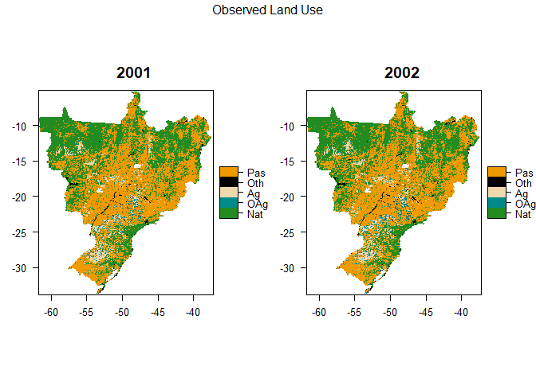

Examine error matrix cross-tabulations of observed maps 

And Maps themselves


```r
library(tidyverse)
library(caret)   #for confusionMatrix
library(diffeR)  #for map comparison
library(knitr)
library(raster)
library(rasterVis)
library(gridExtra)


####FUNCTIONS
nat2pas <- function(x,y) { x == 1 & y == 5 }
pas2nat <- function(x,y) { x == 5 & y == 1 }

pas2oag <- function(x,y) { x == 5 & y == 2 }
oag2pas <- function(x,y) { x == 2 & y == 5 }

nat2oag <- function(x,y) { x == 1 & y == 2 }
oag2nat <- function(x,y) { x == 2 & y == 1 }

ag2oag <- function(x,y) { x == 3 & y == 2 }
oag2ag <- function(x,y) { x == 2 & y == 3 }


binRatify <- function(ras){
  
  ras <- ratify(ras)
  rat <- levels(ras)[[1]]
  rat$code <- c("No Change","Change")
  levels(ras) <- rat
  
  return(ras)
}
```


```r
input_path <- "C:/Users/k1076631/Google Drive/Shared/Crafty Telecoupling/Data/"
classification <- "PastureB"

data_yrs <- seq(2000, 2003, 1)

for(i in seq_along(data_yrs)){

  #create a stack of rasters
  
  inname <- paste0(input_path,"LandCover/MapBiomas23/ClassificationComparison/ASCII/brazillc_",data_yrs[i],"_",classification,".asc")

  
  lc <- raster(inname)
  
  if(i == 1) { s <- stack(lc) }
  else { s <- stack(s, lc) }
  
}

#mask to study area
munis.r <- raster(paste0(input_path,"LandCover/MapBiomas23/ClassificationComparison/sim10_BRmunis_latlon_5km_2018-04-27.asc"))

s <- mask(x=s, mask=munis.r)  #JM edited munis.r  
s <- trim(s, padding=2)
```


```r
mat_yrs <- head(data_yrs, -1) #drop last element of the list

LCnames <- c("Nat", "OtherAgri", "Agri", "Other", "Pasture")  #used to label error matrix in loop below

comparisons <- c(nat2pas, pas2nat, pas2oag, oag2pas, nat2oag, oag2nat, ag2oag, oag2ag) 
comparisons_n <- c("nat2pas", "pas2nat", "pas2oag", "oag2pas", "nat2oag", "oag2nat", "ag2oag", "oag2ag")
  
for(i in seq_along(mat_yrs)){
  
  i <- 1
  
  ts <- stack(s[[i]], s[[i+1]])
  plot(ts)
  
  cat("  \n","  \n","Crosstab ",data_yrs[i],"-",data_yrs[i+1],"  \n") 

  #can render table in html better?
  xtab <- crosstabm(s[[i]], s[[i+1]])
  colnames(xtab) <- LCnames
  rownames(xtab) <- LCnames
  cat("  \n")
  print(kable(xtab))
  cat("  \n")
  
  pl <- list()  #this will hold the plots for the all map for this year

  for(j in seq_along(comparisons)){
    
    np <- raster::overlay(x=ts, fun=comparisons[[j]])
    np <- binRatify(np)
    #create the plot
    p <- levelplot(np,
      contour=F, 
      margin=F,
      colorkey=F,
      scales=list(draw=FALSE),
      col.regions= c("lightgray", "red"),
      main = comparisons_n[j])
  
    #add it to the list
    pl[[j]] <- p    #+1 because LU is in first slot
  }
  
  print(marrangeGrob(pl, nrow = 2, ncol = 4, top = paste0(data_yrs[i],"-",data_yrs[i+1])))

}
```

<!-- -->  
   
 Crosstab  2000 - 2001   
  

               Nat   OtherAgri   Agri   Other   Pasture
----------  ------  ----------  -----  ------  --------
Nat          57941        2394    150      56      3149
OtherAgri     1773       21086   2018      65      2033
Agri             9          41   5630       1        16
Other           40          83     10    2343        61
Pasture       1888        2331    761      45     59062
  
<!-- --><!-- -->  
   
 Crosstab  2000 - 2001   
  

               Nat   OtherAgri   Agri   Other   Pasture
----------  ------  ----------  -----  ------  --------
Nat          57941        2394    150      56      3149
OtherAgri     1773       21086   2018      65      2033
Agri             9          41   5630       1        16
Other           40          83     10    2343        61
Pasture       1888        2331    761      45     59062
  
<!-- --><!-- -->  
   
 Crosstab  2000 - 2001   
  

               Nat   OtherAgri   Agri   Other   Pasture
----------  ------  ----------  -----  ------  --------
Nat          57941        2394    150      56      3149
OtherAgri     1773       21086   2018      65      2033
Agri             9          41   5630       1        16
Other           40          83     10    2343        61
Pasture       1888        2331    761      45     59062
  
<!-- -->
