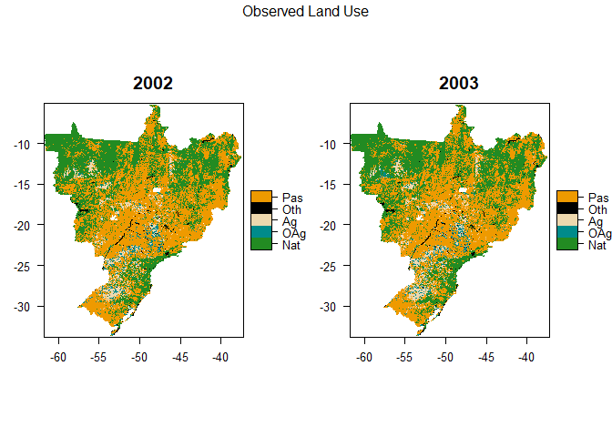
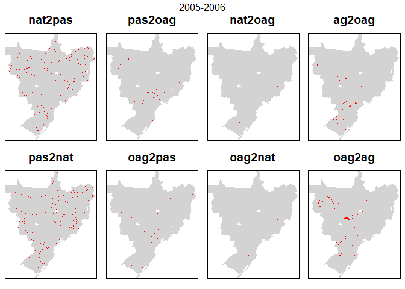
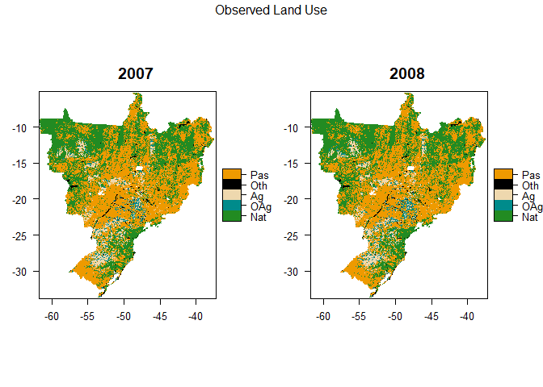
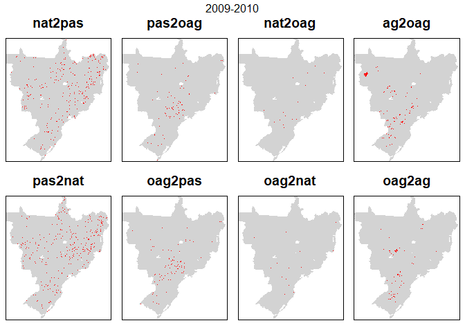
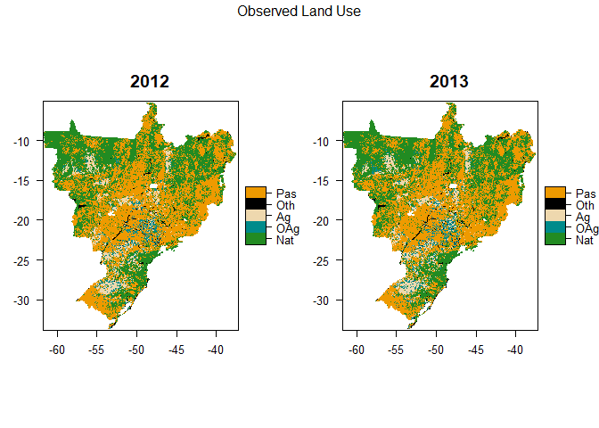
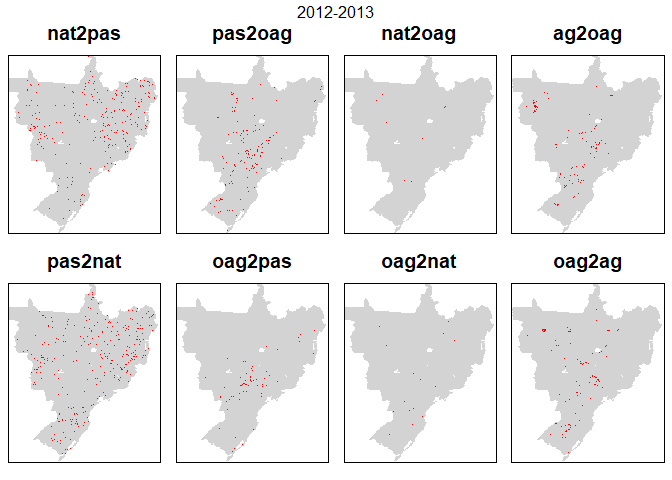
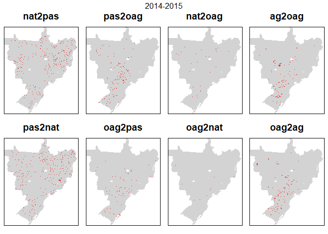

## Examine differences between pairs of raster maps


```r
library(tidyverse)
library(caret)   #for confusionMatrix
library(diffeR)  #for map comparison
library(knitr)
library(raster)
library(rasterVis)
library(gridExtra)


####FUNCTIONS
nat2pas <- function(x,y) { x == 1 & y == 5 }
pas2nat <- function(x,y) { x == 5 & y == 1 }

pas2oag <- function(x,y) { x == 5 & y == 2 }
oag2pas <- function(x,y) { x == 2 & y == 5 }

nat2oag <- function(x,y) { x == 1 & y == 2 }
oag2nat <- function(x,y) { x == 2 & y == 1 }

ag2oag <- function(x,y) { x == 3 & y == 2 }
oag2ag <- function(x,y) { x == 2 & y == 3 }


binRatify <- function(ras){
  
  ras <- ratify(ras)
  rat <- levels(ras)[[1]]
  rat$code <- c("No Change","Change")
  levels(ras) <- rat
  
  return(ras)
}


makeObsLUmap <- function(LU, year) {
  
  
  #add categories for later plotting etc. (see https://stackoverflow.com/a/37214431)
  LU <- ratify(LU)     #tell R that the map raster is categorical 
  rat <- levels(LU)[[1]]    #apply the levels (i.e. categories) 

  uLU <- unique(LU) 

  LUcols <- c()
  LUlabs <- c()
  
  if(1 %in% uLU) { 
    LUcols <- c(LUcols, 'forestgreen') 
    LUlabs <- c(LUlabs, 'Nat')  }
  if(2 %in% uLU) { 
    LUcols <- c(LUcols, 'darkcyan') 
    LUlabs <- c(LUlabs, 'OAg') }
  if(3 %in% uLU) { 
    LUcols <- c(LUcols, 'wheat2') 
    LUlabs <- c(LUlabs, 'Ag') }
  if(4 %in% uLU) { 
    LUcols <- c(LUcols, 'black') 
    LUlabs <- c(LUlabs, 'Oth') }
  if(5 %in% uLU) { 
    LUcols <- c(LUcols, 'orange2') 
    LUlabs <- c(LUlabs, 'Pas') }
  
  rat$LandUse <- LUlabs  
  levels(LU) <- rat 
  
  p <- levelplot(LU, att = "LandUse", col.regions=LUcols, main = paste0(year),
      par.settings = list(
        layout.heights = list(top.padding = 0, bottom.padding = 0),
        layout.widths = list(left.padding = 0, right.padding = 0) 
        )
      )  

  return(p)
}
```


```r
input_path <- "C:/Users/k1076631/Google Drive/Shared/Crafty Telecoupling/Data/"
classification <- "PastureB"

data_yrs <- seq(2000, 2015, 1)

for(i in seq_along(data_yrs)){

  #create a stack of rasters
  
  inname <- paste0(input_path,"LandCover/MapBiomas23/ClassificationComparison/ASCII/brazillc_",data_yrs[i],"_",classification,".asc")

  
  lc <- raster(inname)
  
  
  if(i == 1) { s <- stack(lc) }
  else { s <- stack(s, lc) }
  
}

#mask to study area
munis.r <- raster(paste0(input_path,"LandCover/MapBiomas23/ClassificationComparison/sim10_BRmunis_latlon_5km_2018-04-27.asc"))

s <- mask(x=s, mask=munis.r)  #JM edited munis.r  
s <- trim(s, padding=2)

#as.factor(s)

#luRatify(s)
```


```r
mat_yrs <- head(data_yrs, -1) #drop last element of the list

LCnames <- c("Nat", "OtherAgri", "Agri", "Other", "Pasture")  #used to label error matrix in loop below

comparisons <- c(nat2pas, pas2nat, pas2oag, oag2pas, nat2oag, oag2nat, ag2oag, oag2ag) 
comparisons_n <- c("nat2pas", "pas2nat", "pas2oag", "oag2pas", "nat2oag", "oag2nat", "ag2oag", "oag2ag")
  
for(i in seq_along(mat_yrs)){
  
  #i <- 1 #for testing
  
  lul <- list()  #this will hold the plots for the LU map for this year
  lul[[1]] <- makeObsLUmap(s[[i]], data_yrs[i])
  lul[[2]] <- makeObsLUmap(s[[i+1]], data_yrs[i+1])
  

  #output the crosstab  
  cat("  \n","  \n","Crosstab ",data_yrs[i],"-",data_yrs[i+1],"  \n") 
  xtab <- crosstabm(s[[i]], s[[i+1]])
  colnames(xtab) <- LCnames
  rownames(xtab) <- LCnames
  cat("  \n")
  print(kable(xtab))
  cat("  \n")
  
  pl <- list()  #this will hold the plots for the all map for this year
  ts <- stack(s[[i]], s[[i+1]]) #stack used when creating difference maps

  for(j in seq_along(comparisons)){
    
    np <- raster::overlay(x=ts, fun=comparisons[[j]])
    np <- binRatify(np)
    
    #create the plot
    p <- levelplot(np,
      contour=F, 
      margin=F,
      colorkey=F,
      scales=list(draw=FALSE),
      col.regions= c("lightgray", "red"),
      main = comparisons_n[j],
      par.settings = list(
        layout.heights = list(top.padding = 0, bottom.padding = 0),
        layout.widths = list(left.padding = 0, right.padding = 0) 
        )
      )
  
    #add it to the list
    pl[[j]] <- p   
  }
  
  
  print(marrangeGrob(lul, nrow = 1, ncol = 2, top = paste0("Observed Land Use")))
  print(marrangeGrob(pl, nrow = 2, ncol = 4, top = paste0(data_yrs[i],"-",data_yrs[i+1])))

}
```

  
   
 Crosstab  2000 - 2001   
  

               Nat   OtherAgri   Agri   Other   Pasture
----------  ------  ----------  -----  ------  --------
Nat          57941        2394    150      56      3149
OtherAgri     1773       21086   2018      65      2033
Agri             9          41   5630       1        16
Other           40          83     10    2343        61
Pasture       1888        2331    761      45     59062
  
<!-- --><!-- -->  
   
 Crosstab  2001 - 2002   
  

               Nat   OtherAgri   Agri   Other   Pasture
----------  ------  ----------  -----  ------  --------
Nat          57839        1569    122      65      2056
OtherAgri     1404       21410    847     110      2164
Agri            42         491   7869       2       165
Other           41          41      6    2397        25
Pasture       1637        2100    305      56     60223
  
<!-- --><!-- -->  
   
 Crosstab  2002 - 2003   
  

               Nat   OtherAgri   Agri   Other   Pasture
----------  ------  ----------  -----  ------  --------
Nat          56753        1515     92      48      2555
OtherAgri     1638       20976    422      63      2512
Agri            25         248   8787       3        86
Other           60          34      0    2495        41
Pasture       1814        2292    318      23     60186
  
<!-- --><!-- -->  
   
 Crosstab  2003 - 2004   
  

               Nat   OtherAgri   Agri   Other   Pasture
----------  ------  ----------  -----  ------  --------
Nat          56404        1414     84      57      2331
OtherAgri     1518       20635    717      65      2130
Agri            51         282   9005       0       281
Other           45          32      5    2510        40
Pasture       1913        1983    204      77     61203
  
<!-- --><!-- -->  
   
 Crosstab  2004 - 2005   
  

               Nat   OtherAgri   Agri   Other   Pasture
----------  ------  ----------  -----  ------  --------
Nat          55887        1420    180      32      2412
OtherAgri     1508       20031    778      66      1963
Agri            62         409   9342       9       193
Other           48          34      3    2589        35
Pasture       1835        1616    386      34     62114
  
<!-- --><!-- -->  
   
 Crosstab  2005 - 2006   
  

               Nat   OtherAgri    Agri   Other   Pasture
----------  ------  ----------  ------  ------  --------
Nat          55681        1200     107      48      2304
OtherAgri     1540       19047     535      60      2328
Agri            62         178   10285       2       162
Other           37          43       2    2611        37
Pasture       1857        1184     288      40     63348
  
<!-- --><!-- -->  
   
 Crosstab  2006 - 2007   
  

               Nat   OtherAgri    Agri   Other   Pasture
----------  ------  ----------  ------  ------  --------
Nat          55890        1224     121      43      1899
OtherAgri     1283       18508     499      54      1308
Agri            80         407   10570       5       155
Other           42          45       3    2640        31
Pasture       2160        2022     354      42     63601
  
<!-- --><!-- -->  
   
 Crosstab  2007 - 2008   
  

               Nat   OtherAgri    Agri   Other   Pasture
----------  ------  ----------  ------  ------  --------
Nat          55775        1472     129      48      2031
OtherAgri     1304       18965     439      53      1445
Agri            97         509   10674       3       264
Other           57          32       1    2649        45
Pasture       2036        2312     282      35     62329
  
<!-- --><!-- -->  
   
 Crosstab  2008 - 2009   
  

               Nat   OtherAgri    Agri   Other   Pasture
----------  ------  ----------  ------  ------  --------
Nat          55426        1610     138      46      2049
OtherAgri     1374       20136     463      54      1263
Agri            99         424   10827       3       172
Other           44          54       1    2654        35
Pasture       2233        2412     318      49     61102
  
<!-- --><!-- -->  
   
 Crosstab  2009 - 2010   
  

               Nat   OtherAgri    Agri   Other   Pasture
----------  ------  ----------  ------  ------  --------
Nat          55203        1642     138      42      2151
OtherAgri     1910       20433     512      93      1688
Agri            82         517   10990       1       157
Other           49          54       4    2653        46
Pasture       2056        2146     298      43     60078
  
<!-- --><!-- -->  
   
 Crosstab  2010 - 2011   
  

               Nat   OtherAgri    Agri   Other   Pasture
----------  ------  ----------  ------  ------  --------
Nat          55770        1395     127      49      1959
OtherAgri     1376       21486     357      81      1492
Agri           119         690   10967       2       164
Other           53          37       2    2706        34
Pasture       1966        2345     340      51     59418
  
<!-- --><!-- -->  
   
 Crosstab  2011 - 2012   
  

               Nat   OtherAgri    Agri   Other   Pasture
----------  ------  ----------  ------  ------  --------
Nat          55666        1337     139      51      2091
OtherAgri     1462       21377     705     102      2307
Agri            74         308   11281       6       124
Other           52          39       2    2758        38
Pasture       1903        1832     391      40     58901
  
<!-- --><!-- -->  
   
 Crosstab  2012 - 2013   
  

               Nat   OtherAgri    Agri   Other   Pasture
----------  ------  ----------  ------  ------  --------
Nat          55546        1010     237      44      2320
OtherAgri     2131       17636    1172      98      3856
Agri            67         116   12252       2        81
Other           44          51       6    2790        66
Pasture       1939        1482     881      55     59104
  
<!-- --><!-- -->  
   
 Crosstab  2013 - 2014   
  

               Nat   OtherAgri    Agri   Other   Pasture
----------  ------  ----------  ------  ------  --------
Nat          56048        1002     151      53      2473
OtherAgri     1954       14401     982      80      2878
Agri           142         741   13380       8       277
Other           31          66      11    2832        49
Pasture       1984        1616     271      43     61513
  
<!-- --><!-- -->  
   
 Crosstab  2014 - 2015   
  

               Nat   OtherAgri    Agri   Other   Pasture
----------  ------  ----------  ------  ------  --------
Nat          56631        1037     344      34      2113
OtherAgri     1224       13486    1166      79      1871
Agri            79         282   14341       4        89
Other           50          51      10    2817        88
Pasture       1968        1172     680      39     63331
  
<!-- --><!-- -->
