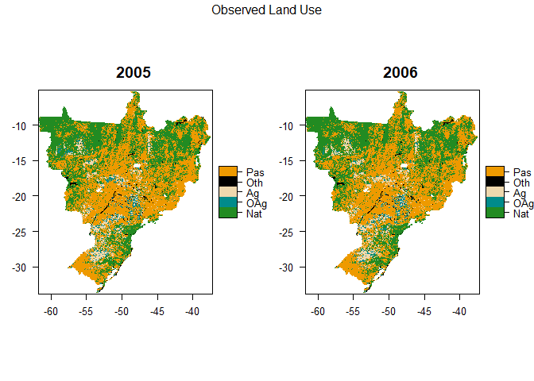
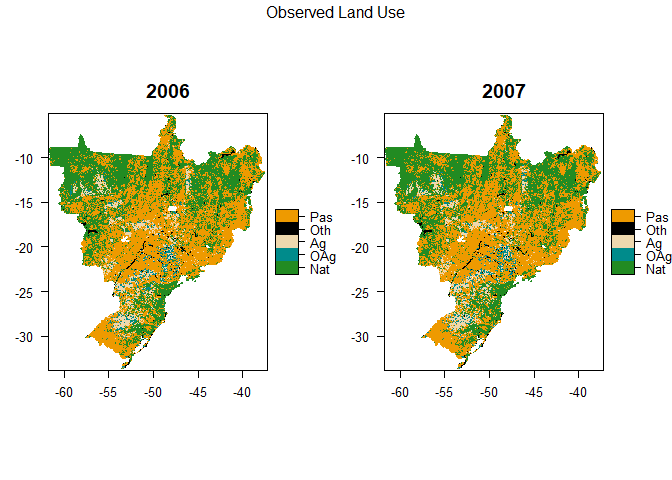
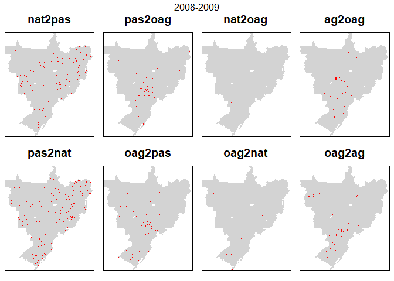
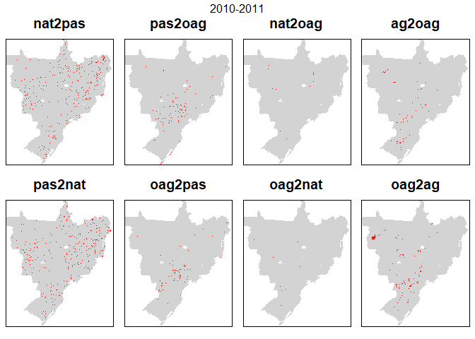
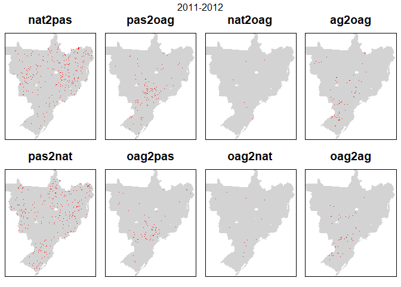
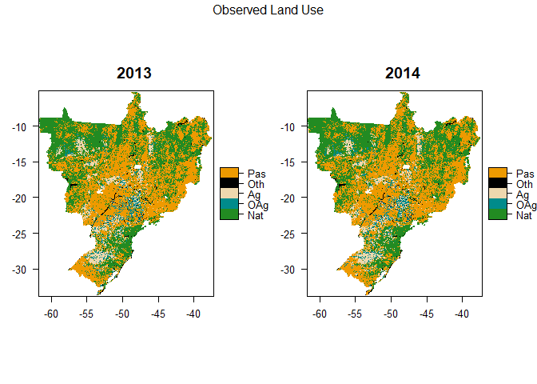

## Examine differences between pairs of raster maps through time (one year to the next)


```r
library(tidyverse)
library(caret)   #for confusionMatrix
library(diffeR)  #for map comparison
library(knitr)
library(raster)
library(rasterVis)
library(gridExtra)


####FUNCTIONS
nat2pas <- function(x,y) { x == 1 & y == 5 }
pas2nat <- function(x,y) { x == 5 & y == 1 }

pas2oag <- function(x,y) { x == 5 & y == 2 }
oag2pas <- function(x,y) { x == 2 & y == 5 }

nat2oag <- function(x,y) { x == 1 & y == 2 }
oag2nat <- function(x,y) { x == 2 & y == 1 }

ag2oag <- function(x,y) { x == 3 & y == 2 }
oag2ag <- function(x,y) { x == 2 & y == 3 }


binRatify <- function(ras){
  
  ras <- ratify(ras)
  rat <- levels(ras)[[1]]
  rat$code <- c("No Change","Change")
  levels(ras) <- rat
  
  return(ras)
}


makeObsLUmap <- function(LU, year) {
  
  
  #add categories for later plotting etc. (see https://stackoverflow.com/a/37214431)
  LU <- ratify(LU)     #tell R that the map raster is categorical 
  rat <- levels(LU)[[1]]    #apply the levels (i.e. categories) 

  uLU <- unique(LU) 

  LUcols <- c()
  LUlabs <- c()
  
  if(1 %in% uLU) { 
    LUcols <- c(LUcols, 'forestgreen') 
    LUlabs <- c(LUlabs, 'Nat')  }
  if(2 %in% uLU) { 
    LUcols <- c(LUcols, 'darkcyan') 
    LUlabs <- c(LUlabs, 'OAg') }
  if(3 %in% uLU) { 
    LUcols <- c(LUcols, 'wheat2') 
    LUlabs <- c(LUlabs, 'Ag') }
  if(4 %in% uLU) { 
    LUcols <- c(LUcols, 'black') 
    LUlabs <- c(LUlabs, 'Oth') }
  if(5 %in% uLU) { 
    LUcols <- c(LUcols, 'orange2') 
    LUlabs <- c(LUlabs, 'Pas') }
  
  rat$LandUse <- LUlabs  
  levels(LU) <- rat 
  
  p <- levelplot(LU, att = "LandUse", col.regions=LUcols, main = paste0(year),
      par.settings = list(
        layout.heights = list(top.padding = 0, bottom.padding = 0),
        layout.widths = list(left.padding = 0, right.padding = 0) 
        )
      )  

  return(p)
}
```


```r
#input_path <- "C:/Users/k1076631/Google Drive/Shared/Crafty Telecoupling/Data/"
input_path <- "C:/Users/k1076631/Google Drive/Shared/Crafty Telecoupling/CRAFTY_testing/"
classification <- "PastureB"

data_yrs <- seq(2001, 2015, 1)

for(i in seq_along(data_yrs)){

  #create a stack of rasters
  
  #inname <- paste0(input_path,"LandCover/MapBiomas23/ClassificationComparison/ASCII/brazillc_",data_yrs[i],"_",classification,".asc")

  inname <- paste0(input_path,"CRAFTYOutput/Data/ObservedLCmaps/PlantedArea_brazillc_",classification,"_",data_yrs[i],".asc")
  
  lc <- raster(inname)
  
  
  if(i == 1) { s <- stack(lc) }
  else { s <- stack(s, lc) }
  
}

#mask to study area
#munis.r <- raster(paste0(input_path,"LandCover/MapBiomas23/ClassificationComparison/sim10_BRmunis_latlon_5km_2018-04-27.asc"))

munis.r <- raster(paste0(input_path,"CRAFTYOutput/Data/ObservedLCmaps/sim10_BRstates_latlon_5km.asc"))

s <- mask(x=s, mask=munis.r)  #JM edited munis.r  
s <- trim(s, padding=2)

#as.factor(s)

#luRatify(s)
```


```r
mat_yrs <- head(data_yrs, -1) #drop last element of the list

LCnames <- c("Nat", "OtherAgri", "Agri", "Other", "Pasture")  #used to label error matrix in loop below

comparisons <- c(nat2pas, pas2nat, pas2oag, oag2pas, nat2oag, oag2nat, ag2oag, oag2ag) 
comparisons_n <- c("nat2pas", "pas2nat", "pas2oag", "oag2pas", "nat2oag", "oag2nat", "ag2oag", "oag2ag")
  
for(i in seq_along(mat_yrs)){
  
  #i <- 1 #for testing
  
  lul <- list()  #this will hold the plots for the LU map for this year
  lul[[1]] <- makeObsLUmap(s[[i]], data_yrs[i])
  lul[[2]] <- makeObsLUmap(s[[i+1]], data_yrs[i+1])
  

  #output the crosstab  
  cat("  \n","  \n","Crosstab ",data_yrs[i],"-",data_yrs[i+1],"  \n") 
  xtab <- crosstabm(s[[i]], s[[i+1]])
  colnames(xtab) <- LCnames
  rownames(xtab) <- LCnames
  cat("  \n")
  print(kable(xtab))
  cat("  \n")
  
  pl <- list()  #this will hold the plots for the all map for this year
  ts <- stack(s[[i]], s[[i+1]]) #stack used when creating difference maps

  for(j in seq_along(comparisons)){
    
    np <- raster::overlay(x=ts, fun=comparisons[[j]])
    np <- binRatify(np)
    
    #create the plot
    p <- levelplot(np,
      contour=F, 
      margin=F,
      colorkey=F,
      scales=list(draw=FALSE),
      col.regions= c("lightgray", "red"),
      main = comparisons_n[j],
      par.settings = list(
        layout.heights = list(top.padding = 0, bottom.padding = 0),
        layout.widths = list(left.padding = 0, right.padding = 0) 
        )
      )
  
    #add it to the list
    pl[[j]] <- p   
  }
  
  
  print(marrangeGrob(lul, nrow = 1, ncol = 2, top = paste0("Observed Land Use")))
  print(marrangeGrob(pl, nrow = 2, ncol = 4, top = paste0(data_yrs[i],"-",data_yrs[i+1])))

}
```

  
   
 Crosstab  2001 - 2002   
  

               Nat   OtherAgri   Agri   Other   Pasture
----------  ------  ----------  -----  ------  --------
Nat          60400         129    218      83      3301
OtherAgri      120        2744    673      13       607
Agri           147         871   6745       8       697
Other           50          10      8    1806        43
Pasture       2726         744   1290     127     78560
  
<!-- --><!-- -->  
   
 Crosstab  2002 - 2003   
  

               Nat   OtherAgri   Agri   Other   Pasture
----------  ------  ----------  -----  ------  --------
Nat          59320         154    221      56      3692
OtherAgri      120        3126    747       6       499
Agri           155         849   7333       3       594
Other           75           3      1    1903        55
Pasture       3083         679   1081      70     78295
  
<!-- --><!-- -->  
   
 Crosstab  2003 - 2004   
  

               Nat   OtherAgri   Agri   Other   Pasture
----------  ------  ----------  -----  ------  --------
Nat          58510         164    206      67      3369
OtherAgri      126        3269    732       5       679
Agri           192        1012   7432       1       746
Other           62           7      3    1808        44
Pasture       3057         744   1181     119     77890
  
<!-- --><!-- -->  
   
 Crosstab  2004 - 2005   
  

               Nat   OtherAgri   Agri   Other   Pasture
----------  ------  ----------  -----  ------  --------
Nat          57999         162    267      37      3482
OtherAgri      155        3450    876      13       702
Agri           208        1177   7357       6       806
Other           62           3      6    1883        46
Pasture       2946         725   1125      82     77850
  
<!-- --><!-- -->  
   
 Crosstab  2005 - 2006   
  

               Nat   OtherAgri   Agri   Other   Pasture
----------  ------  ----------  -----  ------  --------
Nat          57799         125    205      54      3187
OtherAgri      124        3401   1398       8       586
Agri           230         825   7835       8       733
Other           47           4      4    1910        56
Pasture       3002         646    844      72     78322
  
<!-- --><!-- -->  
   
 Crosstab  2006 - 2007   
  

               Nat   OtherAgri   Agri   Other   Pasture
----------  ------  ----------  -----  ------  --------
Nat          58034         143    175      54      2796
OtherAgri      106        3398    966       9       522
Agri           210        1006   8280       7       783
Other           58          10      3    1936        45
Pasture       3096         793    792      66     78137
  
<!-- --><!-- -->  
   
 Crosstab  2007 - 2008   
  

               Nat   OtherAgri   Agri   Other   Pasture
----------  ------  ----------  -----  ------  --------
Nat          57911         175    232      55      3131
OtherAgri      116        3711    886      10       627
Agri           190         990   8250       4       782
Other           77           4      3    1938        50
Pasture       3017         923    889      68     77386
  
<!-- --><!-- -->  
   
 Crosstab  2008 - 2009   
  

               Nat   OtherAgri   Agri   Other   Pasture
----------  ------  ----------  -----  ------  --------
Nat          57632         201    211      57      3210
OtherAgri      157        4009    936       9       692
Agri           205         869   8484       4       698
Other           59          14      3    1945        54
Pasture       3251        1006    726      78     76915
  
<!-- --><!-- -->  
   
 Crosstab  2009 - 2010   
  

               Nat   OtherAgri   Agri   Other   Pasture
----------  ------  ----------  -----  ------  --------
Nat          57428         192    212      53      3419
OtherAgri      189        4158    828      20       904
Agri           201        1222   8248       4       685
Other           66          12      4    1946        65
Pasture       3520         847    737      97     76368
  
<!-- --><!-- -->  
   
 Crosstab  2010 - 2011   
  

               Nat   OtherAgri   Agri   Other   Pasture
----------  ------  ----------  -----  ------  --------
Nat          57958         195    210      65      2976
OtherAgri      142        4307   1226       8       748
Agri           205         767   8365       4       688
Other           67           9      3    1998        43
Pasture       3000        1004    823      98     76516
  
<!-- --><!-- -->  
   
 Crosstab  2011 - 2012   
  

               Nat   OtherAgri   Agri   Other   Pasture
----------  ------  ----------  -----  ------  --------
Nat          57828         150    230      60      3104
OtherAgri      157        4472    790      25       838
Agri           198         726   9098       6       599
Other           55           7      2    2046        63
Pasture       2963         977    901     102     76028
  
<!-- --><!-- -->  
   
 Crosstab  2012 - 2013   
  

               Nat   OtherAgri   Agri   Other   Pasture
----------  ------  ----------  -----  ------  --------
Nat          57706         160    254      56      3025
OtherAgri      199        4421   1007      15       690
Agri           253        1131   9137       4       496
Other           58          13      8    2076        84
Pasture       3566        1473   1366     118     74109
  
<!-- --><!-- -->  
   
 Crosstab  2013 - 2014   
  

               Nat   OtherAgri   Agri   Other   Pasture
----------  ------  ----------  -----  ------  --------
Nat          58182         198    216      61      3125
OtherAgri      194        4644   1292      19      1049
Agri           290        1677   9041      10       754
Other           40          21      9    2115        84
Pasture       3486        1401    927      88     72502
  
<!-- --><!-- -->  
   
 Crosstab  2014 - 2015   
  

               Nat   OtherAgri   Agri   Other   Pasture
----------  ------  ----------  -----  ------  --------
Nat          58749         240    321      42      2840
OtherAgri      188        5325   1603      24       801
Agri           220        1355   9322       5       583
Other           61          13      9    2097       113
Pasture       2791        1246   1059      81     72337
  
<!-- --><!-- -->
