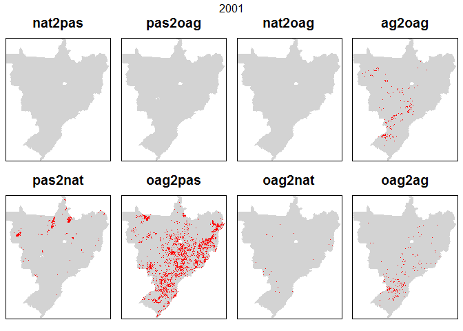
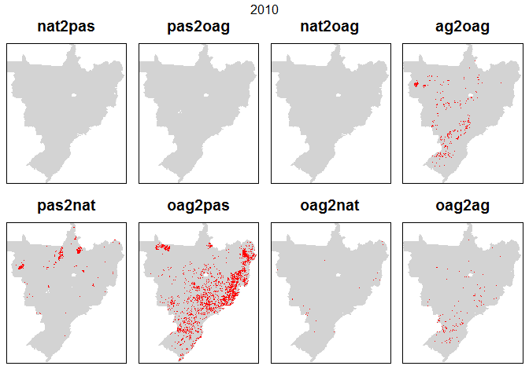

## Examine differences between pairs of raster maps for given years (e.g. between classifications)


```r
library(tidyverse)
library(caret)   #for confusionMatrix
library(diffeR)  #for map comparison
library(knitr)
library(raster)
library(rasterVis)
library(gridExtra)


####FUNCTIONS
nat2pas <- function(x,y) { x == 1 & y == 5 }
pas2nat <- function(x,y) { x == 5 & y == 1 }

pas2oag <- function(x,y) { x == 5 & y == 2 }
oag2pas <- function(x,y) { x == 2 & y == 5 }

nat2oag <- function(x,y) { x == 1 & y == 2 }
oag2nat <- function(x,y) { x == 2 & y == 1 }

ag2oag <- function(x,y) { x == 3 & y == 2 }
oag2ag <- function(x,y) { x == 2 & y == 3 }


binRatify <- function(ras){
  
  ras <- ratify(ras)
  rat <- levels(ras)[[1]]
  rat$code <- c("No Change","Change")
  #if(length(rat) == 1) rat$code <- "unknown"
  #if(length(rat) == 2) rat$code <- c("No Change","Change")
  
  levels(ras) <- rat

  return(ras)
  
}


makeObsLUmap <- function(LU, year) {
  
  
  #add categories for later plotting etc. (see https://stackoverflow.com/a/37214431)
  LU <- ratify(LU)     #tell R that the map raster is categorical 
  rat <- levels(LU)[[1]]    #apply the levels (i.e. categories) 

  uLU <- unique(LU) 

  LUcols <- c()
  LUlabs <- c()
  
  if(1 %in% uLU) { 
    LUcols <- c(LUcols, 'forestgreen') 
    LUlabs <- c(LUlabs, 'Nat')  }
  if(2 %in% uLU) { 
    LUcols <- c(LUcols, 'darkcyan') 
    LUlabs <- c(LUlabs, 'OAg') }
  if(3 %in% uLU) { 
    LUcols <- c(LUcols, 'wheat2') 
    LUlabs <- c(LUlabs, 'Ag') }
  if(4 %in% uLU) { 
    LUcols <- c(LUcols, 'black') 
    LUlabs <- c(LUlabs, 'Oth') }
  if(5 %in% uLU) { 
    LUcols <- c(LUcols, 'orange2') 
    LUlabs <- c(LUlabs, 'Pas') }
  
  rat$LandUse <- LUlabs  
  levels(LU) <- rat 
  
  p <- levelplot(LU, att = "LandUse", col.regions=LUcols, main = paste0(year),
      par.settings = list(
        layout.heights = list(top.padding = 0, bottom.padding = 0),
        layout.widths = list(left.padding = 0, right.padding = 0) 
        )
      )  

  return(p)
}
```


```r
pathA <- "C:/Users/k1076631/Google Drive/Shared/Crafty Telecoupling/Data/LandCover/MapBiomas23/ClassificationComparison/ASCII/"

pathB <- "C:/Users/k1076631/Google Drive/Shared/Crafty Telecoupling/Data/CRAFTYInput/Data/ObservedLCmaps/"


Aname <- "Original"
Bname <- "Planted Data"

data_yrs <- seq(2001, 2015, 1)

for(i in seq_along(data_yrs)){

  print(data_yrs[i])
  #create a stack of rasters for first set of maps
  innameA <- paste0(pathA,"brazillc_",data_yrs[i],"_PastureB.asc")
  lcA <- raster(innameA)
  
  if(i == 1) sA <- stack(lcA)  else  sA <- stack(sA, lcA)
  
  #create a stack of rasters for second set of maps
  innameB <- paste0(pathB,"NewAgri_brazillc_",data_yrs[i],"_PastureB.asc")
  lcB <- raster(innameB)
  
  if(i == 1) sB <- stack(lcB)  else sB <- stack(sB, lcB) 
  
}

#mask to study area
munis.r <- raster("C:/Users/k1076631/Google Drive/Shared/Crafty Telecoupling/Data/CRAFTYInput/Data/sim10_BRmunis_latlon_5km_2018-04-27.asc")

sA <- mask(x=sA, mask=munis.r)   
sA <- trim(sA, padding=2)

sB <- mask(x=sB, mask=munis.r)   
sB <- trim(sB, padding=2)
```


```r
LCnames <- c("Nat", "OtherAgri", "Agri", "Other", "Pasture")  #used to label error matrix in loop below

comparisons <- c(nat2pas, pas2nat, pas2oag, oag2pas, nat2oag, oag2nat, ag2oag, oag2ag) 
comparisons_n <- c("nat2pas", "pas2nat", "pas2oag", "oag2pas", "nat2oag", "oag2nat", "ag2oag", "oag2ag")

comparisons <- c(nat2pas, pas2nat, pas2oag, oag2pas, nat2oag, oag2nat, ag2oag, oag2ag) 
comparisons_n <- c("nat2pas", "pas2nat", "pas2oag", "oag2pas", "nat2oag", "oag2nat", "ag2oag", "oag2ag")


for(i in seq_along(data_yrs)){
  
  #i <- 2 #for testing
  
  lul <- list()  #this will hold the plots for the LU map for this year
  lul[[1]] <- makeObsLUmap(sA[[i]], Aname)
  lul[[2]] <- makeObsLUmap(sB[[i]], Bname)
  

  #output the crosstab  
  cat("  \n","  \n","Crosstab ",data_yrs[i],"  \n") 
  xtab <- crosstabm(sA[[i]], sB[[i]])
  colnames(xtab) <- LCnames
  rownames(xtab) <- LCnames
  cat("  \n")
  print(kable(xtab))
  cat("  \n")
  
  pl <- list()  #this will hold the plots for the all map for this year
  ts <- stack(sA[[i]], sB[[i]]) #stack used when creating difference maps

  for(j in seq_along(comparisons)){
    
    #j <- 2 #for testing
    np <- raster::overlay(x=ts, fun=comparisons[[j]])
    
    if(cellStats(np, sum) > 0) #if there are any differences
    {
      np <- binRatify(np) 
      mycols <- c("lightgray", "red")
    } else {
      mycols <- c("lightgray") 
    }
    
        #create the plot
        p <- levelplot(np,
        contour=F, 
        margin=F,
        colorkey=F,
        scales=list(draw=FALSE),
        col.regions= mycols,
        main = comparisons_n[j],
        par.settings = list(
          layout.heights = list(top.padding = 0, bottom.padding = 0),
          layout.widths = list(left.padding = 0, right.padding = 0) 
          )
        )
    
      pl[[j]] <- p   
    
  }
  
  
  print(marrangeGrob(lul, nrow = 1, ncol = 2, top = paste0("Observed Land Use")))
  print(marrangeGrob(pl, nrow = 2, ncol = 4, top = paste0(data_yrs[i])))

}
```

  
   
 Crosstab  2001   
  

               Nat   OtherAgri   Agri   Other   Pasture
----------  ------  ----------  -----  ------  --------
Nat          61651           0      0       0         0
OtherAgri        0        2854   1926       0     21155
Agri             0         582   6096       0      1891
Other            0           0      0    2510         0
Pasture          0           0      0       0     64321
  
<!-- --><!-- -->  
   
 Crosstab  2002   
  

               Nat   OtherAgri   Agri   Other   Pasture
----------  ------  ----------  -----  ------  --------
Nat          60963           0      0       0         0
OtherAgri        0        3021   1940       0     20650
Agri             0         543   6584       0      2022
Other            0           0      0    2630         0
Pasture          0           0      0       0     64633
  
<!-- --><!-- -->  
   
 Crosstab  2003   
  

               Nat   OtherAgri   Agri   Other   Pasture
----------  ------  ----------  -----  ------  --------
Nat          60290           0      0       0         0
OtherAgri        0        3173   2022       0     19870
Agri             0         608   6984       0      2027
Other            0           0      0    2632         0
Pasture          0           0      0       0     65380
  
<!-- --><!-- -->  
   
 Crosstab  2004   
  

               Nat   OtherAgri   Agri   Other   Pasture
----------  ------  ----------  -----  ------  --------
Nat          59931           0      0       0         0
OtherAgri        0        3344   2084       0     18918
Agri             0         704   7176       0      2135
Other            0           0      0    2709         0
Pasture          0           1      0       0     65984
  
<!-- --><!-- -->  
   
 Crosstab  2005   
  

               Nat   OtherAgri   Agri   Other   Pasture
----------  ------  ----------  -----  ------  --------
Nat          59340           0      0       0         0
OtherAgri        0        3185   2010       0     18315
Agri             0         654   7253       0      2782
Other            0           0      0    2730         0
Pasture          0           0      0       0     66717
  
<!-- --><!-- -->  
   
 Crosstab  2006   
  

               Nat   OtherAgri   Agri   Other   Pasture
----------  ------  ----------  -----  ------  --------
Nat          59177           0      0       0         0
OtherAgri        0        3069   1765       0     16818
Agri             0         643   7985       0      2589
Other            0           0      0    2761         0
Pasture          0           0      0       0     68179
  
<!-- --><!-- -->  
   
 Crosstab  2007   
  

               Nat   OtherAgri   Agri   Other   Pasture
----------  ------  ----------  -----  ------  --------
Nat          59455           0      0       0         0
OtherAgri        0        3324   1609       0     17273
Agri             0         730   7912       0      2905
Other            0           0      0    2784         0
Pasture          0           0      0       0     66994
  
<!-- --><!-- -->  
   
 Crosstab  2008   
  

               Nat   OtherAgri   Agri   Other   Pasture
----------  ------  ----------  -----  ------  --------
Nat          59269           0      0       0         0
OtherAgri        0        3719   1693       0     17878
Agri             0         820   8038       0      2667
Other            0           0      0    2788         0
Pasture          0           0      0       0     66114
  
<!-- --><!-- -->  
   
 Crosstab  2009   
  

               Nat   OtherAgri   Agri   Other   Pasture
----------  ------  ----------  -----  ------  --------
Nat          59176           0      0       0         0
OtherAgri        0        4168   1553       0     18915
Agri             0         784   8312       0      2651
Other            0           0      0    2806         0
Pasture          0           0      0       0     64621
  
<!-- --><!-- -->  
   
 Crosstab  2010   
  

               Nat   OtherAgri   Agri   Other   Pasture
----------  ------  ----------  -----  ------  --------
Nat          59300           0      0       0         0
OtherAgri        0        4073   1453       0     19266
Agri             0         641   7992       0      3309
Other            0           0      0    2832         0
Pasture          0           1      0       0     64119
  
<!-- --><!-- -->  
   
 Crosstab  2011   
  

               Nat   OtherAgri   Agri   Other   Pasture
----------  ------  ----------  -----  ------  --------
Nat          59284           0      0       0         0
OtherAgri        0        4491   1595       0     19867
Agri             0         757   8574       0      2462
Other            0           0      0    2889         0
Pasture          0           0      0       0     63067
  
<!-- --><!-- -->  
   
 Crosstab  2012   
  

               Nat   OtherAgri   Agri   Other   Pasture
----------  ------  ----------  -----  ------  --------
Nat          59157           0      0       0         0
OtherAgri        0        4349   1475       0     19069
Agri             0         791   9042       0      2685
Other            0           0      0    2957         0
Pasture          0           0      0       0     63461
  
<!-- --><!-- -->  
   
 Crosstab  2013   
  

               Nat   OtherAgri    Agri   Other   Pasture
----------  ------  ----------  ------  ------  --------
Nat          59727           0       0       0         0
OtherAgri        0        4150    1279       0     14866
Agri             0        1055   10090       0      3403
Other            0           0       0    2989         0
Pasture          0           0       0       0     65427
  
<!-- --><!-- -->  
   
 Crosstab  2014   
  

               Nat   OtherAgri   Agri   Other   Pasture
----------  ------  ----------  -----  ------  --------
Nat          60159           0      0       0         0
OtherAgri        0        4051   1484       0     12291
Agri             0        1414   9683       0      3698
Other            0           0      0    3016         0
Pasture          0           0      0       0     67190
  
<!-- --><!-- -->  
   
 Crosstab  2015   
  

               Nat   OtherAgri    Agri   Other   Pasture
----------  ------  ----------  ------  ------  --------
Nat          59952           0       0       0         0
OtherAgri        0        3522    1316       0     11190
Agri             0        1747   10609       0      4185
Other            0           0       0    2973         0
Pasture          0           0       0       0     67492
  
<!-- --><!-- -->
