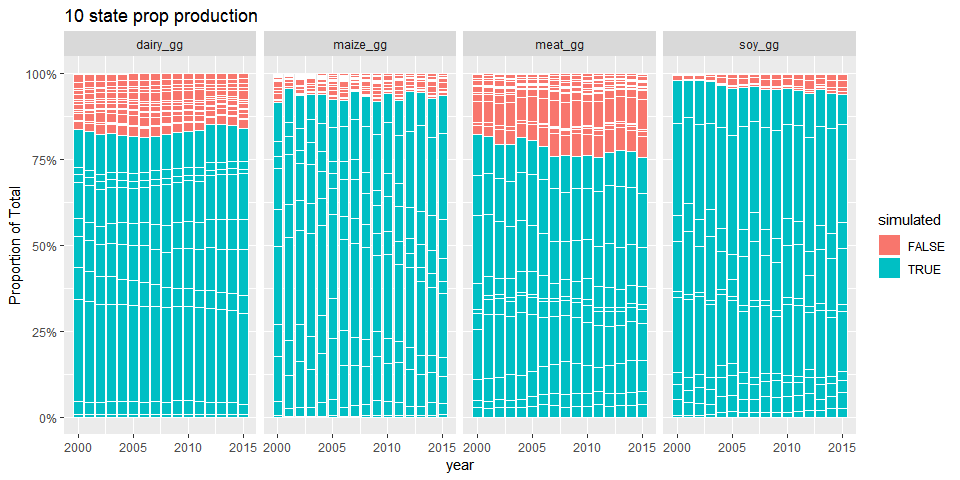
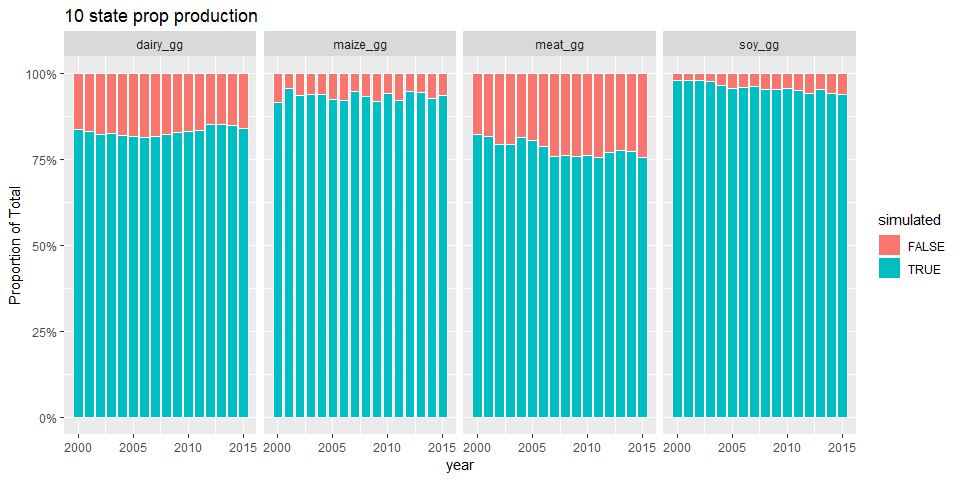

```r
rm(list=ls())
library(tidyverse)
library(readxl)
```


```r
##Load Production Data
meat_prod_Astates_Data <- read_excel("Cattle_meat_production_Kg_2000_2017_all_states.xlsx", sheet = "Plan1", skip = 1)  #data for all states Astates

#dairy data are by municiaplity for all states (Amunis)
dairy_prod_Amunis_Data <- read_excel("dairy_Municipalities_Brazil.xlsx", sheet = "Tabela", skip = 1, na = c("", "-", "..."))

#maize data are by municiaplity for all states (Amunis)
maize_prod_Amunis_Data <- read_excel("maize_brazil.xlsx", sheet = "Production (tons)", skip = 1, na = c("", "-", "..."))

#maize data are by municiaplity for all states (Amunis)
soy_prod_Amunis_Data <- read_excel("soybean_brazil.xlsx", sheet = "Production (Tons)", skip = 1, na = c("", "-", "..."))


Fstate_vals <- c(17,	29,	31,	35,	41,	42,	43,	50,	51,	52)
Fstate_abbrev <- c("TO", "BA", "MG", "SP", "PR",  "SC", "RS", "MS", "MT", "GO")

Astate_codes <- meat_prod_Astates_Data %>%
  select(NM_UF_SIGLA, CD_GCUF) %>%
  rename(state = NM_UF_SIGLA, stateid = CD_GCUF) %>%
  filter(!is.na(state))    #safer way to remove text line at bottom of state column
  

##MEAT
meat_prod_Astates <- meat_prod_Astates_Data %>%
  rename(state = NM_UF_SIGLA) %>%
  select(-NM_UF, -CD_GCUF, -`2016`, -`2017`) %>%      #drop columns
  filter(!is.na(state)) %>%   #safer way to remove text line at bottom of state column
  mutate_at(vars("2000":"2015"), as.numeric) 

meat_prod_Astates_long <- meat_prod_Astates %>%
   gather(key = year, value = meat_kg, -state) %>%
   mutate_at(vars(year), as.integer) %>%
   mutate(meat_gg = meat_kg * 0.001) %>%  #convert from tons to gg
   select(-meat_kg)

##DAIRY
dairy_prod_Amunis <- dairy_prod_Amunis_Data %>%
  rename(muniID = `IBGE CODE`) %>%
  filter(!is.na(muniID)) %>%   #safer way to remove text line in muniID
  mutate(state = substr(muniID, 1, 2)) %>%     #extract the muniID
  mutate_at(vars("2000":"2015"), as.numeric) %>%  #convert values to numeric
  select(-muniID, -Municipality)   #drop unwanted columns

dairy_prod_Astates <- dairy_prod_Amunis %>%
  group_by(state) %>%
  mutate_all(funs(. * 1.03 * 1000)) %>%     #convert from thousand litres to kgs
  summarise_all(sum, na.rm=T) %>%    #summarise munis to states
  mutate(state=replace(state, 1:length(Astate_codes$stateid), Astate_codes$state)) #re-label stated ids with state abbrevs

dairy_prod_Astates_long <- dairy_prod_Astates %>%
  gather(key = year, value = dairy_kg, -state) %>%
  mutate_at(vars(year), as.integer) %>%
  mutate(dairy_gg = dairy_kg * 0.001) %>%  #convert from tons to gg
  select(-dairy_kg)


#MAIZE
#has the same data strucutre (with some differences in unit conversions - could write function to cover both?) 
maize_prod_Amunis <- maize_prod_Amunis_Data %>%
  rename(muniID = `IBGE CODE`) %>%
  filter(!is.na(muniID)) %>%   #safer way to remove text line in muniID
  mutate(state = substr(muniID, 1, 2)) %>%     #extract the muniID
  mutate_at(vars("2000":"2015"), as.numeric) %>%  #convert values to numeric
  select(-muniID, -Municipality)   #drop unwanted columns

maize_prod_Astates <- maize_prod_Amunis %>%
  group_by(state) %>%
  summarise_all(sum, na.rm=T) %>%    #summarise munis to states
  mutate(state=replace(state, 1:length(Astate_codes$stateid), Astate_codes$state)) #re-label stated ids with state abbrevs

maize_prod_Astates_long <- maize_prod_Astates %>%
  gather(key = year, value = maize_kg, -state) %>%
  mutate_at(vars(year), as.integer) %>%
  mutate(maize_gg = maize_kg * 0.000001) %>%  #convert from kg to gg
  select(-maize_kg)

##SOY

soy_prod_Amunis <- soy_prod_Amunis_Data %>%
  rename(muniID = `IBGE CODE`) %>%
  filter(!is.na(muniID)) %>%   #safer way to remove text line in muniID
  mutate(state = substr(muniID, 1, 2)) %>%     #extract the muniID
  mutate_at(vars("2000":"2015"), as.numeric) %>%  #convert values to numeric
  select(-muniID, -Municipality)   #drop unwanted columns

soy_prod_Astates <- soy_prod_Amunis %>%
  group_by(state) %>%
  summarise_all(sum, na.rm=T) %>%    #summarise munis to states
  mutate(state=replace(state, 1:length(Astate_codes$stateid), Astate_codes$state)) #re-label stated ids with state abbrevs

soy_prod_Astates_long <- soy_prod_Astates %>%
  gather(key = year, value = soy_kg, -state) %>%
  mutate_at(vars(year), as.integer) %>%
  mutate(soy_gg = soy_kg * 0.000001) %>%  #convert from kg to gg
  select(-soy_kg)

prod_state_year <- left_join(meat_prod_Astates_long, dairy_prod_Astates_long, by = c("year", "state"))

prod_state_year <- left_join(prod_state_year, maize_prod_Astates_long, by = c("year", "state"))

prod_state_year <- left_join(prod_state_year, soy_prod_Astates_long, by = c("year", "state"))

#add focal states indicator
prod_state_year <- prod_state_year %>%
  mutate(simulated = state %in% Fstate_abbrev) 

psy_long <- prod_state_year %>%
  gather(key = commodity, value = gg, -state, -year, -simulated)

psimy_long <- psy_long %>%
  group_by(simulated, year, commodity) %>%
  summarise(sumsim = sum(gg, na.rm=T))
```


##Plots

```r
##Plot data

ggplot(psy_long, aes(x = year, y = gg, fill = simulated)) + 
  geom_bar(position = "fill",stat = "identity", colour="white") +
  scale_y_continuous(name = "Proportion of Total", labels = scales::percent_format()) +
  facet_grid(.~commodity) +
  ggtitle("10 state prop production")
```

<!-- -->

```r
ggplot(psimy_long, aes(x = year, y = sumsim, fill = simulated)) + 
  geom_bar(position = "fill",stat = "identity", colour="white") +
  scale_y_continuous(name = "Proportion of Total", labels = scales::percent_format()) +
  facet_grid(.~commodity) +
  ggtitle("10 state prop production")
```

<!-- -->


```r
##Proportions

prop_sy <- psimy_long %>%
  spread(key = simulated, value = sumsim) %>%
  mutate(prop = `TRUE` / (`TRUE` + `FALSE`))

prop_s <- prop_sy %>%
  group_by(commodity) %>%
  summarise(
    prop_mn = round(mean(prop),3),
    prop_md = round(median(prop),3),
    prop_max = round(max(prop),3),
    prop_sd = round(sd(prop),3),
    prop_se = round(sd(prop) / length(prop), 3)
  )

prop_s
```

<div data-pagedtable="false">
  <script data-pagedtable-source type="application/json">
{"columns":[{"label":["commodity"],"name":[1],"type":["chr"],"align":["left"]},{"label":["prop_mn"],"name":[2],"type":["dbl"],"align":["right"]},{"label":["prop_md"],"name":[3],"type":["dbl"],"align":["right"]},{"label":["prop_max"],"name":[4],"type":["dbl"],"align":["right"]},{"label":["prop_sd"],"name":[5],"type":["dbl"],"align":["right"]},{"label":["prop_se"],"name":[6],"type":["dbl"],"align":["right"]}],"data":[{"1":"dairy_gg","2":"0.831","3":"0.829","4":"0.852","5":"0.012","6":"0.001"},{"1":"maize_gg","2":"0.934","3":"0.936","4":"0.957","5":"0.012","6":"0.001"},{"1":"meat_gg","2":"0.781","3":"0.774","4":"0.822","5":"0.023","6":"0.001"},{"1":"soy_gg","2":"0.959","3":"0.956","4":"0.980","5":"0.014","6":"0.001"}],"options":{"columns":{"min":{},"max":[10]},"rows":{"min":[10],"max":[10]},"pages":{}}}
  </script>
</div>
