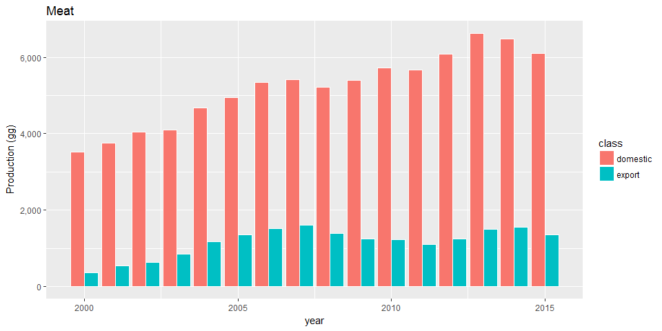
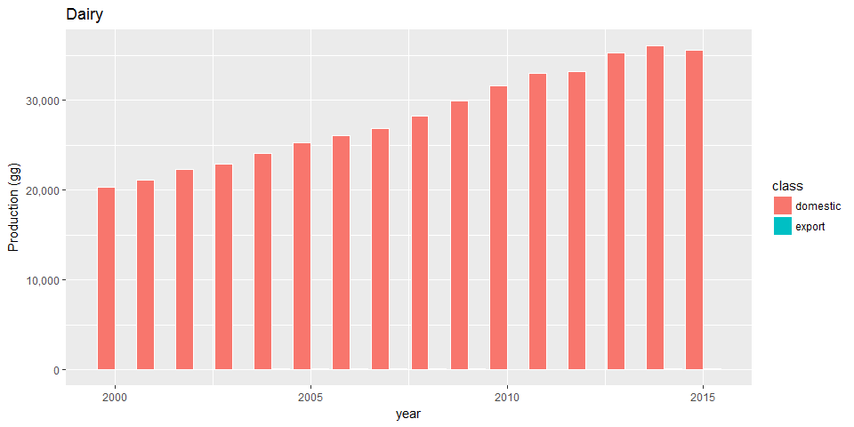
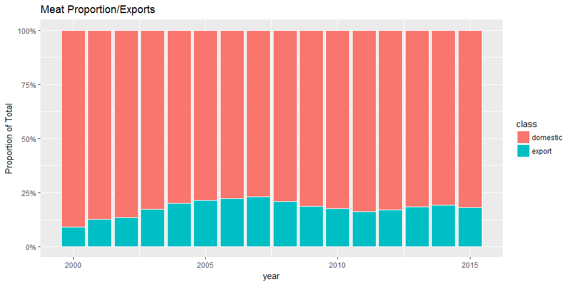
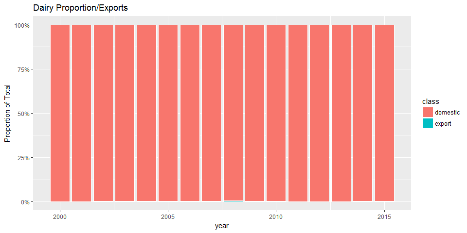

```r
rm(list=ls())
library(tidyverse)
library(readxl)
```


```r
##Load Production Data
meat_prod_Astates <- read_excel("Cattle_meat_production_Kg_2000_2017_all_states.xlsx", sheet = "Plan1", skip = 1)  #data for all states Astates

#dairy data are by municiaplity for all states (Amunis)
dairy_prod_Amunis <- read_excel("dairy_Municipalities_Brazil.xlsx", sheet = "Tabela", skip = 1, na = c("", "-", "..."))

##Tidy production data
meat_prod_Astates <- meat_prod_Astates %>%
  rename(state = NM_UF_SIGLA) %>%
  select(-NM_UF, -CD_GCUF, -`2016`, -`2017`) %>%      #drop columns
  filter(!is.na(state)) %>%   #safer way to remove text line at bottom of state column
  mutate_at(vars("2000":"2015"), as.numeric) 

meat_prod_Astates <- meat_prod_Astates %>%
  gather(key = year, value = kg, -state) %>%
  group_by(year) %>%
  summarise_at(vars(kg), sum, na.rm=T) 

dairy_prod_Amunis <- dairy_prod_Amunis %>%
  rename(muniID = `IBGE CODE`) %>%
  filter(!is.na(muniID)) %>%   #safer way to remove text line in muniID 
  mutate(state = substr(muniID, 1, 2)) %>%     #extract the muniID
  mutate_at(vars("2000":"2015"), as.numeric) %>%  #convert values to numeric
  select(-muniID, -Municipality)   #drop unwanted states

dairy_prod_Astates <- dairy_prod_Amunis %>% 
  group_by(state) %>%  
  mutate_all(funs(. * 1.03 * 1000)) %>%     #convert from thousand litres to kgs
  summarise_all(sum, na.rm=T)    #summarise munis to states

dairy_prod_Astates <- dairy_prod_Astates %>%
  gather(key = year, value = kg, -state) %>%
  group_by(year) %>%
  summarise_at(vars(kg), sum, na.rm=T) 
```


```r
##Load exports data
meat_exp_Astates <- read_excel("Brazilian_Cattle_meat_exports_TOTAL_2000_2017.xls", sheet="Sheet1", range="B3:AG5", col_names=F)

dairy_exp_Astates <- read_excel("Brazilian_dairy_exports_TOTAL_2000_2017.xls", sheet="Sheet1", range="C3:AH5", col_names=F)

##Tidy exports data
meat_exp_Astates <- as_tibble(t(meat_exp_Astates))   #transpose
colnames(meat_exp_Astates) <- c("year", "variable", "value")  #add column names
meat_exp_Astates <- filter(meat_exp_Astates, variable == "weight(Kg)")
meat_exp_Astates <- select(meat_exp_Astates, -variable)

dairy_exp_Astates <- as_tibble(t(dairy_exp_Astates))   #transpose
colnames(dairy_exp_Astates) <- c("year", "variable", "value")  #add column names
dairy_exp_Astates <- filter(dairy_exp_Astates, variable == "weight(Kg)")
dairy_exp_Astates <- select(dairy_exp_Astates, -variable)
```


```r
##Join data

meat_Astates <- left_join(meat_prod_Astates, meat_exp_Astates, suffic = c("prod", "exp"))

meat_Astates <- meat_Astates %>% 
  rename(production = "kg", export = "value") %>%
  mutate_if(is.character, as.numeric) %>% #exports being recognised as characters for some reason, so convert
  mutate(production = production * 0.000001) %>%  #convert from kg to gg
  mutate(export = export * 0.000001) %>%    #convert from kg to gg
  mutate(domestic = production - export) %>%
  select(-production)

meat_Astates_long <- gather(meat_Astates, key = class, value = gg, -year)

dairy_Astates <- left_join(dairy_prod_Astates, dairy_exp_Astates, suffic = c("prod", "exp"))
dairy_Astates <- dairy_Astates %>% 
  rename(production = "kg", export = "value") %>%
  mutate_if(is.character, as.numeric) %>%  #exports being recognised as characters for some reason, so convert
  mutate(production = production * 0.000001) %>%  #convert from kg to gg
  mutate(export = export * 0.000001) %>%  #convert from kg to gg
  mutate(domestic = production - export) %>%
  select(-production)

dairy_Astates_long <- gather(dairy_Astates, key = class, value = gg, -year)
```

##Plots

```r
##Plot data

ggplot(meat_Astates_long, aes(x=year, y=gg, fill=class)) + 
  geom_bar(stat="identity", colour="white", position = "dodge") + 
  scale_y_continuous(name="Production (gg)", labels = scales::comma) +
  ggtitle("Meat")
```

<!-- -->

```r
ggplot(dairy_Astates_long, aes(x=year, y=gg, fill=class)) + 
  geom_bar(stat="identity", colour="white", position = "dodge") + 
  scale_y_continuous(name="Production (gg)", labels = scales::comma) +
  ggtitle("Dairy")
```

<!-- -->

```r
ggplot(meat_Astates_long,aes(x = year, y = gg, fill = class)) + 
    geom_bar(position = "fill",stat = "identity", colour="white") +
    scale_y_continuous(name = "Proportion of Total", labels = scales::percent_format()) +
  ggtitle("Meat Proportion/Exports")
```

<!-- -->

```r
ggplot(dairy_Astates_long,aes(x = year, y = gg, fill = class)) + 
    geom_bar(position = "fill",stat = "identity", colour="white") +
    scale_y_continuous(name = "Proportion of Total", labels = scales::percent_format()) +
  ggtitle("Dairy Proportion/Exports")
```

<!-- -->

##Proportions

```r
##Proportions
meat_Astates %>%
  mutate(prop = export / (export + domestic)) -> meat_Astates

dairy_Astates %>%
  mutate(prop = export / (export + domestic)) -> dairy_Astates
```

The mean meat export proportion of total production is 0.179

The median meat export proportion of total production is 0.184

The maximum meat export proportion of total production is 0.23

The mean dairy export proportion of total production is 0.002

The median dairy export proportion of total production is 0.002

The maximum dairy export proportion of total production is 0.005
